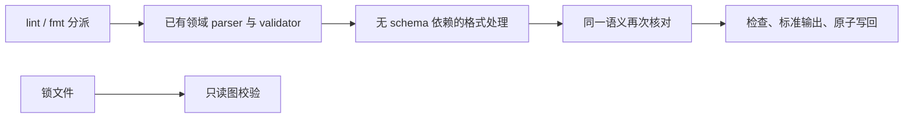

# 系统配置检查与格式化

## Intent：最终目标

提供统一的 zxc lint 入口，覆盖 ZX、RX 及真正的用户配置；为 pkg.yaml 和明确指定的包索引提供保留语义的格式化。校验复用实际构建和包管理使用的 schema，不引入第二套规则。

## Data：可用证据

pkg.yaml 当前由 CLI package/manifest 解码，包含单文档、重复与未知字段、包名、版本、公开面、工作区及原生配置检查；其模型引用 compiler.project.External。pkgs.Index 和 pkgs.Lock 已有独立 parse/validate。lint 不应反向依赖 compiler。

安装器以 pkg.lock.json 原始字节的 SHA-256 命名安装映射。library.json、receipt、编译产物和缓存属于各生产者的协议数据，不能当用户配置通用改写。工作区存在性、依赖匹配、安装完整性和项目图不属于单文件检查。

## Edges：边界与限制

CLI 负责文件、schema 分派和原子写回；领域模块继续维护语义；lint 负责纯文本格式。锁文件只读校验，不通过修改空白使安装映射失效。包索引需要 --kind index 显式指定，不因任意文件叫 index.json 就套用包索引 schema。

YAML 不使用 manifest/write 重新序列化用户配置。通过既有 libyaml 词法范围定位顶层字段，只调整字段间可忽略空行，保留注释、引号、实体和标量正文；块标量尾部空行不动。libyaml mark.index 是字符索引，必须映射回 UTF-8 字节位置。格式化前后都使用同一 manifest parser，比较模型语义，不一致则不输出或写回。

JSON 包索引使用已有 schema 先校验，保留数组顺序；通用 JSON 格式器保留数字原文，避免精度损失。生成锁文件和内部产物不进入此写回通路。配置格式检查不执行下载、安装、源码加载或应用运行。

ZX lint 检查解析、名称和现有空行规则；RX lint 检查 XML、单文件 Schema 及空行。均不宣称完整项目类型与依赖已经通过。依赖实际业务输入的运行时检查仍由后续具体编译能力落实。

不新增测试，不跑全量测试，不使用浏览器。

## Answer：交付与成功标准

zxc lint 接受单文件与可选 --kind manifest|index|lock；zxc fmt 对 pkg.yaml 和显式索引支持输出、--check、--write。锁文件只用 lint。未知配置类型明确报错。

验证有效配置、已有非法配置、语义及注释保持、幂等、索引顺序与数字保持、非法输入不改写，以及锁文件检查不改变安装摘要。完成后提交推送，并提供 IDEA 使用参考与实际执行记录。

## 自我复核

单文件合法与完整工程合法必须分开报告。不能用“只改空白”论证锁文件写回安全；也不能用模型重新序列化冒充注释保留。不得把局部配置覆盖描述为全部 lint 和自举目标已完成。

## 实施与实际结果

正式实现已接通 zxc lint、fmt --kind 与配置分派。lint 只新增纯 JSON 格式器及基于范围的 YAML 空行编辑；CLI 继续调用 manifest.parse、pkgs.Index.parse 和 pkgs.Lock.parse。没有搬迁或复制清单 schema，没有引入 lint 到 compiler 的反向依赖。

YAML 仅整理顶层块映射字段之间的空行，流式映射及标量原文保持原样。字符索引表避免中文路径导致错位。块标量尾部跳过编辑；所有修改后都重新解析并逐字段等价序列化比较。JSON 使用 tab 缩进和末尾换行，数组顺序、字段值与数字原文保留。

根构建 14/14 通过。复用现有清单输入 160 个：51 个合法输入全部保持语义且格式化后 lint 通过，109 个非法输入全部拒绝写回。实际仓库 78 个已跟踪 pkg.yaml 全部通过格式化语义与幂等核验，包括 4 个含非 ASCII 内容的清单；原文件均未改动。修改仅发生在空行。

工作区示例从已有发布闭包示例复制，真实离线安装 4 个包。生成的锁文件 lint 成功、fmt --write 明确拒绝，字节摘要保持不变，随后冻结离线安装再次成功。索引示例来自已有索引用例，格式化后的模型与原始输入完全相同，版本数组顺序不变。

已有包索引回归 64/64 通过；RX 格式化 CLI 分组通过，分配失败检查 2/2 通过。RX 实际执行分组首次因环境中默认 z3 不存在而返回 FileNotFound；显式设置现有真实 Z3 后 1/1 通过，未因此修改源码。没有新增测试或运行全量测试。

只读复核未发现所查范围内的字段边界、块标量、JSON 顺序、锁文件写回或释放路径问题。结果记录见 [执行结果](配置检查/执行结果.json)。系统内部生成协议的检查仍由各自加载器负责，本轮不宣称完整运行时检查或自举已经完成。
