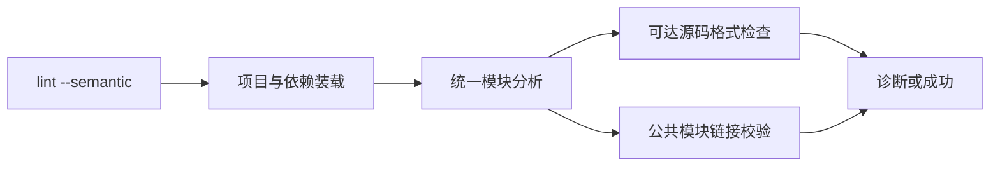
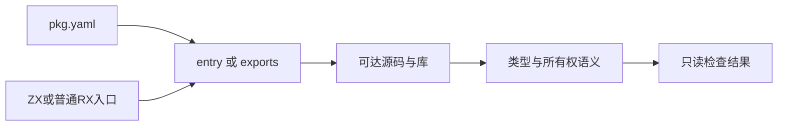

# 项目语义检查实施计划

## Intent：最终目标

为 lint 增加显式项目语义检查，让源码入口及其可达依赖、包的所有公共模块通过与正式编译相同的类型和所有权分析。保留快速单文件检查，不生成目标代码、不安装依赖、不执行证明求解器。

## Data：可用证据

当前 cli/lint.zig 只解析单文件与格式规则。正式 library/analyze.zig 已支持 ZX、普通 RX、Store 和已编译库的公共模块分析及链接，可以直接复用，避免另造类型校验器。library/build.zig 已定义 entry 与 exports 的统一入口选择。

## Edges：边界与限制

新增 --semantic，仅供 lint；--project 仅在该模式用于指定清单。输入为 ZX、普通 RX 或 pkg.yaml；--kind 与该模式互斥。依赖沿正常项目加载器解析；不递归扫描不可达文件，不把包检查表述成整个 monorepo 扫描。Gateway 服务入口、独立 Store 文件、原生 Zig/C 实现正文、形式化证明和实际运行仍由对应命令负责。本轮不添加测试套件或运行全量测试。

## Answer：交付与成功标准

生产实现位于 CLI lint 职责目录，格式规则仍由 lint 包负责，语义规则仍由 compiler/rx_analysis 负责。真实项目应表现为：单文件 lint 可接受的跨文件类型错误被语义模式拒绝；包中的其他公共模块也会检查；合法 ZX、RX 与标准库调用通过；命令不产生构建输出。补齐参考、代码草稿及观测记录后提交推送。

## 实施结果

新增 CLI 的 semantic_lint 选项，参数解析明确限制其仅用于 lint；--project 仅在语义检查中接受，--kind 与该模式互斥。单文件原路径保留，把现有源码规则提取为 checkSource，语义入口直接检查已经加载的文本，不重复从磁盘读取。

新增 cli/lint/semantic.zig 负责项目装载、选择公共模块、调用既有 library/analyze、去重检查可达源码和公共链接。临时分配在本次检查 arena 中释放。源码入口只检查选定入口；清单入口使用 exports 或 entry。显式源码位于已编译包中时，仍分析给定源码，不误把所属包归档当作该源码已经通过。

没有复制类型推导、所有权、无环或库归档校验实现。规则继续归属于 compiler、rx_analysis、lint 和包加载器；CLI 只负责编排及诊断输出。

## 验证

必要构建 14/14 步成功，没有运行全量测试。运行结果.json 保存真实 CLI 返回状态和诊断：

- ZX、普通 RX、标准库调用、显式项目路径、清单 entry 与多个 exports 均通过。
- 在示例的临时副本中把依赖返回值改为错误类型，普通单文件检查通过，语义检查定位到依赖文件并拒绝。
- 增加没有被主入口调用的错误公共模块：选定源码入口仍通过，清单检查拒绝该公共模块。
- 导入环、可达依赖的空行格式错误均被拒绝。
- 已编译依赖和独立归档包通过；损坏归档被拒绝；归档包中的显式错误源码没有被归档成功掩盖。
- 对主示例和临时副本检查前后的全部文件名及内容摘要进行比较，均保持不变。临时副本退出后删除，不新增仓库测试套件。
- --project 缺少 --semantic、--kind 与 --semantic 并用、重复 --semantic 均由参数解析拒绝。

## 自我批判

入口可达检查不是磁盘全目录扫描；包公共面检查不是整个 workspace 检查。归档没有原始文本时无法恢复源码格式证据，只有加载及 IR 校验。语义通过不能保证形式化契约、原生实现 ABI 或运行时输入有效；这些仍需 verify、build 和对应输入检查。Gateway 和独立 Store 文件未在本阶段扩展为语义入口，不把这一项标记为全部 lint 工作完成。
