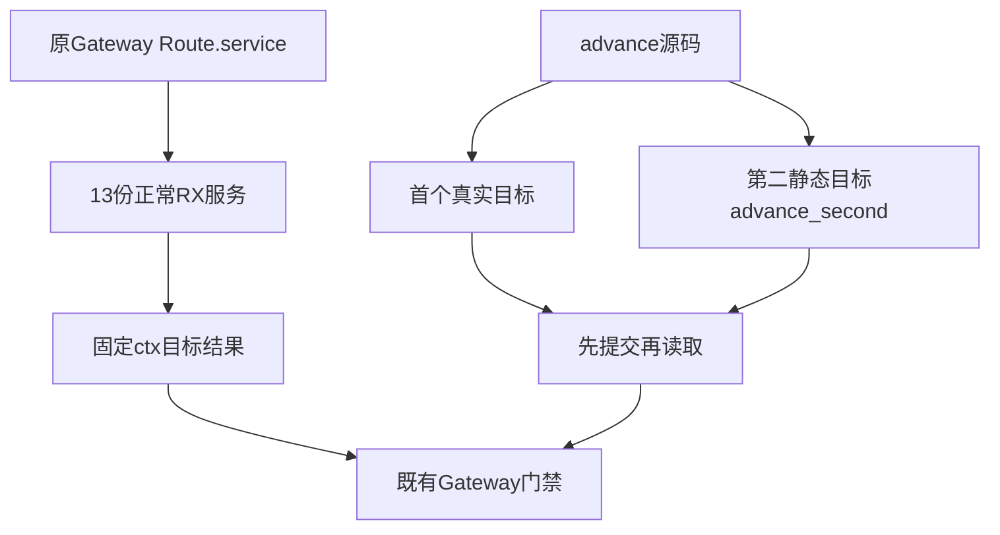

# Gateway调用与静态来源同步计划

## Intent：最终目标

完成 Gateway 正常 RX 服务的最终结果引用迁移，保持路由、HTTP 边界、应用内共享 Store、事务提交、所有权及跨请求存活语义的原验证。

## Data：可用证据

13 份正常 RX 夹具的主检出 WIP 仅 out→name，仍保留 ctx 与两个 Call.service；历史《RX调用属性迁移计划》要求无 name/out、Call.module、$ctx。原 Gateway state.ts 明确测试一次请求内两次 advance，第一值与第二值不同，第二调用须观察第一次提交，不能删除或覆盖第一次结果。

Gateway application.ts 递归复制 fixtures，build/gateway.zig 以 addDirectoryArg 登记目录，因此新增第二个明确目标 advance_second.zx 会进入真实临时项目。静态别名复用已成熟 advance.zx 完整 Store 源；不能改成普通 ZX wrapper，因为 Store 能力不由普通 import 继承。

## Edges：边界与限制

只同步 13 份 RX 及新增一份静态源码目标。basic/native 单调用按文件目标取值；state 保留 Store.from/as、业务字段及 setter；partial 保留先成功后失败顺序；replace 保留 copy→consume→setter 的所有权链。twice 第二个非 void 调用使用独立真实路径，外部 first/second 字段和原断言不变。

Gateway Route.service 属于路由协议，保持；不迁移 Store 字段或改生产。保存13份迁移前WIP原字节，并只完成它们在当前契约下的同职责改动，范围外WIP不参与提交。没有新增测试声明或目录案例，不把复制同源计为新增特性。

## Answer：交付格式与成功标准

14份同路径草稿与正式测试来源，明确 advance_second 与 advance 源字节相同。固定新检出执行既有 test-gateway，ReleaseSafe、-j2，保留完整日志、实际/缓存数量、Node父子场景与应用优化参数。成功必须包含原 first/second、失败事务、部分成功保留、owned历史跨请求、路由和协议边界断言；退出0后独立提交push。真实生产缺陷保存最小复现并发指定实现会话。

## 自我批判

仅删绑定属性会令两次advance发生同目标重名，新的早期诊断会遮蔽真正的共享状态验证。给第二调用不同文件路径保留两个真实调用，而不是用别名层修补生产。first/second快照必须独立存在，原行为断言负责检出错误共享或过早释放；不能只检查服务器启动成功。

## 最终执行记录

固定5684e487的既有test-gateway退出0，37/37构建步骤；48个Zig声明实例全部实际运行（routes9、validation35、allocation4），无运行缓存。Node应用脚本按连续编号完成86项检查，属于原脚本语义检查，不能视为新增86个Node:test声明。

13份RX与advance_second静态来源经过完整应用构建和请求执行；两次提交、first/second快照、失败事务、保留前次成功、历史列表与字符串跨请求存活、HTTP边界和新进程初值全部成功。新增目标与advance源码逐字节相同，14份正式/草稿/实际检出一致，无生产源码修改或新增目录案例。
