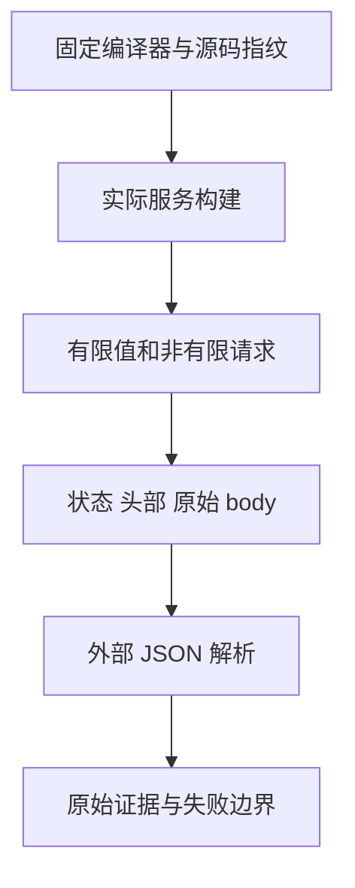

# Gateway 非有限 JSON 核验计划

## IDEA

- Intent：核验 HTTP 服务声明 application/json 的成功响应是否也暴露非有限数序列化问题。
- Data：`genz/src/gateway/invoke.zig` 默认调用 Zig Stringify；三种普通应用出口已有实际失败证据，HTTP 出口尚无实际结论。
- Edges：仅构建本机临时服务、请求环回地址；复用已有 Gateway 应用和 HTTP 驱动，不调用浏览器。普通 RX 只转发 ZX 恒等或除法；不依据输入选择硬编码结果。保存真实响应，有限值用于证明服务正常。
- Answer：在固定 `ebe3d605` CLI 上实际构建一个含两条路由的 Gateway，观察指数溢出、除零及后续正常请求；只有复现后才通知已授权实现会话。结果不登记成通过回归。

## 状态

固定ebe3d605实际构建一个服务，7个同进程HTTP请求全部完成：2个有限控制正常，4个Infinity响应HTTP200且content-type为application/json，body为inf/-inf，实际外部解析失败；1个NaN响应HTTP200且body变为字符串。stdout/stderr为空。源码、编译器和服务产物指纹以及完整wire留存在本功能目录；已通知实现会话扩展JSON输出检查。

首轮headers为Map，JSON保存遗漏了其字段，但原始wire完整。修正采集格式后在同一固定源码重跑，headers及wire均完整；结论不依赖源码预测。当前未声明HTTP修复或正式回归通过。
