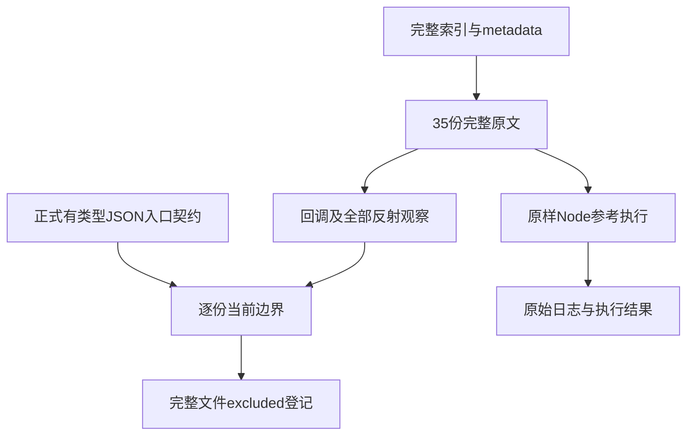
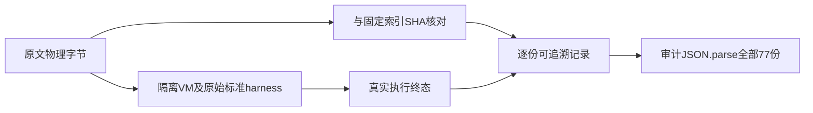

# JSON 剩余原文边界审阅计划

## IDEA

- Intent：完整审阅 JSON.parse 剩余35份原文，区分正式文本输入入口的覆盖与当前无法保留的JS函数对象、转换、原型和reviver语义，不以部分值相同登记整份通过。
- Data：固定Test262提交7ab7fafa0003f73fc85c1b95d88094d33f7eb8bd全部77份原文，已有42份完整适配登记，剩余35份索引和物理SHA，以及不改写JSON.parse的完整原文参考执行。
- Edges：参考Node执行不计zxc通过。ordinary typed恒等入口没有JS全局函数对象、ToString、Proxy、reviver/context或对象descriptor协议。排除记录是当前适配边界，不能声称完整JS兼容或最终语言目标达成。
- Answer：逐份留存原文、metadata、SHA、完整核心观察和排除理由；按标准harness与strict flags原样执行35份，保留真实终态，再登记当前无法完整适配的文件。完成本部分后独立提交push。

## 审阅范围

5份函数反射文件；此前7份输入转换、负零、原型、重复字段和primitive reviver边界；另23份reviver、Proxy、descriptor、遍历顺序及source/context文件。完整callback和反射约束都属于核心观察，不能删掉后只保留文本解析。

`duplicate-proto.js`要求重复字段最后值胜出；当前生产输入parser默认拒绝DuplicateField。这里不能只修改测试解析选项或schema来冒充生产入口符合原文。`text-negative-zero.js`前四个字符串参数得到负零，第五个数值参数经ToString得到正零；仅验证前四项仍不足以登记整份。

reviver error文件的JSON文本通常合法，其错误由callback、getter或Proxy trap触发。typed schema提前拒绝同一文本不等于保留原始异常原因。reviver原文中结果结构未改变也不意味着恒等应用覆盖non-configurable属性行为。

## 审阅结构

## 数据流

## 执行标准

不包装或替换JSON.parse，防止改变length/name/constructor或丢弃reviver参数。每份使用新VM，加载sta.js、assert.js及metadata includes，按原始flags执行；原文修改prototype后仍执行其全部清理和断言。

逐份证明已有入口无法完整保留哪些观察；不增加针对case ID的生产分支，不引入JS运行库。JSON.parse目录闭合只表示77份都有审阅结论，其中excluded仍不是兼容通过。全量Test262和全部zxc特性的工作继续保留原始目标。

## 状态

35份原文全部SHA核对，70次普通/严格原样参考执行通过，35份完整文件已登记excluded。JSON.parse的77份原文全部有审阅结论（42 adapted、35 excluded）；新增ZX案例为0，未宣称完整JS兼容。覆盖审计与家族查询均通过，具体证据在同名功能目录。
