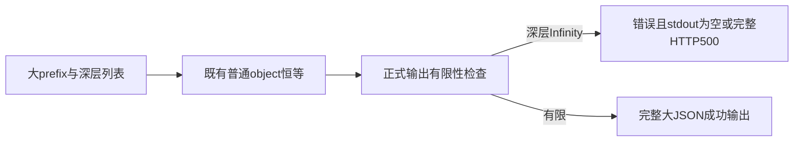
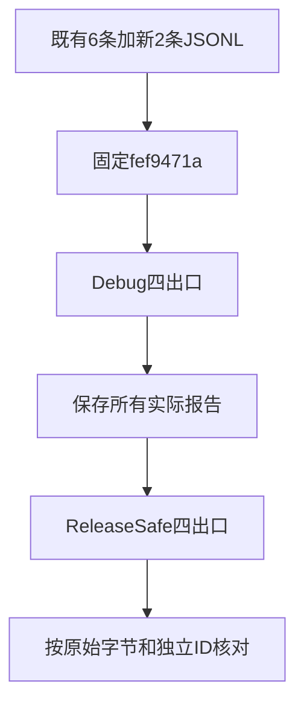

# JSON 大前缀错误输出边界计划

## IDEA

- Intent：补齐上一批自我复核指出的流式写出边界，非有限数位于大字符串之后时，错误也不能留下半截JSON。
- Data：50案例部分fef9471a已通过两个模式。固定生成器的CLI stdout writer使用4096字节缓冲；旧object的prefix只有几个字节，不能迫使正常编码进入流式写出。通用object恒等源码和四出口驱动已成熟。
- Edges：不改生产实现或驱动，不改已有50个ID；只追加两个独立输入。8192字节普通ASCII字符串用于超过当前缓冲容量，同时仍低于argv和HTTP正常传输大小。失败与正常控制使用相同长度前缀，避免把传输拒绝误当作序列化拒绝。
- Answer：先存完整JSONL草稿，正式仅追加object.jsonl两条记录；在固定fef9471a用test-application-json-output执行两模式四出口，保存52ID原始观察和其中新2ID的16次观察；成功后单独提交push。

## 验收与限制

大前缀非有限用例先执行，正常控制随后执行，检查同一个Wasm实例和HTTP进程可继续使用。新增ID仍为2，三种应用目标及HTTP、两个模式共16次新增观察；52个ID两模式四出口共416次观察，不当作416个独立案例。既有372条入口测试和共用驱动已在上一部分同一生产源码上通过，本次不重复扩展到无关门禁。

8192是本次边界输入大小，不是生产特判。它不能证明任意长度、OOM或内存泄漏；原始执行失败、传输异常或超时不计为预期NonFiniteJsonNumber。

## 状态

两条正式记录已追加，Debug/ReleaseSafe均实际40/40步骤通过。52个共享ID四出口两模式共416次观察，新2个ID共16次观察；错误为空stdout或完整HTTP500，随后大前缀有限控制正常。具体证据与边界见[执行结论](JSON大前缀错误输出边界/执行结论.md)。
