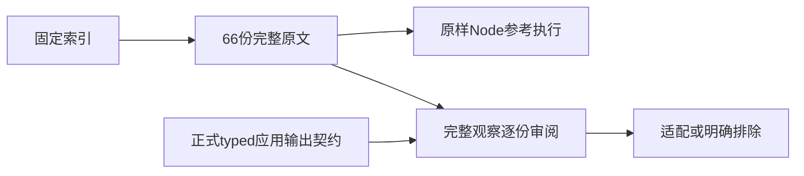
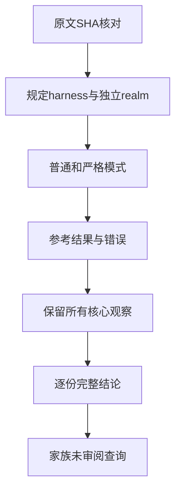

# JSON 字符串化完整原文审阅计划

## IDEA

- Intent：完成固定Test262的JSON.stringify家族逐份审阅，保留完整函数反射、动态属性、replacer、toJSON、缩进和UTF-16观察，明确普通typed输出的真实边界。
- Data：固定上游索引与66份完整原文，独立只读审阅已核对66/66 SHA；正式应用非有限JSON缺陷已有真实复现及e5d21277修复，最终50个应用回归在独立检出执行。
- Edges：Node执行只证明原文参考行为，不代表zxc通过。原文不改写JSON.stringify、不删除参数或断言；跨realm使用真实独立VM上下文。数值负零和非有限两份完整核心可以由typed数据表达，但当前应用输出契约不同，不能笼统说成动态JS无法表达，也不能把解析后数值相同冒充精确文本相同。
- Answer：保存完整原文、元数据、SHA、参考执行与逐份结论；按公开契约登记可适配或排除，不新增假通过ID。最终家族查询未审阅为0，只表示审阅闭合，不宣称JS兼容闭合；完成后单独提交push。

## 数值边界

value-number-negative-zero.js包含标量-0、混合tuple以及固定key对象三次精确文本观察，不能只取其中一次。value-number-non-finite.js包含标量Infinity、对象-Infinity、数组NaN三次精确文本观察，不能删除容器或把要求null改成成功或错误。普通应用输出的NonFiniteJsonNumber政策保持IEEE计算并拒绝JSON中非有限结果；它与原文JS返回null不同，审阅结论必须显式指出。

primitive文件含undefined结果；ASCII转义同时包含动态key和value；Unicode文件12次观察中10次含孤立surrogate。不得删掉这些观察，仅靠其余普通值登记整份通过。

## 状态

66份完整原文已逐份登记excluded，132次原样Node普通/严格执行通过。两份数值原文的六个核心观察由六个普通ZX应用在三目标完成18次精确文本核验，全部确认明确契约差异；没有新增ZX通过或适配ID。家族查询未审阅为0。目录仍80585条，整体review为2619条，其中adapted732、equivalent103、excluded1784，未审阅50978，关联5314条不变。证据保存与自我批判见本目录审阅结论及执行结果。
