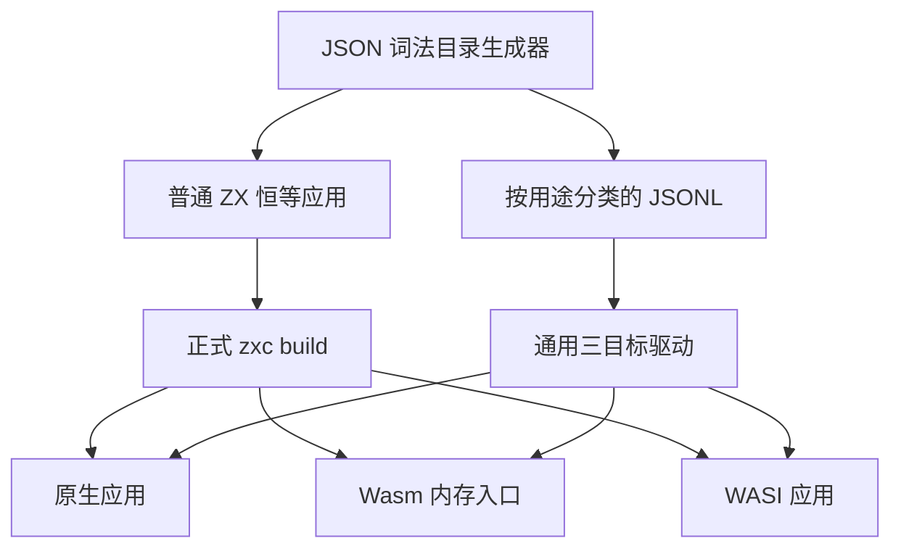
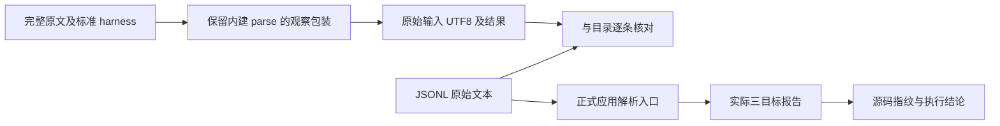

# JSON 空白与对象控制字符测试计划

## IDEA

- Intent：完整保留 19 份 Test262 JSON.parse 原文的 344 次文本解析观察，经普通 typed ZX 恒等应用的正式 JSON 输入入口验证。
- Data：固定 Test262 提交 `7ab7fafa0003f73fc85c1b95d88094d33f7eb8bd` 的完整文件、索引 SHA-256、原文执行产生的原始输入字节，以及 Debug/Safe 三目标的实际运行报告。
- Edges：适配文本解析与结果/拒绝，不声称提供 JS 全局 JSON.parse、异常对象、输入 ToString、对象原型或 reviver。NUL 只能由 Wasm 内存入口传输，native/WASI 分别明确缺测。部分对象负例在控制字符前已有未加引号 token，不能说控制字符已被读取。
- Answer：19 份完整原文逐份登记；新增 344 条上游观察与 1 条独立合法对象控制；复用通用三目标驱动，检查精确 SyntaxError、原始输入字节和正常结果；完成后提交 push。

## 原文边界

`15.12.1.1-0-1..6/8` 共 7 次拒绝，`invalid-whitespace.js` 16 次拒绝，`15.12.2-2-1..10` 各遍历 32 个 raw control，共 320 次拒绝；`15.12.1.1-0-9` 接受原始结构化空白输入。合计 19 文件、344 观察、343 拒绝和 1 成功。

原始 `2-3/5` 使用未加引号 key，`2-8/10` 使用未加引号 value，必须照原文拼接而非照 description 修正。其拒绝发生在 raw control 之前。其他 key 负例在完整 key token 扫描前失败；其他 value 负例通过合法 name 字段匹配后扫描失败。

对象 fixture 为 `{ name: string }`，另加原始文本 `{ "name" : "John" } `，证明同一 schema 正常接受对象。此控制不计入上游观察。结构化空白 fixture 使用 `{ property: {}, prop2: [bool, bool?, f64] }`，接受所有原始 token 和空白；原文只要求成功，准确输出值比较属于额外本地断言。

七份相邻原文涉及 ToString、原型、重复字段、负零及 reviver/context；只截取可解析文本会丢掉核心行为，本部分不把它们登记为完成。

## 实现结构

## 数据流

## 执行与成功标准

1. 先存完整原文列表、逐份审阅和草稿，再同步正式测试文件。
2. 原文按 metadata 的 strict/sloppy 模式完整执行，观察包装仍调用原生 JSON.parse 并重新抛出实际异常。将每份全部输入、结果与目录字节核对。
3. 固定生产提交 `1a7241d6`，执行 Debug/Safe 的 `test-application-json`，保留所有运行报告。每模式本批上游执行 Wasm 344、native 334、WASI 334，共 1012；20 个 argv NUL 观察未执行。独立合法对象控制增加三次实际执行，共 1015。
4. 旧 27 条词法观察同步回归，计数与新增观察分开。生成器检查、类型检查、上游审阅审计通过后复核本次 diff，记录自我批判并提交。

## 状态

19份完整原文正式登记完成，新增345条独立案例。Debug与ReleaseSafe均34/34步骤、372条案例通过，每模式1094次实际目标观察；完整证据见同名功能目录的执行结果与执行结论。
