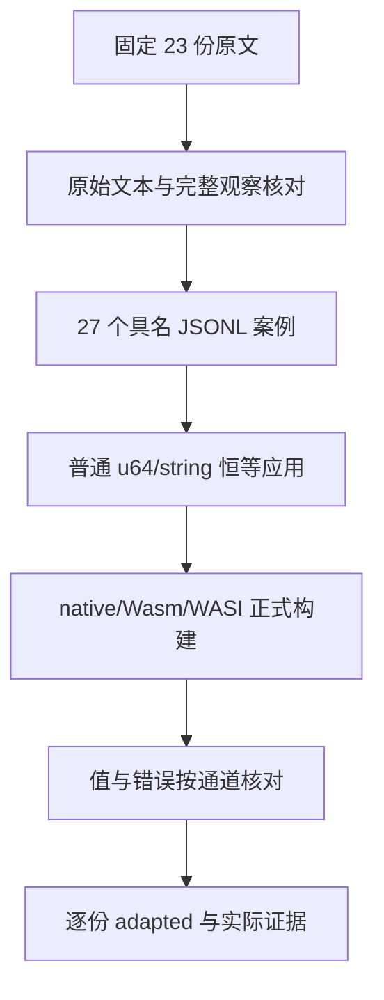

# JSON 输入词法测试计划

## Intent：最终目标

完整保留 Test262 JSON.parse 词法家族 g1/g2/g4/g5/g6 的原始输入文本及成功值、拒绝行为，通过正式生成的 ZX 应用 JSON 入口验证。沿用 packages/test 与分类目录，每部分实际通过后单独提交、推送。

## Data：可用证据

固定 Test262 7ab7fafa 的 23 份原文已全文读取，物理 SHA-256 与索引一致，尚未审阅。四份 g1 各含前置空白接受及分开数字拒绝两个观察，其他 19 份各一个，共 27 个完整观察：14 个成功、13 个拒绝。

CLI 与 WASI 生成入口解析 args[1]；freestanding Wasm 生成入口按长度解析线性内存中的输入。二者实际调用 Zig 标准库 std.json.parseFromSliceLeaky(application.Input, …)，分配策略为 alloc_always。已有 targets/wasm/host.ts 将真实 UTF-8 字节写入内存，wasi_host.ts 使用 argv。正式恒等应用分别接收 u64 与 string，输出同类型；不在应用代码新增解析逻辑。

上一部分 20c2001e 已推送。开始此部分时最新已提交生产修改为 00b2b36e 的 lint 借用语法视图，选择此版本为固定检出，不混入其他聊天的未提交修改。

## Edges：边界与限制

本部分验证 JSON 输入文本的词法语义，不声称 ZX 提供全局 JSON.parse、reviver 或 JavaScript 异常对象。g2-4 缺少终止双引号，JS 原文抛 SyntaxError，而 Zig 标准库预计返回 UnexpectedEndOfInput；明确保留拒绝观察及错误分类差异。g5-2 的第四位 hex 位置仍有引号，应为 SyntaxError，不能混同输入结束。

g4 四份各为八个控制字符组成的一个原始非法 JSON 字符串，不拆成 32 个上游观察，不再次 JSON.stringify 原始文本。含 NUL 的 g4-1 无法经零终止 argv 传输；Wasm 完整执行，native/WASI 按通用文本含 NUL 规则记录未执行的目标观察。其他原始控制字符原样传 argv，禁止按案例 ID 特判。

Wasm 执行 27 个观察，native/WASI 各 26 个，三目标合计 79 次每模式实际入口观察，另有两次 argv 传输限制。不与 27 个独立案例、23 份原文或普通/严格两种参考模式混计。成功结果解析正式 JSON 输出后比较准确值与字符串字节，不强制 JSON 转义排版。失败分别核对 Wasm 状态/错误名、native/WASI 非零退出及 stderr 错误名。

## Answer：交付与成功标准

先在本功能目录保存测试代码、生成器及登记草稿，再写入已授权的正式测试包。扩展 RuntimeSuite.kind 为 application_json，专用 builder 与 Node runner 真正构建 native/Wasm/WASI，复用现有 Wasm host；仍登记 runtime JSONL，字段 json_text 保存原始文本，expected 保存完整值或准确错误名。

对原文按 flags/includes 离线执行并记录每次 JSON.parse 的真实文本与结果，逐字节核对草稿案例。每份原文的全部观察通过后登记 adapted，并披露通道及错误类型适配；不依据源码推断就登记已通过。Debug/ReleaseSafe 各独立执行 27 个登记案例及 79 次目标观察，保存构建命令、二进制/源码/原始文本指纹、日志、报告、生成一致性、类型检查、矩阵审计与逐份完整结论。

## 自我复核

不能用测试进程的 JSON.parse 预先解析后再调用 execute 来冒充生成入口，也不能将非法控制字符重新编码成有效字符串。新的 runtime kind 只负责真实目标执行，不复制 Zig JSON 实现、不引入生产运行库。单元数、观察数、构建数、模式与传输限制独立记录；整体 51,121 份待审仍不由这一专项完成。

## 执行结果

固定生产 00b2b36e，Debug/ReleaseSafe 最终门禁各 32/32 构建步骤通过，27/27 具名案例实际执行，79/79 目标观察准确通过。原文 46/46 普通/严格执行，54 次真实 JSON.parse 调用的原始输入与结果已与 27 条案例核对。全部 23 份完整 adapted 已登记，五个选定家族待审为零；其他 JSON.parse 原文仍待审。

两模式各六次正式应用构建，58 条真实进程命令；Wasm 27 次观察保留所有原始控制字节，native/WASI 各 26 次，含 NUL 的两个 argv 目标观察单独记录。g2-4 实际错误名为 UnexpectedEndOfInput，g5-2 为 SyntaxError，准确差异未被模糊匹配掩盖。23 份测试依赖指纹、五份生产入口源码、实际 CLI 编译器、Zig JSON/argv/构建运行工具源码及应用二进制指纹见 [执行结果](JSON输入词法测试/执行结果.json)。

类型检查、生成一致性、矩阵审计均通过。累计 80,188 个登记案例（runtime 62,645）、2,499 份已审阅（713 adapted、103 equivalent、1,683 excluded），51,098 份未审阅，4,970 个关联案例。统计不代表当前全量执行通过率。

自我复核修正了首次报告被覆盖的问题：按 suite 和模式命名输出并实际重跑，两报告保存全部目标观察；首次通过日志及残留报告仍保留。源码原文没有被改写，27 个观察不按八个组合控制字符、三个目标或两个模式放大成独立案例。生产实现没有违约，未通知指定实现聊天。
