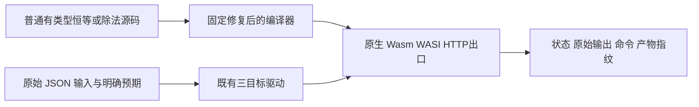
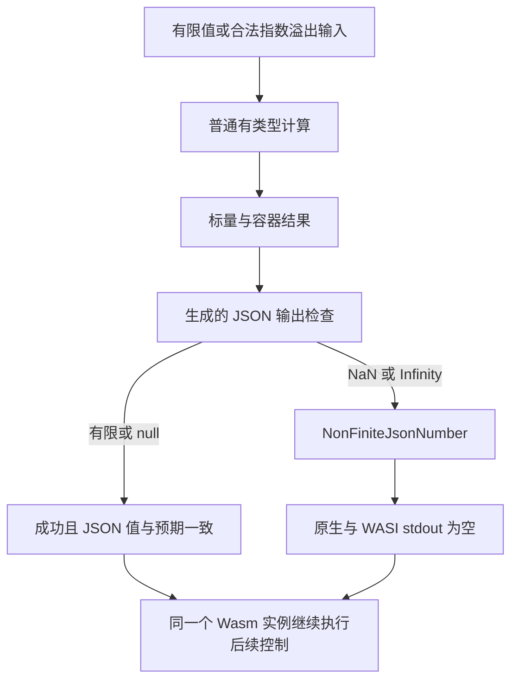

# JSON 输出数值边界回归计划

## IDEA

- Intent：把已确认的非有限 JSON 输出缺陷转化为正式应用回归，保证成功输出为 JSON，失败不会写出半截结果。
- Data：固定 `ebe3d605` 的六个真实应用、21 次目标观察证明 Infinity 成功输出裸 `inf`，NaN 成功输出字符串。实现会话已明确 `NonFiniteJsonNumber` 政策：保留 IEEE 运算，在 JSON 写出前检查。
- Edges：本批测试生产协议，不宣称 JavaScript `JSON.stringify` 兼容。负零按数值保持验证，不强制其文本为 `0`。不删除非有限输入，不在应用中预判测试输入；NAPI、直接 Wasm 标量和关闭结果输出不属于本批。Gateway 复用同一份50个案例，目标观察不再登记成新的独立ID。
- Answer：复用已有 application_json 三目标驱动，增加 f64/f32、除法、嵌套列表、混合元组、可选对象、可选标量以及非有限计算转布尔输出的独立目录案例。保存两个优化模式的真实命令、输入字节、响应、产物及源码指纹；完成后单独提交并 push。

## 结构与数据流

## 验收边界

每个 ID 是一份独立输入与完整输出断言，三目标观察和两个优化模式不增加独立案例数量。列表覆盖空层和不同位置；元组保留字符串前缀；可选对象覆盖 null、空列表和深层非有限数，以检验只访问实际存在的浮点路径。非有限错误精确匹配公开错误名，进程出口要求 stdout 为空。驱动异常、超时、信号和构建失败不计为预期的非有限拒绝。

草稿先存入本功能目录。修复正式提交后，才在固定源码上执行；根目录 `ebe3d605` 全量复跑继续保留原有基线，不混入新测试或修复。新增回归的成功不改写旧基线根门禁。

Gateway额外核验真实HTTP响应：有限值200且为application/json，非有限值500、service failed且不标记application/json；同一服务继续处理后续有限或null请求。临时RX服务只转发同一份正式ZX源码，HTTP驱动读取同一份目录输入，不复制50份输入或编造新ID；结束后核对NonFiniteJsonNumber日志次数及空stdout。

额外8个projection观察保留IEEE能力：正负溢出输入及正负除零、NaN参与普通比较，返回三个布尔字段。此时JSON输出必须成功，不能在输入或运算入口把非有限数统一拒绝，也不能错用输入类型生成输出检查。

## 自我复核

原始缺陷复现的 20 条进程命令和 21 次目标观察分别计数。f32 控制选用可精确表示的有限值，避免把十进制打印舍入差异误当作本批失败。Test262 两份数值原文要求精确文本，仍需独立审阅和登记；本批 JSON 数值比较不能替代它们。

## 执行状态

42个独立案例已同步正式测试。固定fbdae9c5首次Debug实际41/41步骤通过：414条JSON案例（新增42、既有372），1220次实际三目标观察，另22个argv NUL排除项。首轮来源、日志和11份原始报告已保存在首轮Debug目录。

Gateway真实缺陷已得到e5d21277正式修复；独立固定检出在42案例阶段Debug与ReleaseSafe均实际43/43步骤通过，包含各42次HTTP观察：26成功、16错误，16条对应错误日志。中间阶段日志、原始报告和起点已单独保存。

自我复核发现此前形状主要返回浮点类型；为验证只检查输出、保留IEEE输入与运算，追加8个projection观察。最终Debug/ReleaseSafe都实际44/44步骤通过，每模式1244次三目标观察加50次HTTP观察，新增独立ID50。共用驱动及生产修复不改，追加依据是具体语义边界，不据此修改已通过的中间报告。具体来源、计数边界与限制见[执行结论](JSON输出数值边界回归/执行结论.md)。
