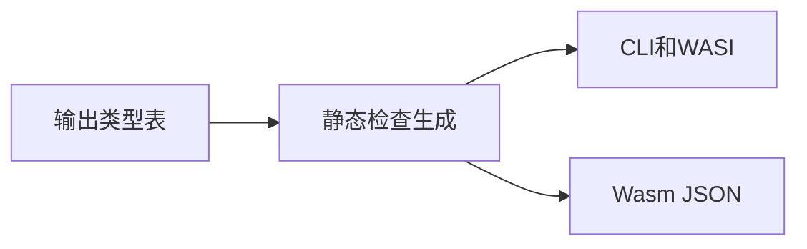
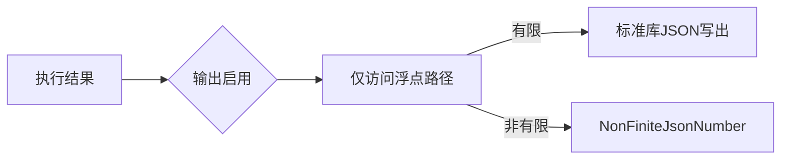
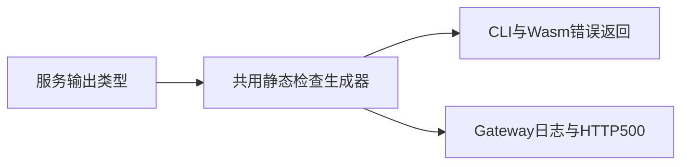
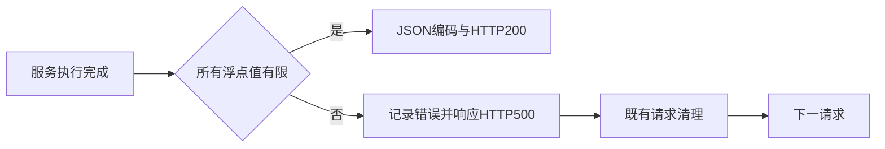

# JSON 非有限数输出修复

## Intent：最终目标

JSON 宿主在输出包含 NaN 或 Infinity 时返回 NonFiniteJsonNumber，保留应用声明的数值类型，保证成功输出为合法 JSON。

## Data：可用证据

测试会话三目标真实运行发现默认 Zig Stringify 输出裸 inf 或字符串 NaN。应用 Bundle 已包含完整输出类型表，genz 可直接按类型生成检查语句。

## Edges：边界与限制

只影响 CLI、WASI 与 Wasm JSON 输出；NAPI 和直接 Wasm 标量保持 IEEE 数值。检查在写出前执行，不改输入和运算语义。关闭结果输出时不检查。只为可能含浮点值的字段生成访问、可选分支和列表循环，无反射运行库，无复制输出对象，无新增测试和全量测试。

## Answer：交付格式与成功标准

genz 共用类型驱动检查生成器，两个 JSON 宿主复用；CLI 从已有 Bundle 传入输出签名。既有构建和专项通过，测试会话负责三目标扩展回归。

## 实施与复核

编译器按 Bundle 已有的 IR 输出类型生成有限数检查，不新增反射函数或 AST 节点。浮点叶子调用 std.math.isFinite；object/tuple 读取既有字段，可选值按实际存在检查，列表只在子类型含浮点时生成循环。共享 JSON 生成器没有改变 NAPI 与直接 Wasm 的标量接口。错误沿 CLI main 或 Wasm 既有 status=1 通道返回，输出关闭时不执行检查。

发行构建 dist 已通过。使用反馈中的原有 scalar.zx/division.zx 完成 15 次真实运行：原生 7 次、Wasm/WASI 各 4 次。有限控制均成功；所有非有限结果均明确失败，CLI/WASI stdout 为空，Wasm result 为 NonFiniteJsonNumber。原始记录位于本目录两个复核结果 JSON，未新增用例源码。

既有 test-wasm-protocol 的 489 项已通过，涵盖标量、JSON、生命周期、Store 与 WASI；test-application-json 全部通过。全部采用 safe，本轮不运行全量测试。

## 自我复核

检查不分配和复制输出数据，但包含浮点数的列表需要在序列化前额外遍历，以保证遇到非有限值时不输出半段 JSON。不能把这项必要边界检查称为没有运行成本。非浮点子树在生成时排除。既有 Bundle 的签名构建和 RX 透传已核对，缺失签名明确拒绝，未建立隐式备用路径。当前专项和手工复核不等于所有嵌套类型与所有优化模式的穷举，后续扩展回归由测试会话负责。

## Gateway 响应出口补齐

Intent：同一 JSON 有限数政策覆盖 HTTP 响应，拒绝成功发送非法 JSON，保留后续请求能力。

Data：测试会话固定旧基线实际发现 Gateway 的独立 Stringify.valueAlloc 出口同样返回 inf 和字符串 NaN。Gateway Service 构建已有当前 program.types/output_type，可直接借用传给共用生成器。

Edges：按既有服务错误约定记录 NonFiniteJsonNumber 并返回 HTTP 500、正文 service failed；只在 JSON 编码前检查，不改变服务执行顺序、Store 或错误后的请求清理。不把内部错误改为 HTTP 200 JSON 字符串。

Answer：共享生成器接受边界自己的失败语句，CLI/Wasm 保留默认错误；Gateway 提供日志和既有 respond 调用。复用原有真实 Gateway 程序、现成 HTTP 专项验证后续有限请求。

### Gateway 验证结果与自我复核

根目录 dist 和 test-gateway 以 safe、j2、本地工具链归档通过；既有 HTTP/路由/Store/空 Gateway 共 86 项通过。复用测试会话的同一普通 Gateway 应用完成 7 个真实请求：开头有限 1 返回 200，随后五个非有限结果均为 500、service failed，末尾有限 2 仍返回 200。stderr 恰有五条 NonFiniteJsonNumber，stdout 为空。原始响应记录位于 Gateway复核结果.json；没有覆盖测试会话的旧基线记录，也没有新增测试用例或运行全量测试。

复核确认检查借用服务当前类型表，表在同步源码生成期间有效，不留入返回产物；记录错误与既有服务失败使用同一响应约定。自我批判：上一阶段仅覆盖 CLI/Wasm，遗漏独立 Gateway 序列化出口；本次同时检索生成器的所有 Stringify 调用，确认应用 JSON 输出仅这三处。该检索不能证明所有标准库 JSON API 和编译器内部元数据编码的行为，本次结论不扩大到那些接口。
