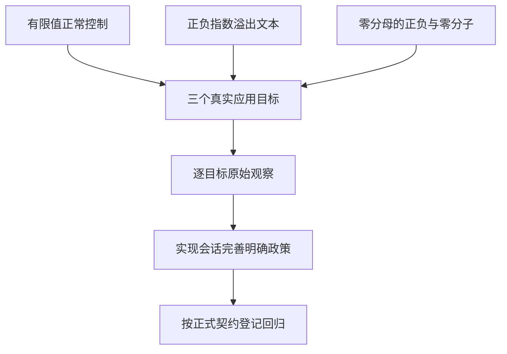

# JSON 非有限输出核验计划

## IDEA

- Intent：核验正式应用默认输出JSON的契约能否保留浮点非有限结果，避免成功退出却输出无法解析的文本。
- Data：生产CLI/WASI与Wasm输出直接调用默认std.json.Stringify；标准库f64 Infinity走裸数值格式化，NaN走字符串格式化。合法JSON数字文本1e400在f64转换中可能溢出为Infinity，现阶段只是源码预测。
- Edges：本阶段是实际复现，不先假定null、错误或字符串的最终政策。JSON.stringify的JS严格文本结果不自动成为zxc输出承诺；只将成功却不是合法JSON的实际结果视为已确认契约问题。非有限数仍应保留数值计算能力，不能通过删除浮点行为使测试通过。
- Answer：使用无输入特判的普通f64恒等和除法应用，经真实native/Wasm/WASI构建与运行留存原始输入、状态、stdout和stderr；加入正常有限值控制。确认实现问题后才通知已授权实现会话，由其完善正式序列化边界，再补正式回归。

## 最小复现结构

## 数据流

## 状态

固定ebe3d605的Debug CLI实际构建六个三目标应用，21个目标观察均完成：6个有限控制正常，12个非有限结果成功状态却输出非法JSON，3个NaN结果变成JSON string。真实问题已通知实现会话；进程命令总数为20，首次通知误写24已补正。原始结果、源码与产物哈希留存在本功能目录。

实现会话已提交fbdae9c5，明确写出前报NonFiniteJsonNumber，保持IEEE运算。本报告记录修复前的实际缺陷；正式修复后的回归另见[JSON输出数值边界回归计划](JSON输出数值边界回归计划.md)，未在本报告登记通过。
