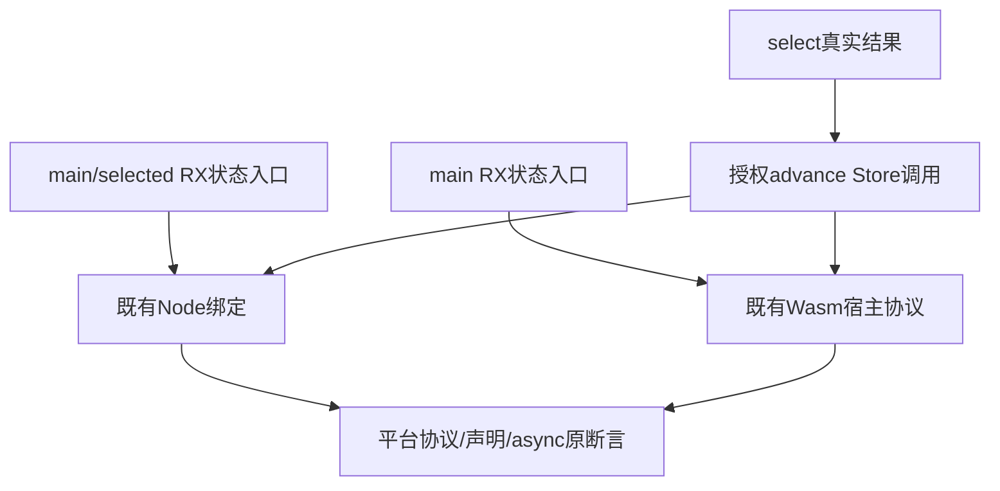
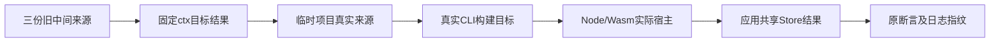

# NAPI与Wasm状态入口来源同步计划

## Intent：最终目标

完成既有 NAPI 与 Wasm Store 状态入口的最终 Call/ctx 契约迁移，继续验证平台公开协议、绑定、异步驱动和状态行为。

## Data：可用证据

三份正常 RX 主检出 WIP 仅 out→name，返回还使用 ctx.result。NAPI selected 的前置 select 结果旧名为 ctx.increment。当前 Call 目标固定产生 $ctx.advance/$ctx.select；Store签名、授权和业务字段无需改变。原 Node/Wasm 驱动直接复制真实 fixtures 并构建 main/selected，async 驱动消费既有产物，不生成新的RX语法。

## Edges：边界与限制

只改三份正常 RX，无新增测试或生产修改，保存迁移前 WIP 原字节。保留 Store.from/as/setter、advance 输入结构、selector 实际调用、Node 与 Wasm ABI/声明/发布/资源/状态预期。不改 async 断言，不把平台标准宿主加载当新专用运行层，不新增动态加载机制。其余故意拒绝夹具与外部框架签名不参与处理。

## Answer：交付格式与成功标准

三份同路径草稿与正式来源一致；固定新检出执行现有 test-napi-protocol、test-napi-bindings、test-wasm-protocol，ReleaseSafe、-j2，保留完整退出码及每类脚本检查/Node场景/Zig实际缓存，明确层级。成功后独立提交push；若平台环境或真正实现失败，分别归因而不是删断言。

## 自我批判

selector结果名必须来自目标select，而不是继续沿用旧自定义increment绑定。只验证addon/module加载会漏掉值、错误和状态驱动，必须完成原平台门禁。平台执行检查次数与Node父子场景不同，不用相同程序重复启动冒充新增语言特性。

## 最终执行记录

固定0087a0fb执行三个原平台门禁，退出0，35/35构建步骤。三份来源实际用于Node绑定、状态选择及Wasm状态生命周期构建；正式/草稿/检出逐字节相同。NAPI原协议脚本561项、Wasm原脚本489项通过；绑定与发布脚本64项通过，其中已经包含33项TypeScript声明检查，不再次相加。

绑定门禁另调用原async子脚本，完成protocol18、ownership42、State11、Worker12、execution failure8，共91项既有检查；子脚本与父计数分开报告。本部分无顶层Zig run test声明实例；实际Zig生成产物由原Node宿主脚本编译执行，不等同新增语言声明。新增测试、目录案例和Test262审阅均为0，无生产源码修改。
