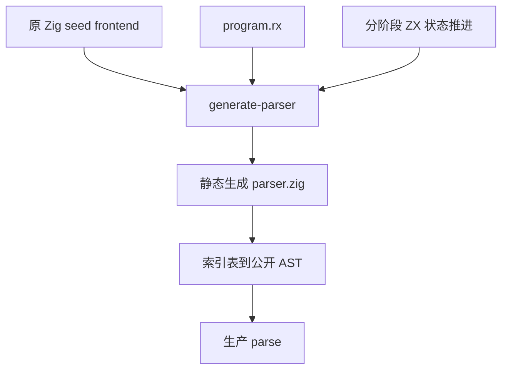
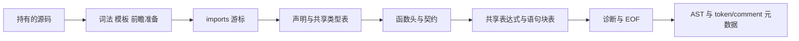

# 统一 Program 解析器实施记录

## Intent：最终目标

让生产 Program 解析由 RX＋ZX 执行，统一 imports、declarations、header、body 阶段，只准备一次源码并传递索引表。原 Zig parser 作为 seed 保留，避免生成器依赖自身；这是一项自举阶段，不等于整个编译器已自举。

## Data：实现与证据

### RX 编排与 ZX 逻辑

正式入口为 `packages/compiler/src/zx/frontend/parser/program.rx`：

```rx
<Module>
  <Call module="prepare" in={$in} />

  <Call fn="program/imports" in={$ctx.prepare} />

  <Call fn="program/declarations" in={$ctx.imports} />

  <Call fn="program/header" in={$ctx.declarations} />

  <Call fn="program/body" in={$ctx.header} />

  <Call fn="program/finish" in={$ctx.body} />

  <Return value={$ctx.finish} />
</Module>
```

imports 与 declarations 按当前游标访问 token，阶段结束时保留下阶段 token；declarations 在非类型 export 处回退。函数头复用声明生成的类型表，函数体继续使用函数头的表达式、契约和状态块表。诊断收口在成功后校验 EOF，支持纯类型文件。

表达式空表从 initial 抽为 `expressions/state/empty_tree.zx`，由既有入口和 Program 共用。阶段 helper 按 imports、declarations、header、body 子目录组织。

### 所有权问题的真实原因

最初草稿失败并不是必须扩展语言：loop 的消费型状态应以 owned 工厂调用初始化；owned 输入中直接索引绑定 token 对象会消费其来源。`token.zx` 使用借用输入读取 token，再构造标量组成的 Token，阶段更新消费完整状态。没有复制源码或 token 数组，也没有放宽所有权检查。失败草稿已删除，保留此诊断说明。

### 生产 ABI 与构建边界

`program_adapter/` 预分配类型、表达式和语句块数组，将索引关系恢复成现有公开 AST。块按子块先于父块的发布顺序转换，表达式指针指向预分配数组，避免递归展开重复节点。适配不重新判断语法；名称、字面量和模板文本借用正式 parse 持有的源码，临时生成状态转换后释放。

构建新增 generate-parser，使用原 Zig lexer/parser 的 seed 编译 RX＋ZX Program。`parser_options.generated_parser` 明确区分 seed 与生产 frontend，生成工具不依赖生成中的 parser。生产 parse 从同一准备结果转换 token/comment 元数据，不额外扫描源码。





### 已完成验证

- Program RX 成功生成 Zig；静态 AST 桥接程序在 Debug 下成功构建并运行。
- 210 份现有 lexer/parser ZX 源码，完整 Program AST 与原 Zig parser 对照，0 差异，见 `已有源码核对.json`。
- 201 份现有语法材料，其中 41 份产生语法诊断；AST、诊断代码、位置和消息对照，0 差异，见 `已有边界核对.json`。
- `zig build dist -j2` 成功，生产 CLI 已使用生成 Program parser。
- 新 CLI 再编译 `program.rx`，产物与原 seed CLI 的生成结果 SHA-256 相同：`df55326b73e28a230fec8a2f50b8a6de7973fb603392f150c05555de0b8da55d`。这是 Program 生成结果一致性，不是整个编译器 stage 3 完成。
- 新 CLI 编译共用表达式初始化源码成功。
- 新 CLI 构建既有 async_value 示例成功；输入 0 返回 0，输入 41 返回 42，确认生产解析结果经过后续分析、生成与实际执行。
- AST 对照中发现并修复 import 路径引号去除问题；构建发现并修正 RX 文本输入类型名。

桥接工具 `program_reference.zig` 只调用新旧实现并输出结果，未新增测试用例；核对使用已有源码和边界材料。通用 CLI build 的完整内部状态 JSON 宿主构建被主动停止，改用生产所需的 AST 桥接构建；停止的命令不计为成功。

## Edges：边界与限制

- 不执行全量测试，不把 411 份材料对照当作一般语义等价证明。
- RX 属性用的 parse_expression 仍是原 Zig 实现，尚未切换。
- 语义分析、模块解析、所有权、IR、genz 和 CLI 仍需迁移；保留既有总体目标。
- 零专用运行库：生成器输出普通 Zig，构建静态链接；AST 适配是编译器内部数据接口，不新增应用运行层。
- 旧递归 AST 转换仍需要分配结构；源码字符串共享，不宣称所有内部转换零分配。

## Answer：交付与自我复核

交付为正式 Program RX＋ZX 源码、静态 AST 适配、seed/生产构建接线和上述核对记录。生产入口已验证，下一阶段切换 parse_expression，然后继续后续语义层自举。

自我复核：本阶段满足 RX 编排、ZX 语法、共享表和真实生产接线要求；生成结果一致性与运行材料覆盖支持本阶段交付，但不能缩减或替代完整自举与此前登记的标准库等长期欠项。
