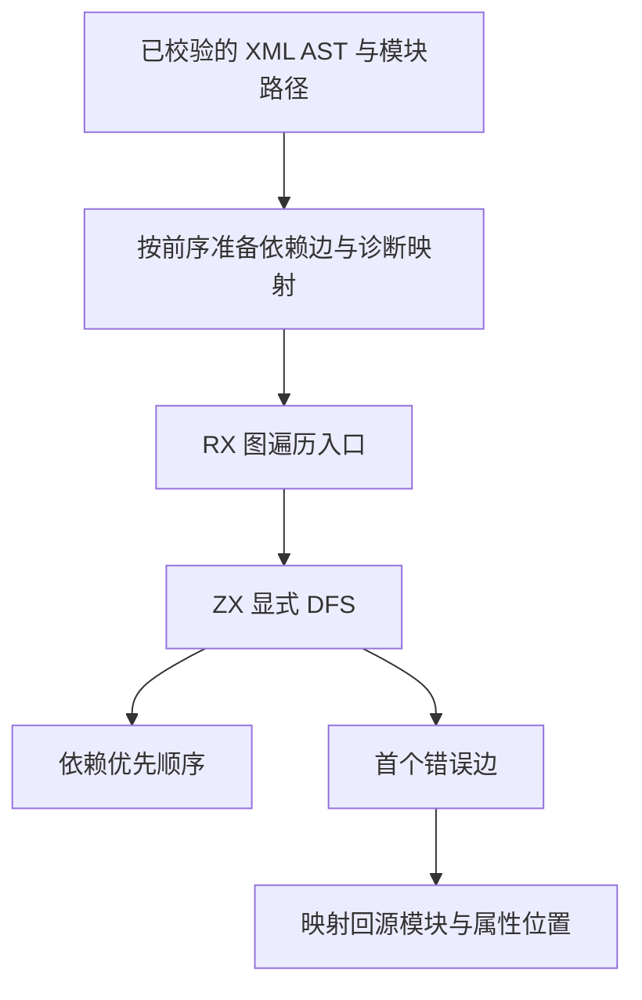
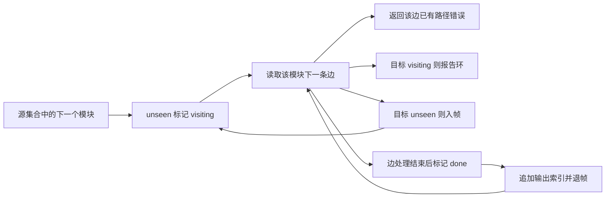

# RX 依赖图遍历自举

## Intent：最终目标

把 RX 模块图的访问状态、环检测与依赖顺序计算迁移到 RX＋ZX。保持整个注册集合无环、所有嵌套分支和 Import 都构成依赖的约束，保留首个诊断的位置和遍历顺序。

## Data：现有实现与迁移边界

当前 `module_graph.zig` 使用显式帧栈按源集合顺序进行 DFS。每个模块的 XML 节点按前序访问；遇到本地依赖立即进入被引用模块，完成后继续原位置。完成模块后追加其索引，得到依赖先于使用者的顺序。

准备层将每个模块的所有依赖按 XML 前序排列为连续边区间。保留源节点与属性作为诊断映射。现有路径解析与包引用分类仍在准备层执行；解析失败记录到对应边，不能提前返回语义诊断，否则会改变 DFS 首错顺序。

ZX 使用预分配的标记、边游标、模块帧和输出索引数组，以 loop 状态中的索引更新实现迭代 DFS。帧容量为模块数，遇到 visiting 即报环，不会递归进入已在栈中的模块。RX 编排计算入口，Zig 只准备图数据、适配结果和传递诊断。

## Edges：边界与限制

- 不关闭或缩减环检测；未使用 Import、条件分支、共享依赖和菱形结构均保留原契约。
- 路径准备失败延迟到 DFS 访问相应边时报告；内存耗尽仍立即失败。
- 不复制源码或路径字符串来驱动遍历，只使用模块与边索引。
- 生产静态链接生成的 Zig，seed 保留原实现以避免生成器依赖自身。
- 本阶段不宣称路径类别、包引用分类、Schema 或整个编译器已自举。
- 不新增测试用例、不跑全量；复用模块图与 RX 文本专项，检查生成代码是否复用数组，避免每次访问复制完整状态表。

## Answer：交付与成功标准

正式 RX＋ZX 遍历、最小准备和结果适配、独立 seed 接线，以及真实专项结果。比较完整诊断和依赖顺序，检查分配失败清理与受限栈行为；性能复核以实际生成代码为证据。完成后记录尚存的原生语义与自我复核。

## 实施结果与验证

正式入口为 `dependency_graph/validate.rx`，调用 `walk.zx`；`initial.zx` 构建工作数组，`model.zx` 定义图和状态。图采用 offsets、targets、issues 三个标量数组，避免每条边使用对象指针。offsets 含结尾哨兵；工作数组长度为模块数。

生产 `module_graph.zig` 只准备数据、调用生成模块并适配结果。原 DFS 保存在 `dependency_graph/seed.zig`，只供生成器的 seed 构建使用。准备层通过规范化路径哈希表寻找目标，仍按源码前序追加边，哈希表枚举顺序不参与 DFS。

检查实际生成代码确认：循环状态按值保存，循环内没有状态对象分配；四个可更新数组分别在首次写入时取得复用缓冲，之后按索引更新。图遍历时间为 O(V＋E)，工作数组空间为 O(V)，准备层另持有 O(V＋E) 的索引及诊断映射。没有新运行库或动态回调。

- `zig build dist -j2` 成功。
- `packages/test` 的 `zig build test-module-graphs test-rx-text -Doptimize=safe -j2` 成功，覆盖 10446 项模块图与 122 项 RX 文本检查，包含既有分配失败、深链和受限栈检查。
- `graph_reference.zig` 复用已有图夹具和 JSONL 数据，比较保存于相邻 `zxc_zig` 目录、提交 `0ce24cec` 的原生模块实现与当前生产实现。10292 份既有图材料、9074 次诊断，完整诊断和依赖顺序均为 0 差异，结果见 `既有图核对.json`。没有新增图用例。
- 原 Zig CLI 与当前生产 CLI 生成图模块的 SHA-256 均为 `136b22981019de56915b0f39a7efd5d5a8d1a183da4ff0853cff46ca9d906aa1`。

对照程序在本目录执行 `zig build -Doptimize=safe -j2`；其 `graph-reference` 可接收现有 `packages/test/tests/rx/modules/graphs/{3,4}/*.jsonl` 与 `resources/*.jsonl`。需要保留用户指定的相邻 `zxc_zig` 基线目录。

## 自我复核与剩余边界

没有以原生环检测回调包装成自举，也没有削弱未使用 Import、分支或路径别名的约束。诊断位置仍来自原始 AST，路径解析错误按遍历顺序延迟报告，有限材料对照不能替代一般图的形式证明。

图准备、依赖标签识别、包引用分类、路径类别与 Schema 仍有原生实现，尚未完成整个 RX 语义层或编译器自举。准备表和首次写入缓冲仍有分配与固定次数复制，不能宣称零分配或最优常数开销。未新增测试用例，未执行全量测试。
