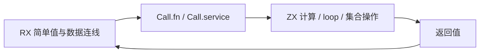
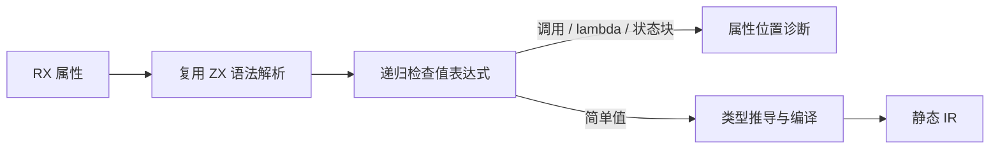

# RX 值与 ZX 逻辑边界

## Intent：最终目标

按用户最新要求，禁止 RX 内联 loop 及 value 中的复杂调用。RX 负责模块编排和数据连线，ZX 负责计算与迭代。以明确语法边界落实：RX 值不执行函数或方法调用，也不定义 lambda 或状态更新块；调用统一通过 Call.fn 或 Call.service。

## Data：可用证据

此前 RX 类型推导专门支持 loop、集合回调和列表操作，普通属性编译还可直接复用完整 ZX 表达式分析，形成两条允许复杂逻辑进入 RX 的路径。统一模块设计已明确 RX 是编排层、ZX 是逻辑层；此前文档推荐 RX 内联 loop 偏离了这一分工。

## Edges：边界与限制

保留字面量、输入和上下文引用、字段/索引访问、对象与列表组装、模板插值及简单运算。嵌套对象、分支、索引和模板中的调用同样拒绝，不依据文本长度或调用深度猜测复杂程度。Store 初值等经同一属性分析入口处理的值遵守相同限制。

ZX 中的 loop、map/filter/reduce 与列表操作不变。RX Call 节点传入简单值并接收结果；ZX 被调用函数可继续实现循环、所有权消费和业务逻辑。结构检查与语义编译仍是不同入口，不以 check-rx 的结构成功替代编译约束。

## Answer：交付与成功标准

在 RX 属性 AST 进入推导或编译前递归检查表达式，返回带实际属性源码位置的 unsupported 诊断；撤除 RX 专属内联调用推导代码，同步当前指导与示例。重放已有含内联调用的材料确认拒绝，并实际构建运行 Call.fn 调用 ZX loop 的应用，确认 RX+ZX 编排仍工作。不新增测试用例、不执行全量测试。

## 执行结果与自我复核

已在共用 attribute.parse 入口检查 AST，普通属性 compile/compileForLinking、项目约束推导与 Store 属性读取均经过该入口。直接调用推导器遇到 call/lambda/state_block 也返回同一规则诊断。删除原 RX calls 与 iteration 推导模块；ZX 中的循环和调用实现保持不变。

发布构建成功。重放前一版本 adjust.rx 中对象内的 loop，以及已有 owned_pop.rx 中的列表方法调用，都在对应属性位置返回 unsupported，未生成产物。迁移后的 adjust.rx 用 Call.fn 调用已有 adjust.zx，实际输入 values=[2,4]、increment=1，返回 original=[2,4]、values=[3,5]、total=8。当前示例直接返回 ZX 输出，取消原 RX 内联示例额外的 adjusted 包装层。自举 expression.rx 仍可生成 Zig。详情见 [RX 值边界核对](RX值边界核对.json)。

此次核对没有覆盖所有 AST 分支的独立负例，也没有运行全量测试；限制通过穷尽 AST 分支遍历实现，不能把两次拒绝当作全部位置的运行证明。曾尝试使用另一既有 fixture，但其 bridge 服务由测试装配提供、不能直接经 CLI 装载，未将该次路径失败计作规则验证。原来期望 RX 内联调用成功的历史测试需要按新语言边界调整，不能为了保持旧预期而放回内联逻辑。
