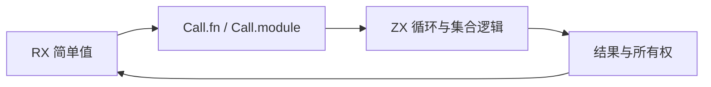
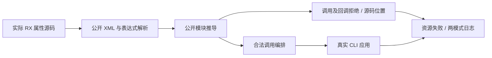

# RX 值边界与 ZX 调用回归

## Intent：最终目标

落实用户最新 RX 编排／ZX 逻辑分工：RX 属性中不能执行函数、方法或回调，递归数据组装不能藏入调用；合法的简单表达式与 Call.fn／Call.service 编排继续执行。迁移已有正向内联逻辑测试，使全仓库门禁不保留旧契约。

## Data：可用证据

实现会话用户消息 01a10d84-b4bd-75d2-8ed7-6f0d1414466d 明确禁止 RX loop 内联及 value 复杂调用。当前 RX值与ZX逻辑边界.md、README 和 value_rules.zig 已规定 call/lambda/state_block 均拒绝，并递归检查字段、索引、运算、条件、对象、列表、模板和 match。生产改动仍由实现会话推进。本轮先使用只读清点定位既有测试，再做最小迁移。

## Edges：边界与限制

本轮只写测试包和执行文档，不代实现会话修改生产。结构校验成功不能代表语义编译允许调用。拒绝测试验证源码、实际属性位置、unsupported 消息和失败清理；不把调用字符串当成表达式。已有所有权断言需要通过 ZX helper 保留实际消费与别名行为，不能删掉断言换成简单成功用例。若原测试专门验证已撤除的内联回调，改为明确拒绝，不冒称其旧语义继续覆盖。

## Answer：交付与成功标准

新增 RX value 策略门禁：共享真实源码夹具供公开推导和 CLI 重放，覆盖根调用、递归容器、分支、索引、模板、控制节点以及回调；每个语义案例保留独立声明。正向 CLI 验证 Call.fn 执行 ZX loop、Call.module 串联 ZX 集合处理、简单值组装和含调用文本的字符串。同步 loop_policy RX 诊断及既有内联正向材料，执行受影响入口的 Debug／ReleaseSafe、类型／格式检查。结果及自我复核写入本目录，部分完成后独立提交 push。





## 迁移范围与具体实现

只读清点定位五份既有 RX 夹具、七个 Zig 测试文件中的 24 条内嵌 RX 材料，以及两个 CLI 文件。保持所有权语义的材料转为显式 ZX 调用；专门验证旧内联调用的材料转为 unsupported 拒绝。所有权测试仍检查独立 owner、重复移交、借用别名、服务 relay、Task 捕获与 Store 发布冻结，不把这些诊断改成语法拒绝。

共享消费 helper 位于测试专用 `rx/support/collections/`，通过静态 Zig 夹具模块向不同测试根提供同一份 ZX 文本，避免越过 Zig 模块文件边界。pop helper 保持原返回元组，reverse helper 也保留原有 [列表, void] 元组，不能为了便于调用而改写原运行测试的 ABI。

```zx
export type Input = u64[]

export type Output = [u64[], u64?]

export default function (in: owned Input): Output {
  return in.pop()
}
```

既有 RX pop 用例保持数据和结果，只移动计算边界：

```xml
<Module>
  <Call fn="map_values" in={$in} />
  <Call fn="pop_values" in={$ctx.map_values} />
  <Return value={$ctx.pop_values} />
</Module>
```

新增两个执行目标仅复用既有构建节点：顺序目标选出 owned_pop、owned_service、control_owned；并行目标选出 task_capture 的源码及八条归档／导入／再发布路线。全量入口原依赖保持，没有复制测试或扩大通过计数。

尝试使用 grit 的 HTML 模式迁移 RX 标签，实际报告 RX 源码解析失败且零匹配；其可用语言列表也没有 Zig。随后按文件和明确片段执行有数量断言的最小替换，没有对整个仓库做宽泛模式改写。

## 迁移期间的历史 Call 契约

执行期间实现会话收到用户新决定：01a10d94-243d-7e83-b3fe-e158588bd5b8 要求移除可通过 name 获取的 out；01a10d96-4da3-7852-a349-a699e4fc1752 要求 Call.in 改为 args。当前 Call 仅接受 fn/service/module/name/args/setter；Task 只接受 name，Module.in/out 仍是公开类型契约。结果统一为 ctx.<name>，默认名字来自目标文件名。内部分析结构的 Call.out 仍保留，不能机械替换内部契约。

因此此前旧属性下的通过日志只能证明当时检出，不能充当当前 API 验收。新增值门禁及正向夹具先同步 args/name，再执行；全包既有 RX 材料按词法标签边界迁移，保持输入、结果形状、调用顺序与所有权边界。被撤除属性的拒绝用例刻意保留，默认名、同名冲突、void 没有值绑定、Task 作用域另行核对。旧多段输出路径不再是合法单 name，相关路径矩阵必须改为当前名称规则，不假装旧路径功能仍在。

## 最终契约与本次独立交付

最终规则以实现会话后续用户消息为准：Call.in 保留；Call.name/out/service 移除；本地 RX 与编译模块均从 Call.module 引用，service 留给 Route；Call 结果为 $ctx.<目标最后文件名>，Task 结果为 $ctx.task.<name>。Task.out 是可选花括号表达式，不能与同一任务边界的 Return 并用。Module.in/out 保留。本次公开用例已使用该契约，历史 args/name/ctx 日志不作为验收。

此部分独立交付新增值策略门禁和 Task 聚合门禁。既有约 188 份 RX 材料的批量迁移还在工作树中，不在本次提交中，也不声称它们在新契约下已全部通过。具体 Task 结果范围见 [Task 聚合回归计划](Task聚合与目标结果回归计划.md)。

| 检查              | Debug                           | ReleaseSafe                     |
| ----------------- | ------------------------------- | ------------------------------- |
| 值策略公开 API    | 42/42 实际通过                  | 42/42 实际通过                  |
| CLI 值拒绝        | 37/37 实际通过                  | 37/37 实际通过                  |
| CLI 合法编排      | 3 个应用、11 次执行通过         | 3 个应用、11 次执行通过         |
| Task 输出公开 API | 36/36 实际通过                  | 36/36 实际通过                  |
| Task 输出 CLI     | 32/32、14 个应用、42 次执行通过 | 32/32、14 个应用、42 次执行通过 |

值拒绝材料包括函数/方法、map/filter/reduce、loop、lambda、对象/列表、运算、条件、字段/索引、模板、match、控制节点、UTF8/CRLF、Store 初值，以及顺序/并行 Task.out 内的调用。正向应用把计算保留在 ZX，RX 只引用、组装及简单运算；同时确认带调用文本的普通字符串仍是数据。共享的 API/CLI 材料不累计成互不相同的语义用例。

## 自我复核

迁移期间出现多次旧属性、旧结果根和旧模块加载方式引发的失败。这些是活动工作树契约变化，不能作为编译器缺陷报告。新嵌套任务夹具只返回 $in 时缺少具体类型约束，补入真实 number 调用后保留原嵌套返回语义并通过。所有权旧夹具的历史执行结果也不能代替本次最终契约验证。

本次没有发现需要通知实现会话的新缺陷；没有修改生产实现，没有新增 Test262 适配记录。完整 RX 迁移、归档、Gateway 和 Store 执行门禁仍需后续逐组验证，不能从这两组通过推断全包通过。
