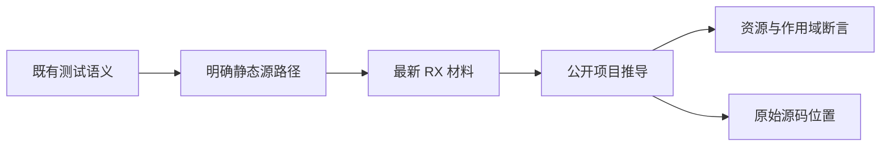

# RX 公开推导迁移计划

## Intent：最终目标

将既有非 Parallel 公开推导和文本契约回归迁移到 Call.in、Call.fn/module、目标名派生的 $ctx 结果以及 Task 输出命名空间，保留原有输入约束、所有权、私有作用域、共享模块类型冲突和错误位置。

## Data：可用证据

当前检出 d00f42f6，RX 调用契约来自 93321ca3。已只读核对 inference 下的 helper、Source 清单、独立 owned 结果与共享 identity 用例，以及 rx/text 的标签字段断言。前一部分 2cae3f0c 与 0f955acd 已实际验证新增值/Task 门禁，不代替现有回归迁移。

## Edges：边界与限制

本部分限定非 Parallel 的 inference 与 rx/text，测试源登记和所需集合夹具；不修改生产，不涉及 Gateway 的 Route.service。共享 identity 必须仍是一个模块；多次独立 owned 生产和消费才使用两个明确源路径。Source 路径是测试输入，不引入生产别名适配。原 API 的 .outs 内部字段保留，只改变结果路径预期。XML 解析的普通字面字符串内容不按变量引用迁移。

## Answer：交付与成功标准

在 docs 中保存限定范围的转换脚本和预览清单；先修正确实需要不同目标的具体用例，再去除 Call.name，改变 module 字段和表达式引用。错误 marker 与严格行列、byte offset 一并复核。执行 test-rx-inference、test-rx-text 的 Debug/ReleaseSafe 和分配失败检查，记录实际执行/缓存/源码指纹及自我复核；完成后独立提交 push。

## 实施结果

限定转换脚本预览并处理 25 份材料，另按具体职责修改 helper 源登记、真实非法目标名、错误 marker、字段断言及撤除属性门禁。最终提交范围为 32 份源码／构建／夹具文件，未包含 Parallel 和运行 driver 的未完成迁移。转换资源独立包含标签词法读取与表达式引用改写，不依赖未提交的历史脚本。重复预览为零修改、零跳过；专门的未知属性拒绝材料保留。

| 检查                | 实际结果                                               |
| ------------------- | ------------------------------------------------------ |
| Debug 首轮          | 26/26 步骤、260/260 条实际执行通过                     |
| 最终 Debug          | 26/26 步骤、150 条实际执行，110 条此前通过的缓存       |
| ReleaseSafe         | 26/26 步骤、260/260 条实际执行通过                     |
| 公开推导            | 138 条，类型、内部输出路径、IR、所有权、位置与分配失败 |
| 文本／Schema        | 122 条，含新增 Call.name/service 撤除属性门禁          |
| 限定文件格式与 diff | 通过                                                   |
| 重复转换预览        | 0 份修改、0 份跳过                                     |

独立 owned 源与消费源分别登记 make_other/pop_other；借用和重复移交依然期待 ownership，未改成重名拒绝。owned_other.rx 只用于独立 owned 返回；共享 identity 类型冲突依旧是同一个 identity.rx。control 的 helper/inner 保留内外区分，shadow 仍使用同一个 helper 目标。Store 两份 read 的槽位身份及 Store-like 结果名隔离检查保留。非法 dotted basename 登记真实源文本后才验证 name 诊断，避免缺失目标遮蔽意图。

集合夹具中 pop_values 已由本部分公开推导使用；reverse_values 是同一夹具模块已有的配套资源，实际执行证据需在后续运行 driver 迁移中补齐，本部分不把推导通过说成列表反转原生执行通过。

## 自我复核

首轮格式检查范围过广，工具改动了四份无关文件的格式与 Zig 内置拼写；已恢复这些文件并重新执行受影响入口。最终只检查和提交本次 diff 的格式，不为对齐风格修改其他旧实现。

转换脚本只处理明确 XML 标签与表达式区域。语义相关的重复目标和诊断预期由逐例审阅完成，脚本不提供隐式兼容别名，也不根据测试名在生产中做特例。对象返回字段和 Route.service 保持协议形状。尚未迁移的 Parallel、原生运行与归档门禁不能由本组结果代表。本部分没有生产缺陷报告，也没有改变 Test262 适配或审阅数量。
