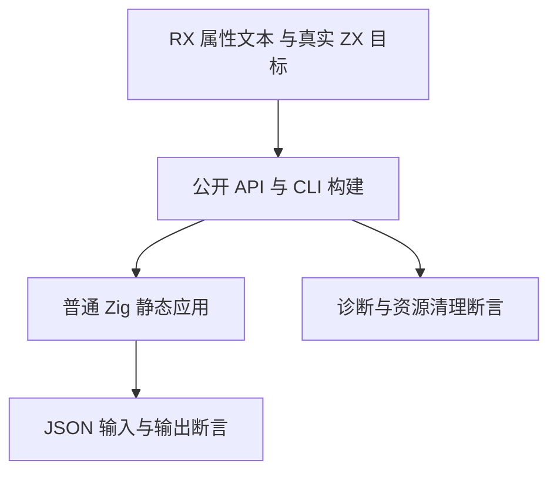

# RX 属性运行迁移计划

## Intent：最终目标

让既有 RX 字符串与花括号属性的 CLI 原生回归使用当前 Call 目标派生结果契约，继续核对引号字面量、表达式、模板插值、分支、模块和 Store 读取行为。

## Data：可用证据

`packages/test/tests/rx/attributes/runtime/` 提供 55 份输入输出行和 6 份语义拒绝行，运行脚本真实构建临时应用并解析其 JSON 输出。`test-rx-attributes` 同时聚合属性 API、清理与 CLI 路径。测试材料仍有历史 Call.service/name 和 ctx 引用；已有属性语法迁移改动一并纳入本部分。

## Edges：边界与限制

只迁移测试材料，不修改生产源码、既有输入输出期望或拒绝错误码。引号中的 `$in` 保持字符串字面量，只有花括号内绑定引用改为 `$ctx`。Call.module 路径仍解析到真实 worker 文件；Store 命名空间保持原样。这里没有重复非 void 目标，不增加别名文件或兼容层。CLI 模式使用固定生产 `0d0f8409`；新增类型化错误和 ZX parallel 不在固定生产基线范围。

## Answer：交付格式与成功标准

交付修改材料、迁移脚本、两模式回归日志与源码指纹。现有 API 和分配回收断言通过，55 次原生应用结果与原 JSON 期望一致，6 份拒绝材料保留原错误分类且不产出应用。每部分通过后独立提交 push。不同模式重复执行不计作新增 Test262 案例。

## 架构图

## 数据流图

## 执行记录与自我批判

复用已验证的标签扫描器，限定当前材料目录。对属性字符串和模板原始文本保持原字节语义；只有表达式中的绑定身份迁移。执行完成后核对本次 diff、未改变的 cases/rejections JSON 和固定检出日志，结构通过不能替代原生输出证据。

## 生成 Schema 材料核对

继续检查聚合入口发现六份生成 Schema 行仍使用历史契约：Call.service/out 的两种属性语法应拒绝为 unknown_attribute，Task.out 引号应拒绝、花括号应接受。保留四份旧 Call 属性作为刻意拒绝材料，并核对属性键起点；不把它们转换成合法调用。fixture 增加明确错误码字段，默认仍为 invalid_attribute；当前诊断只能按这份独立期望断言，不能从生产结果计算期望。

同步既有《RX新属性验证》的 JSON 数据源并重新生成 schema_test.zig，生成器保持原实现，解析 70 项与 Schema 78 项总声明数不变。Task.out 正向只表明结构接受，其内部用 Call 代替 Return，避免把 Return/out 并用作为正向材料；公开推导和原生聚合语义已有独立测试。

## 固定检出隔离

属性材料与正在运行的 Parallel 原生组没有源码依赖交集；仅复制本部分 10 个路径，并核对并行组全部源 SHA 未变。生产 compiler/core/genz 没有差异，当前构建文件与 CLI 输入输出期望未修改。属性 Debug 使用独立日志和 `-j1`，与并行 ReleaseSafe 的构建路径和统计分开。

## 最终结果与自我批判

Debug 和 ReleaseSafe 均退出 0，各 22/22 构建步骤、148/148 Zig 声明实际执行（0 个缓存运行步），55 次原生应用输出与既有 JSON 期望一致、6 次语义拒绝通过。CLI 应用明确使用 debug/safe 优化标记；拒绝入口在产物生成前诊断，不把它计作原生执行。

正式范围为七份 RX、两份 Zig 和一份既有 JSON 数据源，共十个路径。解析 70 项和 Schema 78 项不变；四份已删除的 Call 属性形式改为明确 unknown_attribute 拒绝，另两份 Task.out 改为符合新值种类边界。字段 location 的期望来自独立文本位置，未从生产诊断反算。

最初只清点运行材料，随后发现聚合入口的生成 Schema 行仍不符契约，因此扩展到数据源、生成文件与通用错误码字段。没有放宽断言，也没有删除旧属性材料。Task.out 正向只验证结构接受，完整推导、输出和所有权由独立组提供证据。本部分固定基线不含新增 typed try；不会用本组通过代替其测试。
