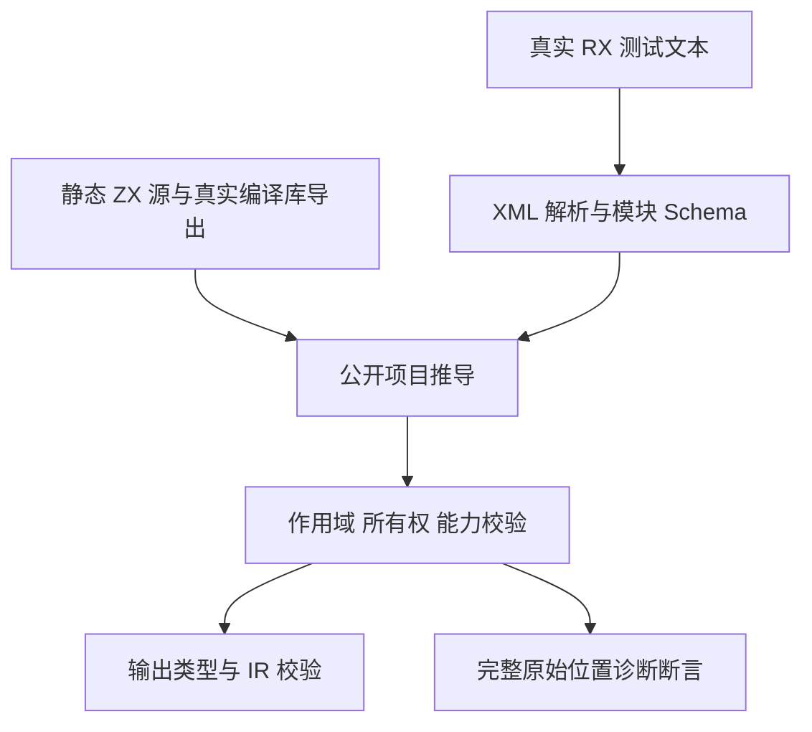
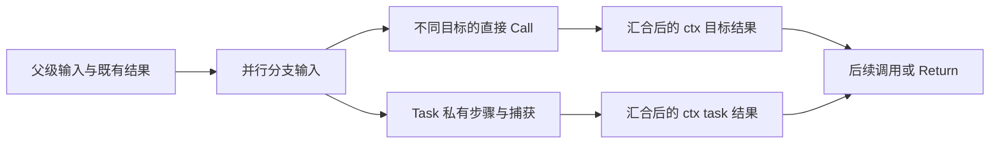

# RX 并行推导迁移计划

## Intent：最终目标

将 Parallel 的公开项目推导回归迁移到 Call.fn/Call.module、目标派生结果名与 `$ctx` 契约。保留兄弟隔离、汇合、所有权转移、捕获冻结、能力闭包和原始诊断位置的既有判定。

## Data：可用证据

- 当前生产契约来自 `rules/RX开发约定.md` 与 compiler RX README；普通推导迁移已经提交为 `5b582a0f`。
- 材料位于 `packages/test/tests/rx/inference/parallel/`，并行入口是 `zig build test-rx-parallel-inference`，普通组入口为 `zig build test-rx-inference`。
- 现有测试仍含 Call.name、Call.service 与旧 ctx 表达式。删除属性会让原本不同输出变成同名；因此需要静态登记不同调用目标，不能只改引用字符串。
- 编译库转移测试必须链接两个真实公开导出，分别调用各自模块；本地相同实现可以登记在两个真实源码路径下。

## Edges：边界与限制

仅修改这组正式测试和日期目录下的迁移证据，不修改生产源码，不增加兼容层。名称矩阵的合法性表独立于生产验证器；非法目标也登记源，避免缺失文件诊断掩盖名称诊断。中文、CRLF 和实体编码位置断言保持完整。结构 Schema 通过不表示项目语义或生成程序执行通过。本部分不覆盖原生线程运行，也不增加 Test262 审阅数量。

## Answer：交付格式与成功标准

交付分类 Zig 测试、可审阅迁移材料、Debug/ReleaseSafe 日志及结果记录。两个模式都通过公开推导和 IR 校验，所有负例保持错误码、文件、偏移、行列与消息约束；完成后独立提交并 push。发现经核实的生产缺陷才消息实现会话。

## 架构图

## 数据流图

## 执行记录

开始前读取 RX 开发约定和文档分工。使用前一部分的纯文本扫描工具生成迁移材料；对重复消费、借用与消费顺序、实体编码、编译库导出和有限名称矩阵逐项调整真实目标。

## 自我批判

首轮并行公开推导实际执行 105 个声明，101 通过、4 失败；两处错误标记误匹配 Return 中同名前缀，一处沿用了旧重名文案，已修正。第四处没有输出的 Task 引用被误分类为 Store 能力错误，已按用户授权通知实现会话，保留 name 诊断期望等待修复。普通推导单独执行 138 个声明通过，不能代替并行组；首次选择构建入口时遗漏这一分离，已改正并保留独立日志。特别复核是否因名称冲突提前终止而丢失所有权或能力断言，以及是否把不同模式、矩阵循环或分配失败枚举重复算作独立上游案例。

## 已完成验证

生产修复提交 `55c070bd` 在 RX 推导阶段拒绝 void 结果引用，不再误入 Store 分支。本会话在该修复后执行 Debug 与 ReleaseSafe：各 7/7 步、105/105 Zig 声明通过，均实际运行；其中 9 个声明执行分配失败枚举。有限名称矩阵在 1 个声明中检查 49 对目标，12 对接受、37 对拒绝，不把循环次数或两个模式重复算作独立 Test262 用例。

11 份正式 Zig 测试文件迁移，库路径使用真实公开 `consume_left`/`consume_right` 导出。非法目标同样有登记源，所有权负例继续触发 ownership，副作用闭包继续触发 unsupported。Schema 的四个引号输出负例与四种花括号放置只验证结构；同一任务 out 与 Return 冲突另由公开项目推导检查。

复核发现迁移扫描器曾将两个兄弟 Task 汇合表达式中的右结果保留为旧命名空间，已纠正为 `$ctx.task.right`；实体编码冲突仍指向 `fn='&#110;umber'` 的原始属性。位置标记采用完整输入引用，避免 `$ctx.list_read` 前缀再次命中 `$ctx.list`。迁移材料重复执行没有改变正式文件。

顺序运行组后续发现重复 void Call 的结果重名问题，独立记录在《RX顺序运行迁移计划》；该发现不改变本组的非 void 重名与所有权判定。本次不声称 Parallel 原生线程执行或全仓库回归已经通过。
