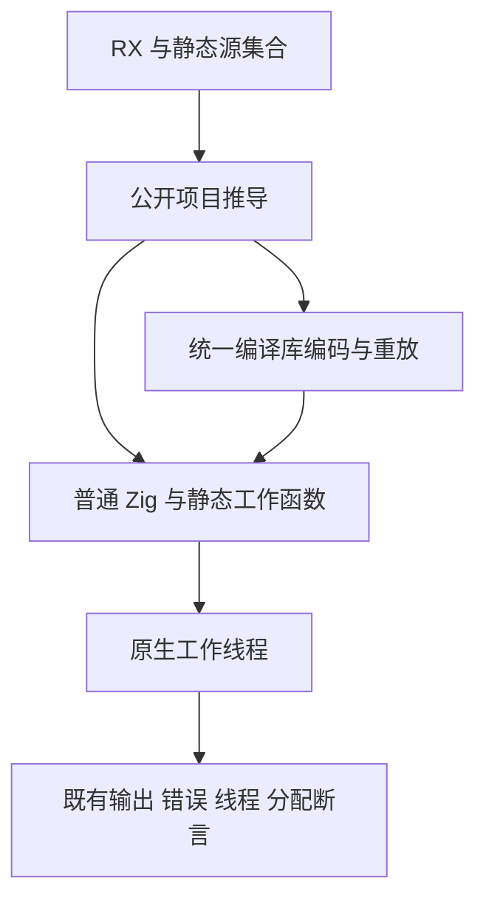
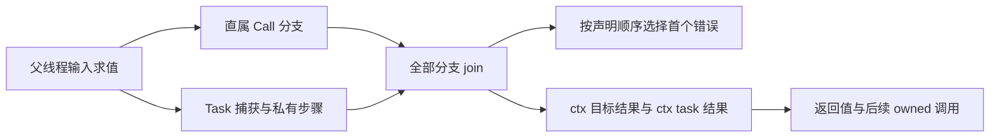

# RX 并行运行迁移计划

## Intent：最终目标

迁移 Parallel 原生运行材料，保留真实工作线程、汇合输出、声明顺序错误、参数先求值、owned 转移、嵌套 Task 捕获与库重放的既有断言。

## Data：可用证据

材料位于 `packages/test/tests/rx/runtime/parallel/`，运行驱动为 `parallel_compile.zig`，构建入口由 `build/rx_parallel_runtime.zig` 注册。并行推导已完成 105 项公开 API 回归；顺序运行固定检出已通过两模式并提交 `c673fd13`，使用生产提交 `0d0f8409`，不受共享工作区新类型化错误实现影响。

## Edges：边界与限制

仅修改本部分正式测试与文档，不修改生产源码。原生线程跟踪和失败注入 helper 保持原有断言；不同调用目标必须静态登记真实源或真实公开导出，不能把同一个编译导出伪装成两份。私有 Task 内同名旧别名必须按词法作用域迁移，不能使用全文件扁平替换。父级 map_values 与子 Task 新调用需要不同目标，避免命名冲突遮蔽捕获和所有权语义。库共用 consumer.rx 已由顺序部分迁移，本部分不重复改写。

当前验证对象是既有 RX Parallel 的原生线程契约。新增 ZX parallel/类型化 try 不在固定生产基线范围，本部分不能作为它们的完成证据。

## Answer：交付格式与成功标准

交付真实 RX 材料、静态源/导出登记、词法迁移脚本、Debug 与 ReleaseSafe 日志、源码指纹及独立提交 push。运行原有来源和库路径门禁，输出、错误优先级、线程跟踪、参数失败不启动工作线程及分配失败回收均通过后完成。

## 架构图

## 数据流图

## 执行记录与自我批判

先登记语义需要的目标，再用带 Task/Case 作用域的纯文本扫描迁移。保留既有用途分组，不把不同库路由、两个模式或分配失败枚举当作独立 Test262 案例。完成后复核本次 diff 和固定检出结果。

预览复核发现 owned direct/module 原先用 getter 简写生成 left/right 输出字段；结果目标更名会改变简写字段名，因此已将 Return 明写为 left/right 键。服务路径也使用相同显式键，保持既有 owned_test 的公开输出契约。词法迁移材料重复执行无变化；这一处输出字段修正单独记录，不能只核对 ctx 引用可解析就认为行为等价。

## Debug 固定检出结果

Debug 退出 0：1155/1155 构建步骤，927/927 Zig 声明实际执行，198 个运行步均无缓存。22 种材料沿来源及八条库路由执行；Task 捕获和真实工作线程断言保留，不把 198 条路径视为 198 个独立 Test262 案例。ReleaseSafe 终态与指纹在最终结果补录。

迁移脚本记录最终 name/ctx 阶段的词法转换；更早的 out 与内联集合调用变更由历史方案及正式 diff 记录，不能将这个脚本描述为任意旧版本的完整转换器。

## 最终结果与自我批判

Debug 与 ReleaseSafe 均退出 0，各为 1155/1155 构建步骤、927/927 Zig 声明实际执行、198 个运行步和 0 个缓存运行步。源码材料是 26 份 RX 加两份驱动/构建文件；39 份不同的既有 Zig 声明沿 22 种材料和九条路由重复执行，不将 927 次执行声称为 927 个新增测试。运行来源和依赖测试材料的字节与固定检出一致，生产源没有工作树差异。

Task 捕获、返回借用、输入先求值、声明顺序错误、owned 转移、真实线程及分配失败回收均由原有断言验证。明确登记不同 target 或两个真实公开导出，保留同时启动的直属 Call；没有用 Task 包裹改变线程粒度，也没有伪造编译模块名称。Return 的 left/right 输出字段明确书写，避免目标更名改变公开对象键。

本部分没有发现新的生产缺陷，不发送通过消息给实现会话。固定生产不包含刚提交的 typed try；其测试另列同日《类型化错误测试计划》。库消费的不同路径证明相同语义跨边界重放，不证明全部发行或网络功能已完成。
