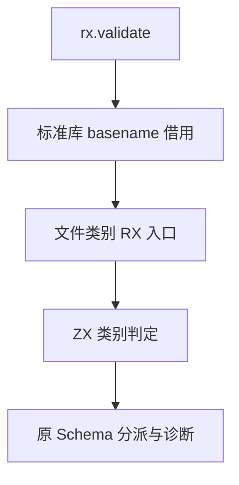

# RX 文件类型自举

## Intent：最终目标

把 RX 校验入口的文件类型判定迁移为 RX＋ZX 模块，保留公开 API、根标签诊断与平台文件名处理语义。

## Data：当前证据

`rx/root.zig` 按 basename 依次判定 app.rx、.gateway.rx、.store.rx、.rx；它不要求合法模块相对路径。因此不能直接复用上一阶段路径合法性结果，例如绝对路径仍可进入单文件 Schema 校验。basename 继续由 Zig 标准库提供借用切片，类型规则复用现有 ZX 字节比较函数。

## Edges：边界与限制

- 文件类别与模块引用合法性是不同契约，不合并。
- 生成规则只借用文件名，不复制节点或文件名，不引入运行库。
- 保留 app.rx 优先错误、未知后缀错误、根标签不匹配错误及原位置。
- 完整 Schema 仍由 DSL 解码。递归 AST 的 Zig 节点连续数组与 ZX 聚合指针数组尚不能直接互借；后续迁移必须解决布局边界，不能通过复制整树宣称 zero copy。
- 不新增测试，不执行全量。

## Answer：交付与成功标准

正式 RX＋ZX 文件类别模块、最小编译接线和原生 seed 实现；生成代码不含堆分配，既有 RX Schema 和文本专项通过，原生与自举 CLI 生成内容一致。

## 验证与自我复核

`packages/compiler` 的 `zig build test-rx -Doptimize=safe -j2` 已通过，包括文件后缀选根 Schema、保留 app.rx、根诊断位置及分配失败传播。文件类别判断只接收 basename 借用切片；不更改原有节点或诊断生命周期。

原生 `c563af62` CLI 与自举 CLI 对正式 `rx/schema/file/classify.rx` 生成结果一致，SHA-256 为 `3ea6bcad6d939ba651d42f76536ca1010a04f0d1832068482d64351c0bdb503f`。生成源码没有 alloc/create，适配层仍使用零容量 allocator 验证分配假设。保守错误集合包含 OutOfMemory 不等于实际存在分配。

本阶段只迁移分类决策，Schema 解码和诊断构造仍在原生侧；不能将此局部生成一致称为完整编译器自举或形式化证明。

## 后续完整 Schema 迁移的已核实前置条件

当前 `packages/dsl/src/ast.zig` 的 children/attributes 是连续结构数组；`packages/genz/src/zx/types.zig` 则将 ZX object/tuple 生成为结构指针，list 再包裹该元素类型。`packages/compiler/src/zx/analysis/types.zig` 的 named 明确拒绝递归类型别名，`packages/core/src/ir.zig` 的 Type 也没有原生借用引用类型。只把 Node 的字段照搬到 ZX 并不能解决零拷贝遍历。

候选的通用前置能力是具名、不透明、只读的原生借用引用：身份来自模块与导出类型，生成静态 Zig 指针。原生访问器只取字段、长度、原数组元素地址与借用字符串，ZX 持有遍历、重复检查、作用域、首错和 Schema 决策。RX 编排验证阶段；遍历栈属于算法辅助空间，不复制 AST。该方案尚未实现，也尚未确定声明语法。

不能把引用伪装为整数或字节数组。实现必须覆盖类型身份、IR 校验、缓存及链接重映射、生成 ABI、所有权、聚合内借用、返回与原生结果的生命周期、Store 持有及并行使用边界；Wasm／N-API 等不能安全承载的出口应静态拒绝。现有 native 调用 borrowed 输出传播只能作为起点，不能当作已满足上述契约的证据。

此外，`rx/steps.zig` 的 Step 是递归 Schema 解码结果的一部分；只迁移 validator 仍不足以完成返回 `Schema.Data` 的解码自举。这一差距必须在后续实施中显式保留，不以局部验证迁移代替完整目标。

发行构建 `zig build dist -j2` 已通过。

`packages/test` 的 `zig build test-rx-attributes test-rx-text -Doptimize=safe -j2` 已通过；日志包含 70 条解析、78 条 Schema 材料，以及既有 CLI 执行和语义拒绝检查。未新增用例、未执行全量。发行 CLI 重建后再次生成正式入口，SHA-256 保持一致。
