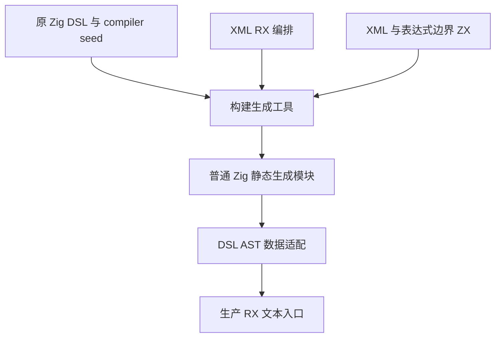
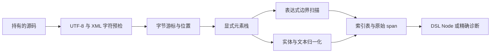

# RX 文本解析自举实施计划

生产接线与最终验证记录见 [实施记录](实施记录.md)。以下保留实施前计划和阶段一记录。

## Intent：最终目标

生产 RX XML 文本解析由 RX＋ZX 实现，保留 XML 结构、实体、原始属性值、解码值和字节位置的现有契约。原 Zig DSL 解析器作为 seed，不产生 DSL→compiler→DSL 构建环。

## Data：已核对事实

生产入口 frontend/attribute.zig 调用 dsl.parseXmlWith 并注入 template.interpolationEnd。表达式 AST 已自举，但这个边界扫描仍是 Zig。XML 边界层只寻找闭合花括号，不能用完整表达式 parser 替代，否则会提前改变错误阶段。

XML parser 支持 ASCII 名称、四种空白、实体、CDATA、注释和受限 XML 1.0 声明，最大 256 层元素。整份输入 UTF-8/合法字符预检失败的位置固定起点。offset 和 column 按字节；CRLF 算一次换行。属性保留 kind、raw_value、value_location；文本与 children 分开保存，注释不产出节点。数字 entity 先检查数字，再按 u21 范围检查，最后检查 XML 字符范围。

## Edges：边界与限制

不增加 DTD、namespace、非 ASCII 名称或 processing instruction。普通 dsl.parseXml 仍不接受裸花括号，RX 文本路径支持表达式边界。不得让适配器重新解析语法或实体；不得复制原 Zig parser 为专用运行层。源码副本由结果 arena 持有，临时表释放前须保留解码字节。

不新增测试用例、不全量测试；复用现有 XML、属性、位置与模板材料，不能把只断言 syntax 的测试称为精确消息已验证。

## Answer：实现顺序与成功标准

1. 独立 ZX 边界 scanner：显式栈处理插值、模板、字符串和注释，保留原错误消息与位置。
2. XML 游标与位置推进、UTF-8/字符预检、声明、实体及归一化。
3. 显式栈生成节点、属性、文本与孩子索引表，RX 编排验证、解析、结果收口。
4. 静态 DSL AST 适配与独立 seed 生成链，接生产 RX 文本入口。
5. 完整 AST/诊断对照、既有属性政策验证、发行构建与自身 RX 再生成。

自我复核要求：源码中的状态机不等于生产接线；每阶段分别登记已完成与未完成项，最终以真实入口调用链及运行结果收口。

## 阶段一实施进展

已在 `packages/compiler/src/rx/syntax/` 实现下列基础模块，全部通过正式 CLI 的 ZX 编译：

- boundary：显式栈的 interpolation/template/string/comment 边界扫描；不调用原 Zig parser。
- validate：复用既有 ZX UTF-8 检查，并补 XML 字符范围预检。
- position：按字节推进 offset/line/column，处理跨推进片段的 CRLF。
- starts/equal/name/whitespace/comment：受限 XML 词法与游标工具。
- entity/decode、number、digit：五种命名实体与十/十六进制字符引用；保留数字先校验、u21 范围、XML 字符范围的错误顺序。
- document/model、initial、advance、fail：显式节点表、元素帧、属性/文本及诊断状态。

`boundary_reference.zig` 对照旧 template.interpolationEnd 和新生成 ZX scanner。复用既有属性 JSON 材料中的花括号起点，完成 79 次边界对照（6 次诊断），0 差异，见 `既有表达式边界核对.json`。

值表采用原始 span 与字符片段：不需归一化或实体替换时，最终 AST 可直接借用持有的源码；发生转换时，ZX 确定 Unicode codepoint，数据适配层仅进行 UTF-8 编码及片段拼接，不识别实体语法。这样避免依赖当前不存在的通用整数强制转换语法，也避免给所有源码字节扩成 u64。

边界 scanner 返回原 source 所有权，以便 XML 主状态继续使用；只读词法 helper 的诊断由枚举/标量状态生成静态消息，避免把借用状态中的消息错误地传给消费型函数。

尚未完成声明解析、完整元素/属性/文本推进、AST 适配和生产接线。新目录尚未加入生成器入口，因此不能把这组可编译模块或边界对照称为完整 XML 自举。未新增测试用例、未运行全量测试。
