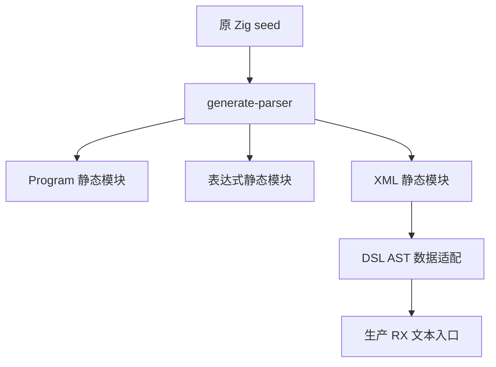
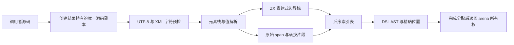

# RX 文本解析自举实施记录

## Intent：最终目标

把生产 RX 文本入口接到 RX＋ZX XML 解析器，保留原 XML/表达式边界、节点、实体、位置和结果生命周期契约。此阶段完成语法层接线，不把它称为完整编译器自举。

## Data：实际实现

### 编排与状态推进

正式入口为 `packages/compiler/src/rx/syntax/parse.rx`：

```rx
<Module>
  <Call fn="prepare" in={$in} />

  <Call fn="validate" in={$ctx.prepare.source} />

  <Call fn="document/parse" in={{source: $ctx.prepare.source, message: $ctx.validate, expressions: $ctx.prepare.expressions}} />

  <Return value={$ctx.parse} />
</Module>
```

ZX 模块按职责分成 boundary、declaration、document、document/value、entity 与公共字节游标工具。文档使用显式元素帧栈、后序节点表、属性/文本/孩子链表，保留各自源码顺序。表达式边界使用独立模板/插值栈，保持“寻找边界”与完整 ZX 语法检查分离。

实体解析在 ZX 中识别五种命名实体与数字引用，并保持数字合法性、u21 范围、XML 字符范围的诊断顺序。值表保留原始 span；遇到实体替换或换行归一化才记录源片段与 Unicode 字符片段。

### 源码生命周期与数据适配

原 XML API 要求结果独立于调用者 buffer，因此原实现先复制源码。本阶段把这一次必要复制放到 RX prepare，Zig 入口不再复制。普通名称、表达式属性、raw_value 和无需归一化的文本直接借用结果持有的源码。

syntax_adapter 只把后序索引表转换成 DSL AST，并对 ZX 已确定的字符片段进行 UTF-8 编码和拼接；它不识别实体名称、不寻找 XML 标签，也不决定表达式边界。需要转换的字符串才另行分配。

生成解析与 AST 转换使用结果的同一个 arena。所有分配完成后才复制 arena 到返回的 Result。中间状态表仍随结果保留到 deinit，此处没有宣称解析零分配或内存峰值已经最优。

### 构建与 seed 分离

构建生成器收集 compiler/src 下的 RX/ZX 源码，分别生成 Program、完整表达式和 XML 三个静态模块。seed frontend 使用原 Zig 解析器；生产 frontend 导入 generated_xml。XML adapter 通过显式构建模块导入，避免跨 Zig module 根目录引用，也不让 DSL 包反向依赖 compiler。

`frontend/attribute.zig` 的生产路径直接调用生成 XML；原 `dsl.parseXmlWith` 和 `template.interpolationEnd` 仅保留在 seed 分支。独立 DSL 包的公开纯 XML API 仍保留原实现，未改变其公共契约。





## Data：验证结果

- 既有属性材料的 79 次边界对照，包含 6 次诊断，0 差异。
- 140 份既有 XML/RX 材料分别以纯 XML 和 RX 表达式模式解析，共 280 次完整 AST/诊断对照；包含 139 次诊断，0 差异。比较节点、顺序、属性 kind/value/raw_value、位置和错误消息，见 `既有XML核对.json`。
- 原 Zig 基线 CLI 与新生产 CLI 分别生成当前 XML 解析器，SHA-256 一致：`93888300036a921a8fca69fe70701908b4d020d5891184da8c5fd18d702e9226`。
- 资源修复后的最终发行构建已通过；新 CLI 的既有 RX 属性限制检查 37/37 通过。
- 既有 `test-rx-text` 与 `test-xml-expression` 专项在修复后通过，覆盖源码所有权、256 层深度边界、宽子节点列表、实体位置映射及分配失败等原有检查。未新增测试用例，未执行全量测试。

### 验证中发现并修复的问题

首次资源专项虽有 137 项行为断言通过，但 4 个路径泄漏 arena 分配块，不能视为专项通过。根因是返回结构先复制 arena，随后在 AST 转换中继续分配，可能使返回的 arena 未包含最新分配链。现在先完成转换再构造返回值；同时修正 Program/表达式诊断分支和属性字符串入口中的同类顺序，复跑专项成功。

### 优先处理的外部测试反馈

测试会话发现 generate_types 按 catalog 顺序生成 import，违反既有路径排序。已只对生成顺序排序，不改 catalog 或 lint 规则，提交 `a34f4eab` 并推送 master。当前 packages/cli safe 默认构建通过。

该单文件修复以 `0ce24cec` 同步到保留原 Zig 实现的 zig 分支并推送；zxc_zig 的 packages/cli safe 默认构建通过。未把自举接线混入原 Zig 分支。

## Edges：限制与后续

- 不增加 namespace、DTD、非 ASCII 名称或其他 XML 能力；保留原受限 XML 契约。
- RX 属性的调用、lambda、状态块限制仍在后续政策层执行，边界读取不替代它们。
- 对照与专项支持上述接线，不能证明所有输入下的语义等价。
- RX Schema/类型推导、ZX 语义与模块分析、所有权、IR、后端和 CLI 仍需继续迁移；此前登记的标准库等长期欠项仍在目标内。

## Answer：交付与自我复核

交付为正式 RX＋ZX XML 源码、DSL AST 适配、独立 seed/生产构建接线及既有材料核对记录。生产 XML 语法不再调用旧 Zig parser。保留原实现与两个生成结果一致，不等于整个编译器已经完成 stage 1→2→3 重建。

自我复核：没有通过原生 XML 回调伪装自举，没有为材料硬编码结果；资源专项确实暴露了仅 AST 对照无法发现的问题，已按 arena 所有权根因修复。临时表内存峰值仍可优化，不将当前实现包装成零分配。
