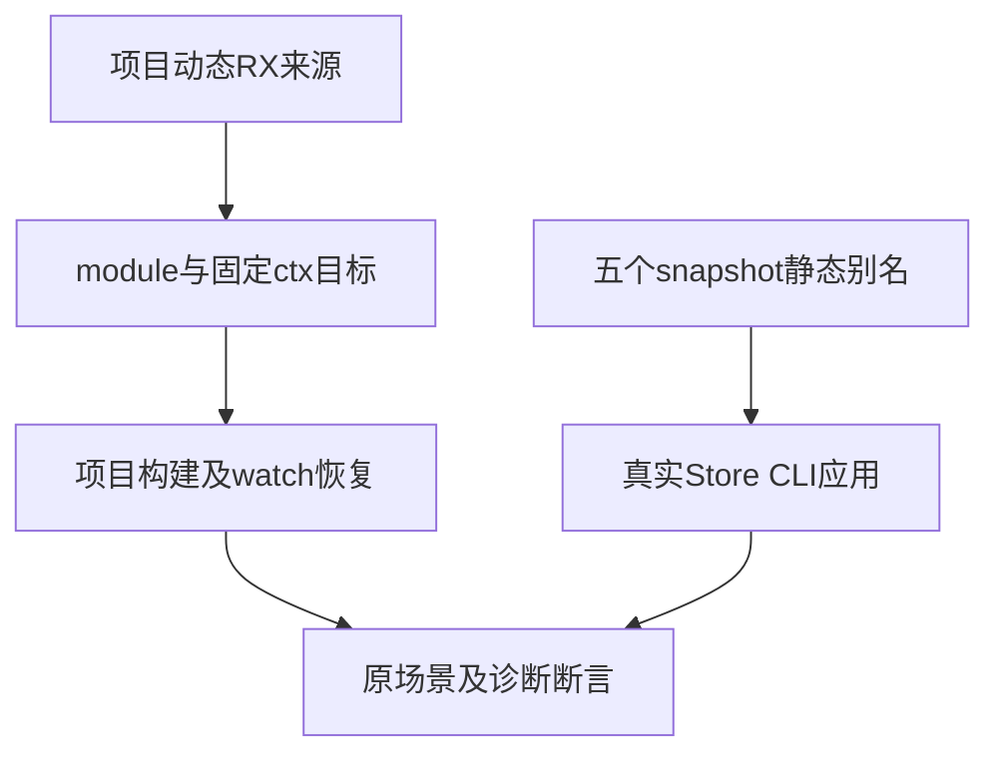

# RX磁盘项目与Store来源同步计划

## Intent：最终目标

完成 RX 磁盘项目 CLI 与应用生命周期 Store 的最终调用契约迁移，保持实际构建、watch 恢复、共享状态与不落盘语义的原断言。

## Data：可用证据

当前固定生产 3833ff40 包含 Program/表达式/RX XML/路径自举。project_cases.ts 的主检出 WIP 只有把 Call.out 改为 name，两项调用仍使用 service/ctx；其对应《RX调用属性迁移计划》明确说明这是旧历史阶段，最终契约为无 name/out、module、$ctx。本部分把这同职责的中间迁移完成，先保存原 WIP 字节，不覆盖范围外修改。

同文件的 ZX import ./helper.zx、./absent.zx 仍旧后缀，后者原意是 missing source 诊断，不能被后缀拒绝遮蔽。RX fn 的显式 ../functions/plus.zx 合法，保持。state_app_test.ts 只复制 snapshot.zx，而已迁移的 Store 主模块实际调用五个时序别名；API dual/compile.zig 已显式登记这些静态 Source，CLI 必须在磁盘准备同样五份来源。

## Edges：边界与限制

仅修改两份测试来源。原九个项目 CLI 场景、watch 更新/失败保留/恢复、Store 五个增量、重新启动初值及无状态文件断言全部保留。未改 Store 对象/字段、setter、签名或生产装载；别名复用同一 snapshot 源，明确落盘到五个目的文件名。源文件基线在全部来源准备和 app 构建之后建立，避免把测试正常生成来源误认作运行时状态。

调用 service 只在 project_cases 的 Call 改 module；Route.service 不在本部分。缺失、循环、越界及 child name 拒绝目的保持，不能改为 unknown_attribute。当前主检出其他 22 份历史中间 WIP 留待各自门禁，不全目录覆盖或提交。

## Answer：交付格式与成功标准

两份同路径草稿与正式源；保存迁移前字节及来源指纹。固定 3833ff40 叠加这两份源，执行既有 test-rx-project-cli、test-rx-watch、test-rx-state-app，ReleaseSafe、-j2，完整实际退出码、测试层级及日志收录。现有场景数量不增加，门禁通过才独立提交 push；若遇真正实现缺陷则保留最小复现并通知指定实现会话。

## 自我批判

只改 XML 字段会使后续真实磁盘加载仍缺五个别名，这说明语法与 Source 登记必须一起处理。静态 Source 复用不是运行时别名解析，也不是新增专用运行库；应用结束即释放状态。测试的父子场景与重复优化运行分别计数，不把循环执行次数当新增声明。

## 最终执行记录

固定3833ff40的三个既有门禁退出0，35/35构建步骤。项目CLI的9个场景、watch的1个场景以及Store父1/子7共8个场景全部实际通过。Node汇总18是父子及动态场景数量，未新增源码声明或目录案例；不把五个输入增量或多次应用启动再重复累计。

两份正式来源与最终草稿、实际检出字节一致。五份snapshot时序来源在app构建之前静态生成，文件基线在生成完成之后建立；原“执行不写状态、重启使用初值”的断言已成功。原缺失ZX诊断、依赖循环、路径越界和child name错误都保留，项目无效/删除依赖后恢复与watch恢复也实际成功。范围外WIP未提交。
