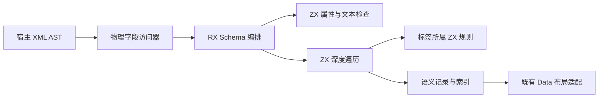
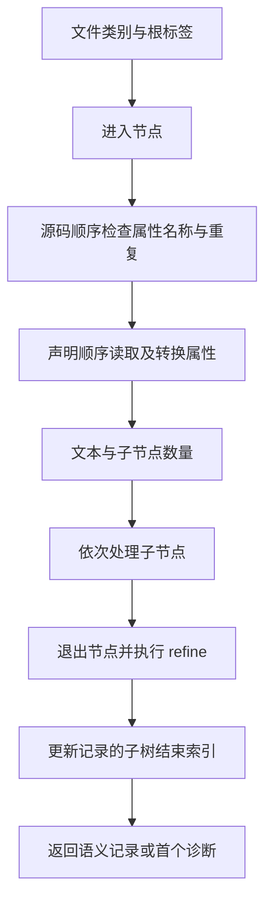

# RX 结构解码自举

## Intent：最终目标

由 RX 编排、ZX 执行完整的 RX AST 结构校验与语义解码，保持现有公开接口和首错顺序。原生代码只读取宿主 AST 字段以及转换 ABI 布局，不重复执行 Document.decode。

## Data：可用证据

- 当前 Schema 涵盖 17 种角色，Store 定义与模块中的 Store 引用具有不同规则。
- dsl.attributes 先按源码顺序检查未知与重复属性，再按声明顺序处理必填、默认值和类型转换。
- dsl.element 在属性后检查文本；dsl.children 先检查数量，再依次完整处理子节点；refine 最后执行。
- Task、Parallel 的允许子标签取决于直接父角色。Task 下 Switch 的 Case 可以包含 Task，不能继承一个全局禁用标记。
- 现有 ZX 已支持原生 opaque 引用、显式迭代、列表容量复用及 RX 模块编排。
- 原生引用输入不暴露 ZX 聚合头，但目前 genz 的局部性判定同时拒绝字符串输出，需要分别审查输入隔离与输出表示。

## Edges：边界与限制

- 零专用运行库；所有生成模块静态链接。
- AST 名称、属性值和文本借用输入内存；结果有效期不能超过输入。
- 不复制 AST，不将属性查找、标签白名单、trim、遍历或规则判断藏进原生访问器。
- 不新建测试用例，不运行全量测试，不进行浏览器 UI 检查。
- 保留诊断 code、位置、element、attribute、expected、child_count 和 message。
- expected 的 Zig 类型名与 usize 最大值通过宿主元信息提供，不能猜测平台宽度或改写类型名。
- 解码采用语义记录与索引表达递归关系；原生布局适配器只能根据已解码记录构造既有 Data。
- 未完成解码与生产接线前，不宣称完整 Schema 自举。

## Answer：交付格式与成功标准

交付标签所属目录中的 ZX 规则、schema 中的 RX 编排与通用遍历、最小原生 AST 访问器和生产构建接线。使用已有专项检查确认输出与旧实现一致，记录实际执行结果；完成特性后提交并推送。

## 实施步骤

1. 定义 Node、Attribute、Text 的 opaque 借用接口，仅提供物理字段和指定范围的切片。
2. 接入生成器的原生接口声明与共用 ABI 模块。
3. 在标签 owner 中表达字段顺序、子节点范围和标签专属 refinement。
4. 用显式 enter/exit 栈实现首错遍历，同时输出解码记录。
5. 替换生产结构解码入口，保留 seed 构建路径。
6. 执行既有专项检查、核查生成代码分配和借用生命周期。

## 自我批判与复核项

- 仅迁移几个谓词不能算 Schema 自举；必须移走遍历、字段转换和 refinement。
- 校验后再调用旧解码会隐藏两套规则，不能作为最终交付。
- 用大量标量列规避类型能力限制可能恶化维护性；实现时应对照生成成本和访问边界选择表示。
- 原生函数的局部性不等于纯函数，不能把借用读取标为 pure 来强行触发优化。
- 任何栈化优化必须证明作用域与返回路径，不能只按整个函数的最终返回类型作判断。

## 首批实施记录

genz 的原生调用局部性检查已区分输入和输出：输入仍只接受不暴露 ZX 内存的标量、枚举、错误集、宿主引用及其 optional，展开元组逐字段满足相同条件。输出允许字符串以及元素满足输入叶条件的列表。此修改不授予 pure，也不允许把循环候选列表传给原生函数。

草稿中已定义 Node、Attribute、Text 物理访问器、17 种角色的字段描述和标签分类。`inspect.rx` 经 `zig:rx_ast` 借用节点名称完成分类，已发布为静态库并通过该库的 Zig 构建。它目前只执行分类，不是完整校验或解码。

整数解码草稿对应当前 Zig `std.fmt.parseInt(u32, value, 10)` 的成功输入集合：接受前导正号、负零及内部连续下划线；拒绝首尾下划线、空数字、非十进制字符、非零负数及溢出。已通过 ZX 编译，尚未进行运行结果对照。现有 ZX 没有整数显式转换表达式，十进制 digit helper 用静态字节分支返回 u64，不借助原生解析。

实际验证：

- 根目录发行构建通过，使用此前校验过 SHA-256 的本地官方 Zig 归档。
- 原四个专项构建中的 225 项 Zig 检查通过，但总构建因下载阶段 `TlsInitializationFailed` 失败，不能称整组通过。
- 用已构建 CLI 重新运行原 `iterate/cli_test.ts`，5 项通过；原 `iterate_calls/cli_test.ts`，1 项通过。
- 用同一 CLI 生成既有 iterate 的 4 个模式、iterate_buffer 的 11 个模式，再直接编译运行原 root.zig 检查，15 个模式全部通过。没有增加测试用例。
- 独立 `test-value-return` 通过。

当前状态：原生借用返回的生成器前置条件已完成，Schema 的字段和访问接口仍在草稿阶段。进入／退出遍历、refinement、语义记录解码及生产接线尚未完成。
