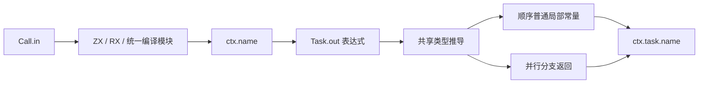
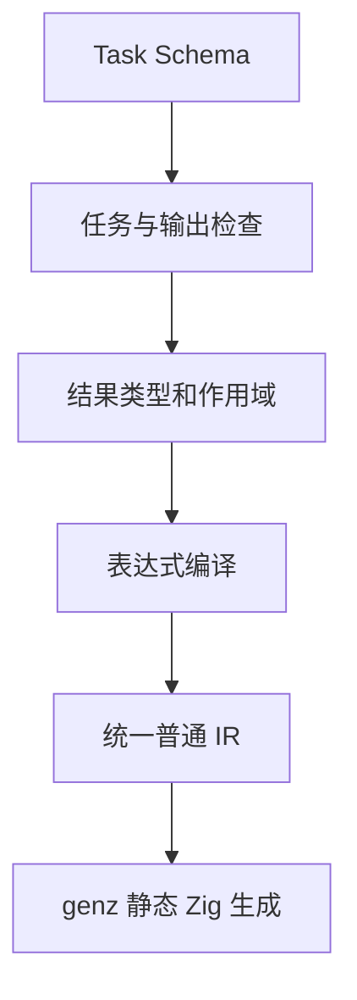

# RX 调用参数与命名结果

## Intent：最终目标

输入命名保持 in：Call.in 传参、RX 使用 $in、ZX 固定函数参数使用 in。Module.in/out 都保留。仅移除 Call.out：通过目标文件名或显式 name 定位 ctx.<name>。Task 保留可选 out，但其含义是聚合输出表达式，不是绑定路径；结果统一为 ctx.task.<name>。

## Data：可用证据

Call 的 fn、service、module 三选一，默认结果名取目标最后路径段并去掉源码后缀。Parallel Task 原来已经有独立返回值，顺序 Task 原来仅是局部分组。本轮直接复用现有表达式类型推导、作用域和普通 IR 常量/返回，不引入专用运行库或运行时路径查找。

## Edges：边界与限制

- Call.name 可选；默认名不是合法标识符时需显式指定，不自动修改字符。task 是保留名，避免 ctx.task 与任务命名空间冲突。同一作用域同类结果不得重名，Call 与 Task 可同名。
- Task.out 可选，必须用花括号表达式；字符串输出写 out={"hello"}，旧 out="ctx.path" 不再表示路径，也不再接受。
- out 在内部步骤结束后求值，可引用该 Task 内的 Call、已有外层值及已汇合的 Task 结果。它遵守 RX 值边界：仅引用、组装和简单运算，不允许内联函数调用、lambda 或状态更新。
- 同一个任务不同时定义 out 与 Return，包括其顺序分组和条件分支中的 Return；嵌套 Parallel Task 的独立 Return 不属于外层任务输出。
- 未写 out 的顺序 Task 保持局部作用域语义，其 Return 结束所在模块或并行分支；未写 out 的 Parallel Task 保留独立 Return。无返回值的调用或任务仍执行，但不产生可读结果。
- Module.in/out 为类型名称；实际输入输出类型仍从调用、函数签名与返回值推导。Input/Output 类型、内部 IR 输出字段与外部协议不变。

## Answer：交付与成功标准

同步标签校验、Task 表达式分类、约束推导、顺序作用域结果、Parallel 返回和捕获扫描。当前应用指导、正式 RX 与已有示例同步使用 in。构建发布编译器，重放既有顺序聚合、并行聚合与自举表达式入口；不新增测试用例，不执行全量测试，不覆盖测试会话的修改。

```xml
<Module>
  <Task name="adjusted" out={{values: ctx.adjust.values, total: ctx.adjust.total}}>
    <Call fn="adjust" in={$in} />
  </Task>

  <Return value={ctx.task.adjusted} />
</Module>
```





## 决策与实施记录

此前 args/$args 迁移，以及 Module.out 删除，均已按用户后续决定撤回；没有把这些中间方案提交。最终契约以上述规则为准。之前提交的 Call.args 本轮恢复为 Call.in，不保留 args 别名。

Call/Task 命名空间已在 5d3aee65 实现并验证过同名、嵌套和 void 分支；本轮在此基础上新增可选 Task.out 表达式，顺序 Task 只发布聚合结果，内部调用仍局部可见。Parallel Task.out 降为已有分支 Return；顺序 Task.out 降为现有 IR 常量，保留 Store 和普通调用原有执行顺序。两个入口都使用原表达式解析和所有权分析。

Grit 对 RX 表达式属性和 ZX owned 参数不能完整解析；本轮受控修改已定位的属性与类型结构，不将不完整的匹配当作完整迁移证明。

## 验证结果与自我复核

发布构建通过。已有顺序 adjust 示例通过 Task.out 组装 original、values、total；输入 values=[2,4]、increment=1，实际返回 original=[2,4]、values=[3,5]、total=8。既有并行 main 示例中 number Task 使用对象 out，嵌套 flag Task 使用标量 out，外层 flag 保留 Return，discard 仍省略 out；两组原有输入分别返回 {value:12,enabled:false} 与 {value:7,enabled:true}，并通过已有 Z3 到达契约门禁。正式 expression.rx 使用 Call.in 成功生成 Zig。

本轮未新增测试用例、未执行全量测试、未改测试会话文件。运行证据覆盖顺序聚合的列表字段、并行对象输出、嵌套输出、未写 out 的 Return 分支与 void 分支；重复输出、旧字符串 out、内联调用等负向分支仅核对实现，未宣称全部实跑。Module.in/out 源码保持原定义；args/$args 大规模中间迁移全部撤回，正式 ZX 源码没有此次改名差异。尚未完成的 header 自举草稿不并入本次提交。
