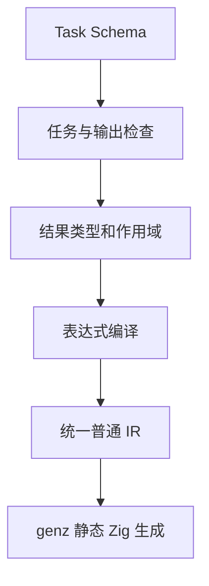
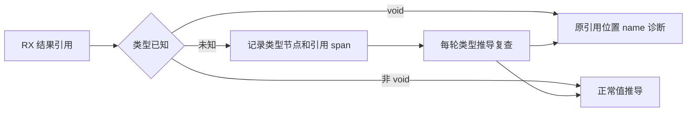
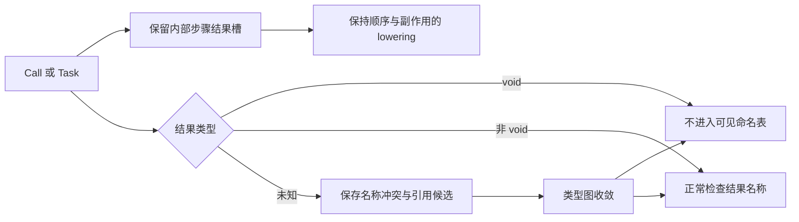

# RX 调用参数与命名结果

## Intent：最终目标

输入命名保持 in：Call.in 传参、RX 使用 $in、ZX 固定函数参数使用 in。Module.in/out 都保留。仅移除 Call.out：直接通过目标文件名定位 $ctx.<name>，不提供 Call.name。Task 保留可选 out，但其含义是聚合输出表达式，不是绑定路径；结果统一为 $ctx.task.<name>。

## Data：可用证据

Call 的 fn、module 二选一，默认结果名取目标最后路径段并去掉源码后缀。Parallel Task 原来已经有独立返回值，顺序 Task 原来仅是局部分组。本轮直接复用现有表达式类型推导、作用域和普通 IR 常量/返回，不引入专用运行库或运行时路径查找。

## Edges：边界与限制

- Call 不接受 name；目标文件名必须是合法标识符，不自动修改字符。task 是保留名，避免 $ctx.task 与任务命名空间冲突。同一作用域同类结果不得重名，Call 与 Task 可同名。
- Task.out 可选，必须用花括号表达式；字符串输出写 out={"hello"}，旧 out="$ctx.path" 不再表示路径，也不再接受。
- out 在内部步骤结束后求值，可引用该 Task 内的 Call、已有外层值及已汇合的 Task 结果。它遵守 RX 值边界：仅引用、组装和简单运算，不允许内联函数调用、lambda 或状态更新。
- 同一个任务不同时定义 out 与 Return，包括其顺序分组和条件分支中的 Return；嵌套 Parallel Task 的独立 Return 不属于外层任务输出。
- 未写 out 的顺序 Task 保持局部作用域语义，其 Return 结束所在模块或并行分支；未写 out 的 Parallel Task 保留独立 Return。无返回值的调用或任务仍执行，但不产生可读结果。
- Module.in/out 为类型名称；实际输入输出类型仍从调用、函数签名与返回值推导。Input/Output 类型、内部 IR 输出字段与外部协议不变。

## Answer：交付与成功标准

同步标签校验、Task 表达式分类、约束推导、顺序作用域结果、Parallel 返回和捕获扫描。当前应用指导、正式 RX 与已有示例同步使用 in。构建发布编译器，重放既有顺序聚合、并行聚合与自举表达式入口；不新增测试用例，不执行全量测试，不覆盖测试会话的修改。

```xml
<Module>
  <Task name="adjusted" out={{values: $ctx.adjust.values, total: $ctx.adjust.total}}>
    <Call fn="adjust" in={$in} />
  </Task>

  <Return value={$ctx.task.adjusted} />
</Module>
```




## 决策与实施记录

此前 args/$args 迁移，以及 Module.out 删除，均已按用户后续决定撤回；没有把这些中间方案提交。最终契约以上述规则为准。之前提交的 Call.args 本轮恢复为 Call.in，不保留 args 别名。

Call/Task 命名空间已在 5d3aee65 实现并验证过同名、嵌套和 void 分支；本轮在此基础上新增可选 Task.out 表达式，顺序 Task 只发布聚合结果，内部调用仍局部可见。Parallel Task.out 降为已有分支 Return；顺序 Task.out 降为现有 IR 常量，保留 Store 和普通调用原有执行顺序。两个入口都使用原表达式解析和所有权分析。

Grit 对 RX 表达式属性和 ZX owned 参数不能完整解析；本轮受控修改已定位的属性与类型结构，不将不完整的匹配当作完整迁移证明。

## 验证结果与自我复核

发布构建通过。已有顺序 adjust 示例通过 Task.out 组装 original、values、total；输入 values=[2,4]、increment=1，实际返回 original=[2,4]、values=[3,5]、total=8。既有并行 main 示例中 number Task 使用对象 out，嵌套 flag Task 使用标量 out，外层 flag 保留 Return，discard 仍省略 out；两组原有输入分别返回 {value:12,enabled:false} 与 {value:7,enabled:true}，并通过已有 Z3 到达契约门禁。正式 expression.rx 使用 Call.in 成功生成 Zig。

本轮未新增测试用例、未执行全量测试、未改测试会话文件。运行证据覆盖顺序聚合的列表字段、并行对象输出、嵌套输出、未写 out 的 Return 分支与 void 分支；重复输出、旧字符串 out、内联调用等负向分支仅核对实现，未宣称全部实跑。Module.in/out 源码保持原定义；args/$args 大规模中间迁移全部撤回，正式 ZX 源码没有此次改名差异。尚未完成的 header 自举草稿不并入本次提交。

## 删除多余 Call.name

用户明确 service/fn/module 已确定结果名称，不需要 name 别名。本轮移除 Call.name Schema，结果解析仅对 Task 读取 name，对 Call 直接读取目标文件名。正式 RX 和当前文档移除 Call.name 并同步 $ctx 引用；可见结果重名继续拒绝，不新增隐藏别名。多个独立的同名文件调用可各自在 Task 中聚合发布。

此前为了别名而保留的示例 identity 重复调用改回直接取文件名，示例不再用额外属性表达同一个调用身份；不修改业务计算结果。此修正优先于上方历史执行记录中的显式 name 说法。

## 特殊上下文前缀

用户要求上下文明确带 $ 前缀，结果路径统一改为 $ctx.<目标名> 与 $ctx.task.<Task.name>，输入仍为 $in。编译器在建立绑定身份时生成该路径，所有推导、捕获和生成复用同一身份；不新增运行时对象或路径搜索。正式 RX 与当前应用文档同步，旧 ctx 路径不作为兼容别名。

## Module 编排统一使用 module

### Intent：最终目标

Call 只保留 fn 与 module 两种目标；service 仅用于 Route。module 同时承接本地 RX 模块与既有包公开模块，不增加第二个别名字段。

### Data：解析依据

此前 service 固定解析本地 RX，module 固定解析已编译包，因此不能仅替换 Schema。模块图、入口装载和项目推导需要共享同一分类依据：当前文件所属包中已声明的精确模块引用优先作为包目标，否则按现有相对 RX 路径规则解析。本地同名引用可显式写 ./。不以文件是否存在作为回退判断。

### Edges：边界

Route.service 不变；本地 RX 的缺失目标与直接/间接环继续拒绝。图校验接收每个源码所属包的依赖列表；独立文本校验默认空依赖，所有 module 引用均按本地处理。已声明包目标仍由现有公开导出、产物与权限检查验证，不跳过依赖检查。既有 source 包 ZX 引用不冒充已编译 RX 库。

### Answer：实施

增加轻量模块引用分类 helper，复用现有 package_scope 选择所属包；将依赖列表传入文本/AST 图校验、CLI 引用收集和项目准备。当前 RX 与指导将旧 Call.service 迁移为 Call.module，保留 Route.service。分别构建本地模块、自举入口及已有编译库消费材料，确认无别名的 $ctx 路径与 Task.out 继续工作。

### 最新验证与复核

发布构建通过。正式 expression.rx 改用 module 与 $ctx 后生成成功，check-rx 入口检查通过。$ctx 顺序聚合与并行聚合重放均保持既有输出：列表示例 [2,4]+1 返回 original=[2,4]、values=[3,5]、total=8；并行示例分别返回 {value:12,enabled:false} 与 {value:7,enabled:true}。

旧 arithmetic 编译产物的 IR 版本不兼容，因此保留历史产物，用原示例源码重新发布。现有 RX 消费程序改用目标名 $ctx.increment/$ctx.multiply，新发布库构建消费成功，输入 3 输出 40；带 --project 的 check-rx 也通过。修复了入口相对路径必须以真实工作目录为基准、再转为项目内路径的问题。重放材料位于 [RX模块命名](RX模块命名/pkg.yaml)，发布目录作为可再生产物忽略提交：

```sh
zig-out/bin/zxc build docs/2026-10-05/统一库/公开模块示例/arithmetic/pkg.yaml --mode lib --out docs/2026-10-06/RX模块命名/发布库 --no-cache
zig-out/bin/zxc build docs/2026-10-06/RX模块命名/消费/main.rx --project docs/2026-10-06/RX模块命名/pkg.yaml --out /tmp/zxc_module_library --no-cache
/tmp/zxc_module_library '3'
zig-out/bin/zxc check-rx --entry docs/2026-10-06/RX模块命名/消费/main.rx --project docs/2026-10-06/RX模块命名/pkg.yaml
```

未新增测试用例，未执行全量测试；上述是既有源码和输入的定向重放。Route.service 的 Schema 与路由解析保持原样；本轮没有启动 HTTP 服务实测。旧别名、重复结果和循环等负例未重新执行，图遍历本体保持原有实现，仅改为读取 module 并区分已声明包目标，不能据此宣称完整回归通过。函数头自举草稿仍未完成，不纳入本次提交。

## 无输出结果引用诊断修复

- Intent：保持无输出 Call/Task 不产生值绑定的契约，引用它们时在 RX 属性中的原位置报告 name。
- Data：测试会话提交的既有用例 `RX parallel Task without Return cannot expose void output` 曾把 `$ctx.task.value` 误报为 Store capability。
- Edges：不能给 void 结果补造值，也不能修改 Store 授权或添加仅识别该 Task 名称的特例。
- Answer：RX 推导遇到结果绑定引用时检查其值类型；已知 void 立即拒绝，未知类型记录引用位置，在类型图收敛过程中复查。已知非 void 不增加延迟检查。

根因是类型推导仍接受 void 占位结果，而链接时会删除 void 值绑定，导致后续 ZX 分析把未绑定的 `$` 根误送入 Store 处理。修复放在 RX 值语义边界，不改通用 ZX Store 路由。



定向执行 `packages/test` 下的 `zig build test-rx-parallel-inference -j2 --summary all`，105/105 项通过。未增加用例、未执行全量测试、未修改测试会话文件。该证据覆盖当前并行推导集合；不能据此宣称所有跨模块未知类型路径均已单独回归。

### 重复 void 调用不占用结果名称

测试会话随后反馈：已有 IO discard/input_error 程序连续调用 write，其返回类型为 void，却被当成 `$ctx.write` 重名。命名约束现在只针对最终非 void 结果；已知 void 立即排除，尚未确定的本地模块输出保存名称冲突约束，在类型图收敛时判定。多个同名候选的引用也推迟到唯一非 void 候选确定后联结，避免后出现的 void 模块遮住先前有效结果。一般单候选查询不增加临时列表分配。

用于 lowering 的每个 Call/Task 结果槽仍完整保留，包括 void；它与表达式可见命名表职责不同。首轮删掉整个登记时，定向回归发现无输出 Task 导致步骤槽越界，已修复为保留内部槽、只排除公开值绑定。没有修改执行顺序或略去 void 调用。



修复后 `test-rx-parallel-inference` 重新通过 105/105；`zig build test-rx-io -j2 --summary failures` 退出 0 且无错误输出，覆盖当前 IO 来源、库重放、RX/ZX 消费和再发布集合。早先使用中间版本启动的 test-rx-runtime 已在确认步骤槽缺陷后中止，不算通过。没有执行项目全量测试，没有新增或修改用例。尚未为同名未知模块候选组合增加专项样例，相关处理来自类型图规则和代码复核，不能混同为该组合的独立运行证据。
