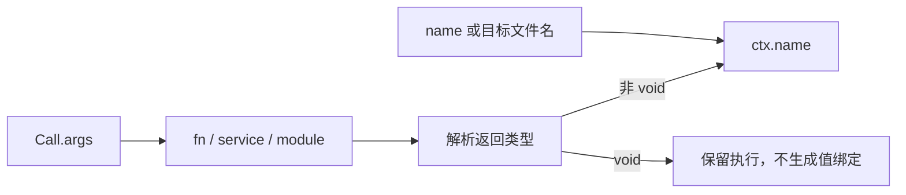

# RX 调用参数与命名结果

## Intent：最终目标

按用户要求将 Call.in 改为 Call.args，移除 Call.out 与 Task.out。调用结果通过 ctx.<name> 访问，不另写结果路径。RX 值中仍禁止内联函数或方法调用。

## Data：可用证据

当前 Call 目标由 fn、service、module 三选一确定；Task 已有 name，Parallel Task 已具备独立返回值。原约束推导和生成按显式 out 的出现顺序分配结果，需要同时更新，不能只修改 Schema。

## Edges：边界与限制

- Call.name 可显式指定；省略时取目标最后一个路径段，去掉 .zx、.rx 或 .zig 后缀。无法形成合法标识符时要求显式 name，不自动替换字符。
- 同一作用域结果名不能重复或覆盖已有路径。同一目标调用多次时显式指定不同 name。
- 返回 void 的调用仍执行，不产生可读取的 ctx 值。推导阶段为所有调用保留结果槽，待类型确定后再决定是否生成绑定，避免前置 void service 导致后续结果错位。
- Parallel Task 使用其 name 暴露结果。顺序 Task 仍是已有局部作用域，不在本次改成独立函数边界。
- Module.in/out 是模块类型契约；本次修改调用参数属性与结果绑定，不改模块类型契约或 ZX 函数参数名。
- 不保留 Call.in、Call.out、Task.out 兼容别名。

## Answer：交付与成功标准

同步 Schema、属性分类、参数联结、结果推导、顺序/并行生成和实际 RX 用法。构建并重放已有 RX+ZX 应用，检查默认名、显式名及 void 结果顺序；不新增测试用例、不执行全量测试。

```xml
<Module>
  <Call fn="adjust" args={$in} />

  <Return value={ctx.adjust} />
</Module>
```



## 执行记录与自我复核

已同步 Call/Task Schema、args 属性分类、参数与 Store getter 入口、结果约束、顺序及 Parallel Task 联结。推导为每个结果身份保留稳定槽位；生成在类型确定后仅绑定非 void 值。顺序 Task 的分组语义保持原样。

已迁移正式自举 RX、当前网站与使用指导、adjust 示例及已有嵌套 Parallel Task 示例。尝试 Grit HTML 模式不能匹配 RX 的表达式属性，改用按引号和花括号边界扫描的受控属性迁移脚本；没有盲目替换 Module.in/out 或 ZX 的 in。

发布构建成功。默认命名 adjust 示例实际返回 original=[2,4]、values=[3,5]、total=8。已有 Parallel main 示例在原有 Z3 契约门禁通过后构建，两个已有业务分支分别返回 {value:12,enabled:false} 与 {value:7,enabled:true}，其中包括嵌套命名 Task、重复目标的显式命名和 void Task。自举 expression.rx 使用 args 与命名结果生成成功。旧版 adjust.rx 因旧属性被拒绝且没有产物，见 [执行记录](RX命名结果迁移/执行记录.json)。

未新增测试用例、未执行全量测试；这些运行证据不覆盖所有前向服务的 void 输出组合，也不等于全仓旧测试已迁移。测试会话正在修改的文件未由本次实现改写。历史日期目录中的旧语法证据保留其原始含义，当前使用文档以本规则为准。
