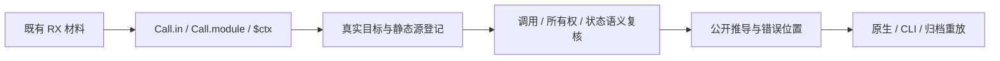

# RX 调用属性与结果名称迁移

## Intent：最终目标

使现有正式测试采用最新契约：Call.in 传值，fn 调用 ZX，module 统一引用本地 RX 或编译模块；Call 不接受 name、out、service，结果由目标最后文件名决定并通过 $ctx.<文件名> 读取。Task.out 是可选聚合表达式，结果为 $ctx.task.<name>。迁移必须保留原调用顺序、输出协议、所有权、线程行为、共享状态和诊断，而非只让 XML 能解析。

## Data：可用证据

生产提交 93321ca3 已统一模块调用和特殊上下文。对应用户消息依次为：恢复 in 的 01a10da9-fa76-7f33-b94b-cc47f979b500；Task.out 表达式的 01a10daa-f5c3-7002-8e93-ebcde24dd8b7；撤除 Call.name 的 01a10db2-fee9-7672-9d60-39392118082f；$ctx 前缀的 01a10db5-d76f-7ac3-98fa-c3a40c16ffa8；Call.module 字段的 01a10db7-0f26-7932-ac1e-fba949da7156。两次只读清点已定位公开 API 与各运行 driver 的具体源登记。

最初清点为 196 份源材料，词法迁移预览处理了其中 188 份。旧 args/name/ctx 方案发生在后续契约决定之前，仅保留为迁移历史。该数量不是测试执行数量，也不是通过证据。恢复 in 的范围单独保存；新增值策略与 Task 输出已由 2cae3f0c 独立交付，现有材料尚待最终迁移。

## Edges：边界与限制

只写测试和对应文档。Module.in/out、Route.service、Store 名称/别名、业务返回对象字段以及内部 Call.out/outs 契约保持原职责。格式化及底层 XML 解析的任意标签材料不用于证明公开执行，不能套用编译语法迁移。旧属性拒绝用例必须刻意保留，生成 Schema 用例须同步其数据源与生成校验入口。

同一可见作用域不能重复使用同一个目标名，父调用名也会进入 Task 子作用域。仅删 name 会使资源、类型和运行错误被重名诊断遮蔽。需要独立结果的测试在其现有 driver 显式登记不同源路径，复用对应的成熟夹具文本；不增加生产别名适配或运行时查找。编译库的重复公开调用需要两个真实公开导出名。共享模块类型冲突必须保留同一模块身份，分别放入两个普通 Task 私有作用域，不能复制模块后声称仍在检查共享约束。

## Answer：交付与成功标准

按 driver 逐组迁移：顺序、项目、Parallel、IO、Store、双 Store、Store IO，再迁移推导与严格位置。单次目标直接去 name 并改引用；重复目标逐例增加明确静态源路径。每组先检查语义，再执行对应 Debug/ReleaseSafe、原生或 CLI 路线。实际执行、缓存、源码版本与失败原因分别记录，完成一个部分即提交 push。整体旧回归尚未全绿时不得宣称全量完成。




具体最终写法：

```xml
<Module>
  <Task name="summary" out={{value: $ctx.calculate}}>
    <Call fn="calculate" in={$in} />
  </Task>

  <Return value={$ctx.task.summary} />
</Module>
```

## 已核对的最小迁移决策

- ownership 的独立 make/pop 调用使用 make_other、pop_other 的明确 Source 路径；重复移交同一个 owner 则只创建一次 make，但使用两个不同消费目标，以保留 ownership 拒绝。
- control 的外层 helper 与内部 inner 使用不同真实源路径；shadow 用例仍调用同一个 helper，确保检查的仍是可见目标重名。泄漏检查读取真实 inner 结果名。
- project 的共享 identity 类型冲突保留同一个 identity.rx，在两个普通无 out 的 Task 内调用；不同 owned 返回才登记 owned_other.rx。
- Parallel 直属重复 copy/consume 保持直属 Call 及真实 worker 粒度，用 copy_values_right、consume_right 等具体目标，不用 Task 包装消除线程证据。
- Task 捕获父 map_values 时，私有再次生产列表使用 map_values_local，保持父列表与私有列表区分。
- Store 多次 snapshot/read/write 保留实际调用次数与提交顺序，分别登记描述时序的目标名，不把重复调用删除。
- 重名/非法名字的 marker 指向整个 fn/module 原始属性值；表达式位置包括 $ctx 的 $ 前缀。Task 名称诊断仍按 Task 本身的 name 或节点定位。
- 原 49 格路径祖先矩阵改为 7 个真实目标文件名的合法性与重名矩阵，非法 stem 也登记真实源码，避免缺失目标抢先挡住名字规则。

## 工具与自我复核

已尝试 grit：RX HTML 表达式解析失败，且没有 Zig 语言规则；零匹配不是迁移完成。旧受限词法脚本只作为历史转换资源，不能用它偷偷保留 Call.name 兼容。当前最大风险是重复目标遮蔽所有权诊断，以及复制共享模块使原类型冲突测试失真；因此最终转换按现有 driver 的职责和明确源清单实施，不进行全仓无语义替换。
