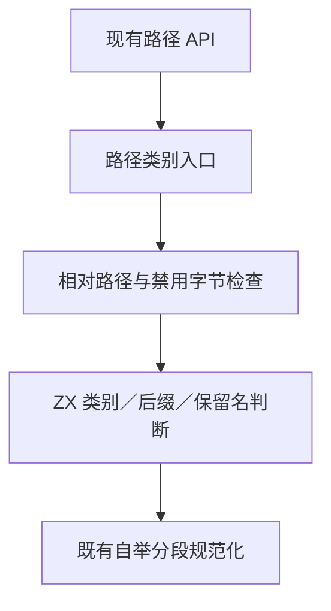
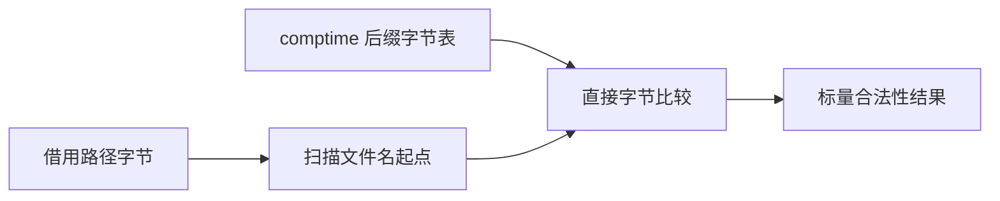

# RX 路径类别自举

## Intent：最终目标

将普通模块文件、模块引用、专用文件、Store 引用和 ZX 函数引用的合法性判断迁移到 RX＋ZX，保持现有无 allocator 谓词与路径解析 API。

## Data：实际边界

`paths.zig` 的判断共用相对路径、禁用反斜杠／冒号／NUL、非空文件名等规则，再检查后缀与保留名称。分段规范化已经自举，本阶段迁移其之前的类别判断；路径拼接仍保留原接口。

纯比较所需固定字节表目前被 genz 复制到 arena，内联对象实参也可能装箱。需要在有证据的边界消除这些分配：只将纯标量函数中的原始常量列表生成 comptime 只读数组；只为纯标量被调函数使用栈上的对象实参。原生调用、Store、任务和并行继续沿用原表示，不推广到无法证明不逃逸的值。

## Edges：边界与限制

- 继承原有路径字节语义，不增加 UTF-8、文件系统或符号链接检查。
- 固定后缀属于语言规则，不依据测试材料识别路径。
- 常量列表不包含运行时表达式或聚合引用，生成 comptime 数据以避免临时栈地址失效。
- 列表修改仍遵循既有复制／缓冲语义，不把只读常量直接交给原生消费者或返回为拥有所有权的列表。
- 使用零容量适配验证无分配；不新增测试用例、不执行全量。

## Answer：交付与成功标准

正式类别规则、最小现有 API 接线、genz 中通用且保守的常量／实参优化，以及生成代码和既有路径材料核对。必须保留首错、后缀补齐及特殊文件边界；未迁移的路径拼接和 Schema 继续列明。

## 当前验证记录

路径规则已经接入生产 `paths.zig`。生成代码中固定字节表为 comptime 只读数组，纯标量调用的对象参数按值构建后传入栈地址。直接读取 loop 字段也通过按值路径处理，不再要求源码先为中间状态命名。不能安全按值处理的循环仍沿用原路径。

生成的完整路径类别模块没有 alloc/create。发行构建通过；既有 test-module-graphs、test-rx-store-paths、test-iterate、test-array-callbacks 专项通过，其中 Store CLI 16/16、循环 CLI 5/5。

`path_reference.zig` 使用相邻 zxc_zig 目录中的原生 RX 模块，重放既有路径 JSONL：302 次规范化、114 次引用解析，结果与错误均为 0 差异，见 `既有路径核对.json`。此对照没有扩造输入，也不能替代所有 API 的一般证明。

`scalar_assembly.zig` 可生成 x86_64 的模块文件判断汇编。正常路径为字节扫描与固定后缀比较；仍保留标准整数安全检查及其 panic 支持，不能把完整产物称为无函数调用或零体积。本阶段不提交庞大的标准 panic 汇编，只保留可复现的导出入口。

## 自我复核与复现

本阶段只完成路径类别判断；路径拼接、完整 Schema、ZX 语义分析与后端仍包含原生 Zig，不能据此宣称编译器已完成自举。有限路径回放只覆盖已有材料，Store 与循环边界另由已有专项检查覆盖。

通用生成优化独立提交为 `8585ead1`，原生 `zig` 分支同步为 `c563af62`。它不依赖任何 RX 路径名称：静态列表根据 IR 元素种类和函数纯度决定；对象实参根据被调函数纯度及标量返回类型决定；直接字段投影复用既有循环值生成路径。

在本目录执行 `zig build -Doptimize=safe -j2`，再运行 `zig-out/bin/path-reference ../../../packages/test/tests/rx/modules/paths/cases.jsonl`，即可重放既有路径材料。该对照需要相邻 `zxc_zig` 工作区。

正式生成入口为仓库根目录的 `zig-out/bin/zxc packages/compiler/src/rx/path_kind/validate.rx --out /tmp/zxc_path_kind.zig`。生成内容包含完整被调用的 ZX 规则，可直接检查常量表示及是否出现分配调用。

原生基线 CLI 已在 `c563af62` 重建成功。原生 CLI 与自举 CLI 生成同一正式路径类别入口的 SHA-256 均为 `70f7383e33c027f109bacfb0f2916af21acd9167af862570e2fbcab6de5c03fe`；提交格式化后的输出也保持一致。此证据确认该模块生成一致，不等于全编译器固定点证明。
