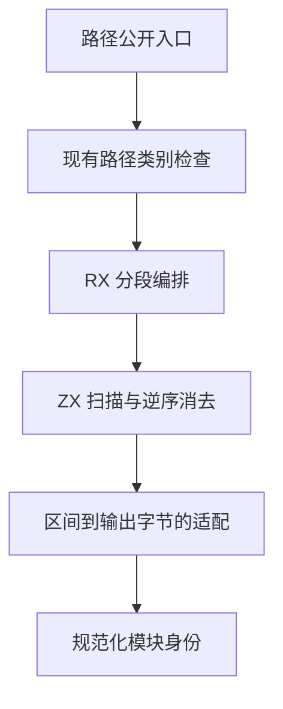
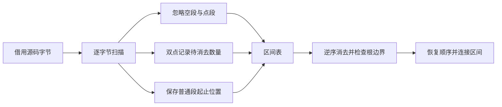

# RX 路径规范化自举

## Intent：最终目标

将 RX 模块身份中的路径分段与归一化迁移到 RX＋ZX，并保持普通模块、Gateway、Store 与函数路径共用同一实现。先迁移有明确输入输出边界的分段算法，再继续迁移路径类别规则与依赖图。

## Data：现有证据

`packages/compiler/src/rx/paths.zig` 的 normalizeSegments 被所有规范化入口共用。现有算法按 `/` 分段，忽略空段和 `.`，遇到 `..` 弹出最后一段；空栈弹出报告 InvalidPath。最终用 `/` 连接源片段。

ZX lexer 已使用借用输入的 reduce 构造拥有所有权的状态，适合在不复制输入字节的情况下生成区间表。新实现沿用这一成熟模式。原生适配只按区间复制最终输出，不重新决定路径语义。

实现时检查生成代码发现，直接 push/pop 段栈无法进入现有只追加缓冲优化，逐段复制会产生平方级开销。最终采用两步：扫描并忽略空段及单点段，保存其余段的位置与双点标记；从后向前归约，双点增加待消去数量，普通段优先抵消该数量，剩余普通段输出。最终待消去数量非零即越出根。结果反转回源码顺序。

这与原有栈语义等价：每个双点只能消去其左侧尚未被消去的普通段；缺少可消去段即非法。两个只追加归约均已生成普通 Zig ArrayList 缓冲调用，数组反转也仅处理区间，不复制源码字节。

## Edges：边界与限制

- 公共 API、路径类别判定、后缀补齐与宿主路径行为保持现有契约；本阶段不宣称这些判定已自举。
- 不引入文件系统访问、符号链接解析、动态装载或专用运行库。
- seed 使用原生分段，生产使用生成的静态模块，避免自举构建环。
- 不新增测试用例、不运行全量测试；使用已有路径与 RX 依赖图专项验证。
- 区间表与临时状态使用临时 arena，最终输出由调用者 allocator 持有；不把分配藏入纯 bool 路径谓词。

## Answer：交付与成功标准

正式 RX＋ZX 分段模块、seed/生产构建接线、最小 Zig 数据适配与既有专项结果。以真实路径规范化结果、InvalidPath 契约、依赖图顺序和内存生命周期保持一致为标准；实施后复核生成源码与资源检查，记录未完成的迁移范围。

## 实施与自我复核

生产 `paths.zig` 的公共入口共用生成模块；`rx_options.generated_paths=false` 仅供 seed 构建保留原算法。Zig adapter 在临时 arena 中调用生成模块，按源区间一次分配最终路径，随后释放临时区间表。没有新增源码副本或路径解释回调。

生成源码检查确认扫描与消去的两个 reduce 均使用缓冲调用；最终段追加至多复制一次区间表，整体时间和辅助空间随路径长度线性增长。仍有区间对象和数组分配，没有宣称零分配或与手写原实现完全相同的常数开销。

发行构建已通过。原 Zig 基线 CLI、此前生产 CLI 与当前生产 CLI 生成同一模块的 SHA-256 一致：`06b538a48787ad9aba207df379de9d518f437b0bfa12c27d93a67d6d6c510757`。

验证过程中遇到两套遗留测试契约：旧 compiler RX 测试使用被移除的 `std.meta.fields` 和 `Call.out`，未修改这套旧入口；packages/test 模块图夹具使用旧 `Call.service`，已将其迁移为 `Call.module` 并同步路径错误消息。图、路径数据与枚举范围没有变化，未新增用例。首次模块图运行 4722 通过、5724 失败，不能记为通过；迁移后同一命令 `zig build test-module-graphs test-rx-text -Doptimize=safe -j2` 成功退出，10446 项模块图及 122 项 RX 文本检查全部通过，包含既有分配失败与受限栈检查。未执行全量测试。

本阶段只完成路径分段算法自举；文件种类、后缀补齐、依赖图遍历及 RX Schema 等语义仍须继续迁移。
