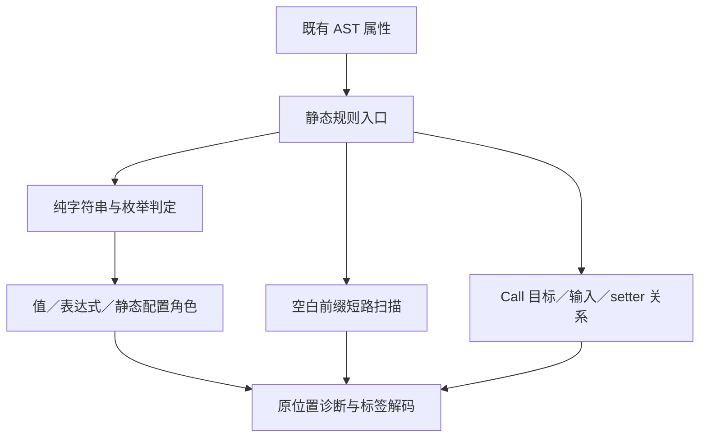

# RX 静态规则自举

## Intent：最终目标

将 RX 属性角色、路径类别及标签的纯判定规则逐步迁移到 ZX，由 RX 组织入口。保留无 allocator 的现有判定 API，不因自举额外引入堆分配或将已有校验重复执行两遍。

## Data：当前证据

`attribute_kind.zig` 决定字符串值、花括号表达式和静态配置的边界；`checks.nonEmpty` 先完成所有属性角色检查，再检查非空限制。角色错误优先于空值错误，必须保持。

DSL refine 的标签检查接口不接收 allocator。先用已有语法验证纯字符串／枚举判定能否生成无分配 Zig，再决定生产接线；不能为了套入生成器而更改整个 DSL 公共契约。

草稿证明属性角色和 Call 目标关系可直接生成无分配枚举函数。非空检查需要在找到第一个非空白字节时停止，不能用扫描全部字节的 reduce 代替。现有 genz 会将这种循环的初始和最终状态装箱，即使函数最终只返回 bool。

本阶段同时补齐该实际后端缺口：沿用已有纯函数分析，只允许无原生调用、无 Store、无任务／并行且返回标量的函数把不逃逸的对象局部量放在栈上；平坦循环状态支持按值初始化和返回。公开生成 ABI 和保守错误集合保持不变。原有聚合返回、逃逸值和不能证明安全的循环沿用原路径。

## Edges：边界与限制

- 不改变属性语法、静态配置与值表达式的角色。
- 只迁移有明确 owner 的实际规则，不用生成函数包裹旧判定。
- 无分配必须由生成代码和实际调用验证；不能将内存失败当作普通校验结果。
- 无分配适配使用零容量 allocator；若后续生成器重新引入分配，将作为内部不变量失败暴露，不静默改变校验结果或增加堆分配。
- 不新增测试用例、不执行全量，使用既有 RX 属性与文本专项。




## Answer：交付与成功标准

交付纯规则 RX＋ZX 源码、最小适配及既有材料验证。首个验证点为无堆分配的属性角色分类；后续路径与标签规则沿相同实际边界推进。未迁移部分继续明确列出，不能把此阶段称为完整 Schema 自举。

## 已实施的边界

正式规则位于 `packages/compiler/src/rx/schema/`：attribute 分类 Static／Value／Expression；content 判断是否包含空格、TAB、CR、LF 以外的字节；call 判断 fn/module 二选一、fn 的必填输入与 module 禁止 setter。三个入口使用 RX 调用各自 ZX 规则。

`attribute_kind.zig`、`checks.hasContent`、Store Field 校验及 Call refine 已调用这些规则，seed 分支保留原判定。属性角色仍先整体检查，再检查空值；Call 的 target、input、setter 错误顺序不变，路径检查仍在这些规则之后。

非空规则通过 loop 只扫描空白前缀。生成代码已经没有 alloc/create；其错误集合仍保守包含 IndexOutOfBounds／OutOfMemory，未为优化更改公共错误契约。零容量适配器不会把潜在内部错误转换成普通校验失败。

测试适配中发现无分配回调的错误集合不含 OutOfMemory，导致 Zig 标准库故障注入工具无法实例化。现有 allocation_testing 包装器现在只在类型层合并 allocator 错误集合后调用同一个工具；既不制造分配，也不跳过故障注入或资源检查。

## 验证与自我复核

- 通用后端修复提交 `f1f35ffb`，已推送 master；仅这组后端与测试适配修改以 `e87ee1d5` 同步到原 Zig 实现分支，不混入 RX 自举接线。
- 原 Zig 实现的 packages/cli safe 默认构建通过。更新后的原 Zig CLI 和生产 CLI 生成三个规则的 SHA-256 分别一致：attribute_role 为 `774487ef74156a9304518a5594a8c1e4e4825f5c5fd4971e0da12e7b84f1dcf4`，attribute_content 为 `64898d5e8282c97e572dffdb688494dd56df9878f0ae8e41ec019dfa619ca4e8`，call_rule 为 `88e3fb0563183b2c2e239162d1cab41849aab02c34a7fe2f7d85d5eb0788ccc7`。
- 发行构建通过，三个正式静态规则都能由生产 CLI 生成。角色与 Call 规则为 error{} 标量函数，非空规则保留保守错误集合，但三个生成实现都没有 alloc/create。
- RX 属性、RX 文本和 value-return 专项通过。属性材料包含 70 个解析案例、78 个 Schema 案例，实际 CLI 执行 55 项通过、语义拒绝 6 项通过。value-return 覆盖源码／编译库两条路径的别名、可选值、容器逃逸和分配失败。
- 初次循环组合专项有 199 项已执行的 Zig 测试通过，但有两个无分配模式的测试适配编译错误和一处旧 RX 夹具错误，不能记为整体通过。修复通用错误集适配、相关会话完成原有夹具迁移后，失败的 test-iterate 重跑通过，CLI 5/5 通过；此前 test-iterate-buffer、test-iterate-calls 已通过，包含旧快照和编译库迁移。
- `scalar_assembly.zig` 将正式非空规则和零容量适配器组合为导出函数。x86_64 macOS 的 ReleaseFast 汇编见 `content_x86_64.s`：只有字节扫描、比较、跳转和返回，没有函数调用，allocator／arena 适配已被消除。这是该目标上的实际代码证据，不宣称覆盖所有 CPU 的汇编表现。

没有新增测试用例、没有执行全量测试。当前只迁移属性角色、非空规则和 Call 的属性关系；重复声明、文件种类、路径类别及其余 Schema 规则仍需继续迁移。后端优化不处理无法证明纯粹性或平坦布局的局部循环，也没有为当前材料硬编码优化分支。

汇编证据可在仓库根目录复现：

```sh
zig-out/bin/zxc packages/compiler/src/rx/schema/content/validate.rx --out /tmp/zxc_attribute_content_final.zig

zig build-obj -O ReleaseFast -fstrip -fno-emit-bin -femit-asm=/tmp/content_x86_64.s \
  --dep scalar --dep content \
  -Mroot=docs/2026-10-06/RX静态规则自举/scalar_assembly.zig \
  -Mscalar=packages/compiler/src/rx/schema/scalar.zig \
  -Mcontent=/tmp/zxc_attribute_content_final.zig
```
