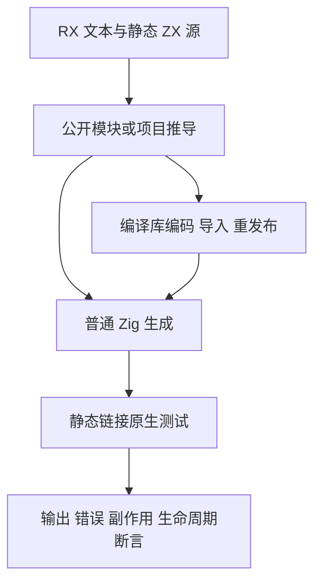
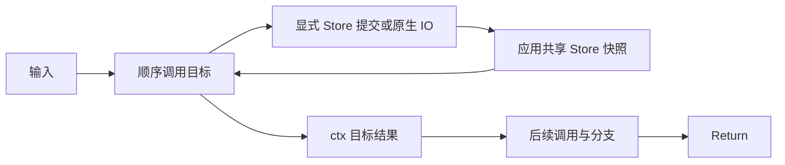

# RX 顺序运行迁移计划

## Intent：最终目标

迁移真实 RX → 项目推导 → 普通 Zig → 原生执行回归，使最新目标派生结果契约继续覆盖调用顺序、借用、owned 集合、模块组合、分支终止、IO、共享 Store 与库重放。

## Data：可用证据

- 原有运行驱动位于 `packages/test/tests/rx/runtime/`。共享集合源码已经在普通推导部分提交，但 pop/reverse 的最新语法尚需原生执行验证。
- `test-rx-runtime` 聚合顺序核心、Store 与 IO/库路径。Parallel 原生运行使用独立入口，留给后续部分。
- 当前材料的 Call.name 与 ctx 是历史契约；重复的非 void 目标不能通过仅删除属性迁移。

## Edges：边界与限制

仅迁移测试材料与静态源登记，不修改生产实现、用户输出字段、IO 副作用顺序或 Store 物理身份。需要不同结果名时登记明确的独立源码目标；重复模块的内部依赖仍指向同一共享 leaf/Store。void 调用没有值绑定，保留其执行。结构通过不作为原生成功证据。模式、库路由及 OOM 重复执行不算新增 Test262 案例。

## Answer：交付格式与成功标准

交付分类测试材料、迁移脚本、Debug/ReleaseSafe 日志与结果指纹。通过现有原生运行入口，核对输出、错误、副作用、内存生命周期及分配失败回收；完成一个可验证部分后独立提交 push。生产缺陷复现后消息实现会话，由该会话修复。

## 架构图

## 数据流图

## 执行记录

并行推导保留一个已反馈的生产诊断失败，期间推进独立的顺序运行迁移。先按真实调用目标修改材料，再登记明确的顺序第二目标与 Store 快照目标，不为兼容旧 name 增加运行层。

## 自我批判

已通过固定检出回归核对共享依赖、既有输出字段、非 void 调用结果身份及重复 void 调用的执行；最终自我批判记录后续发现与证据限制。

Grit 已按仓库偏好先尝试 HTML 模块属性规则 dry-run，因变量匹配上下文失败而未应用任何正式材料；日志保留其具体错误。改用前一部分的 RX 属性扫描器处理花括号表达式和结果引用，随后显式登记语义需要的独立目标。

首轮原生组发现重复 void `write` 被推导阶段登记为结果重名；discard 与 input_error 原有执行材料均失败。已向实现会话反馈，保留原始两次 void 调用，不用不同目标绕过。Store/IO 的成功输出需等生产修复后重新汇总，首轮局部成功不记为全组通过。

## 修复与完整回归

- 实现会话提交 `55c070bd`：在 RX 推导收敛时拒绝无输出结果引用，使其报告 name，避免误入 ZX Store handle 路径。
- 实现会话提交 `0d0f8409`：非 void 结果才进入可见名字集合；内部 lowering 的每步结果槽仍保留。修复中删除槽位引起的合法 void Task 崩溃已通过联动回归发现、反馈并修正。
- 本部分保留 IO discard/input_error 的两次真实 void write，已有原生断言验证执行顺序、错误阻止后续写入与分配失败回收。没有通过复制 void 目标规避重复调用问题。
- Debug 修复后首次成功时，197 次普通 Zig 声明实际执行、137 个运行步复用缓存；另有 14 个 Node 组实际执行 70 次外部 Zig 声明。提交版本后 Debug 939/939 步、980/980 普通 Zig 声明全实际执行，外部 70 次同样通过。
- ReleaseSafe 首次完整成功：939/939 步、980/980 普通 Zig 声明全实际执行，14 个 Node 组的 70 次外部 Zig 声明通过。其中包含 105 次并行推导联动；顺序原生部分为 875 次普通 Zig 声明执行。

本次迁移 54 份 RX 材料与 7 份运行驱动/构建文件。主要变更是目标属性和结果引用；追加的第二目标与快照目标均明确登记同职责实现。重复桥接模块仍调用同一 leaf，重复 Store 调用仍访问同一个物理 Store。既有输出对象字段 first/second/before/after 等保持原契约，源码集合只改变调用身份。

共享 pop_values/reverse_values ZX 实现通过 owned_pop、owned_service、control_owned 真实原生路径验证，收回上一部分“只有推导证据”的限制。IO 运行覆盖来源、库重放、RX/ZX 消费与重发布，以及纯导出不需要 IO 宿主的路径；这些是同一语义沿不同路径的执行次数，不能计作独立上游 Test262 案例。

## 最终自我批判

最初误以为 void 调用可以直接保留同名目标却未预先检查命名推导阶段；实际回归揭示了生产缺陷，现由实现会话修复。对非 void 重复目标使用静态独立源，对 void 重复目标保留相同源，两者的区别由是否存在结果值决定。

提交 hook 为前一并行部分调整两份测试的空行，导致预先保存的源 SHA 与提交字节不一致。已保存格式前后指纹，并在新生产修复后联动复跑；不把提交前日志冒认为相同字节的提交后运行。完整运行期间生产修复从工作树变成正式提交，初始指纹中 expression/types 两文件发生变化；最终以提交契约检出与补录日志核对，不以起始 HEAD 代替执行证据。

本轮没有修改生产实现、Test262 catalog 或逐份审阅记录；没有完成 Parallel 原生运行材料、Gateway/库发布及 RX 属性剩余材料的迁移，也没有声称全仓库通过。实现会话中的新 ZX parallel 与类型化 try 需求尚在设计/实现阶段，待公开契约和实现可验证后增加相应测试。

## 固定检出核对

共享工作区随后开始引入 ZX parallel/类型化 try 所需的 core 与 ZX 分析变更，因此最终补录复用本聊天已有且干净的 `release-safe-regression` 工作树，切到 `0d0f8409`。仅覆盖本部分 61 份测试材料，生产 compiler/core 没有工作树差异。记录固定检出指纹，两种模式从该检出运行；完成并保留日志后归档临时检出。共享区中的新实现不会混入这个部分的固定生产验证。

共享目录的 ReleaseSafe 提交契约补跑遭遇新 core/ZX 类型实现尚未接齐的 4 个编译错误，退出 1（当次已执行 368 个 Zig 声明通过）。该日志更名为《ReleaseSafe共享类型变更日志》，标注为并行实现中的证据，不能用于本部分成功标准；没有把这类开发中的编译失败再次当成已完成特性的缺陷通知。固定检出将作为最终两模式验证来源。

## 固定检出最终结果

Debug 与 ReleaseSafe 均退出 0，各完成 939/939 构建步骤、980/980 Zig 声明实际执行（0 个缓存运行步），另有 14 个 Node 组、70 次外部 Zig 声明实际执行通过。980 次中，顺序原生为 875 次，并行推导联动为 105 次。固定生产提交为 `0d0f8409`，61 份本部分测试字节与共享目录一致，固定检出中的 compiler/core/genz 没有差异。

并行推导部分提交 hook 的空行变动也通过这次固定检出的两模式验证；其先前回归指纹仍作为历史保留。后续 Parallel 原生组可复用此检出，在本组终态确认后才复制下一部分材料。以上数字是执行次数，不是独立 Test262 案例数。
