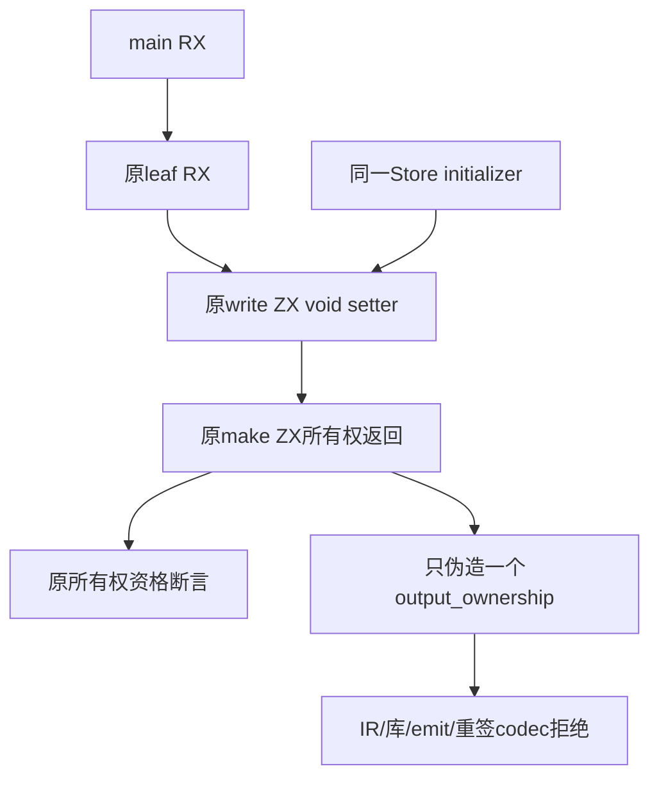

# Store所有权嵌套来源同步计划

## Intent：最终目标

恢复既有Store所有权证明测试的嵌套模块调用，使摘要伪造、跨函数边界及分配失败门禁继续到达原校验阶段。

## Data：可用证据

根第二轮固定ca727e2c中本组78个声明实例，direct/helper及非嵌套伪造36通过，嵌套service/combined32、普通allocation4、嵌套伪造4、伪造allocation2共42项失败。日志均main.rx unknown_attribute。共享fixture.outer仍用Call.service，是唯一旧RX字段；失败在推导阶段，尚未到伪造summary检查。只读核对源登记main.rx/leaf.rx/write.zx/make.zx及同一state.store.rx已完整。

## Edges：边界与限制

只改fixture.zig一处Call.service→module，保持in={0}。writer及leaf为void，不增加ctx或Return。Case.service开关、测试标题和service.zig文件名仍表达原场景，不为字面名称改写业务。保持main→leaf→write→make，同一Store、原module/函数身份，不复制/内联实现。

forgery按basename make.zx精确找到一个目标，先断言borrowed，再只伪造output_ownership为owned；changed==1、函数体、输入输出类型、rows/labels布局、expected值不改。validateIr/link/emit的InvalidIr及codec.decode的InvalidLibrary拒绝、正确schema和重签digest、未变异control成功解码均保持。没有严格XML行列断言，不把历史unknown_attribute位置填为迁移预期。历史10-05草稿与日志保留。

## Answer：交付格式与成功标准

一份正式/草稿/固定检出逐字节相同。固定生产版本运行既有test-store-ownership-proof，Debug及ReleaseSafe，记录真实实例、分配失败声明与缓存，成功后精确提交push并核验指纹。新增测试声明、目录案例及Test262审阅0。新出现的所有权/编码/OOM失败保留原断言，独立归因；本轮不能据42个早期失败报告生产Store proof缺陷。

## 自我批判

未知属性会遮蔽所有权摘要验证，修正来源后必须实际到达原伪造边界。删除in 0会改变调用图输入推导，历史已验证该字面量必要；不能为缩短源码删除。嵌套source数量、make唯一定位和同Store身份必须不变，否则通过不再代表原边界。

## 最终执行记录

固定9b24f8b5，Debug和ReleaseSafe的test-store-ownership-proof均退出0，各24/24步骤、78/78 Zig声明实例全部实际通过，无运行缓存。原32 direct/helper、32嵌套service/combined、4普通allocation、8非嵌套/嵌套伪造、2伪造allocation保持；故障注入内部迭代不另算新声明。

此前42项被旧属性遮蔽的原边界现已通过：同Store身份、main→leaf→write→make路径、make唯一目标和borrowed→owned伪造、IR/link/emit/正确digest下codec拒绝与未变异control，全部原断言保持。正式/草稿/固定检出一致，一处属性修改之外无源码变化。新增测试声明、目录案例和Test262审阅均0，无生产源码变更。
