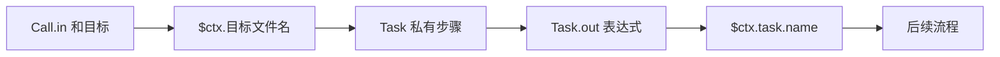
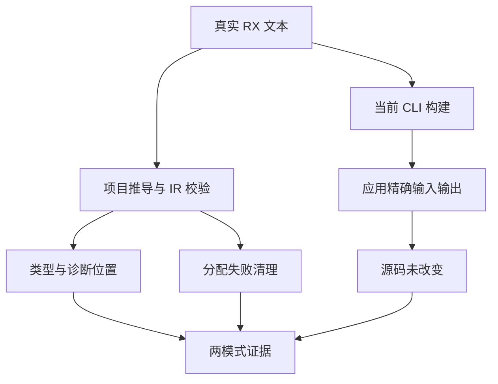

# Task 聚合与目标结果回归计划

## Intent：最终目标

验证 Task.out 作为可选聚合表达式的实际编译与执行，以及 Call 目标直接决定结果名的契约。目标是保住输入、私有作用域、任务汇合、输出路径和资源生命周期。

## Data：可用证据

实现提交 a6bb6f51 接入顺序与并行 Task.out；实现会话后续用户消息 01a10db2-fee9-7672-9d60-39392118082f 明确移除 Call.name。当前源码恢复 Call.in，Module.in/out 保留，Call 输出为 $ctx.<目标文件名>，Task 输出为 $ctx.task.<name>。同一任务边界的 out 与 Return 不可并用，嵌套 Parallel 的独立 Return 不算外层任务输出。

## Edges：边界与限制

只修改 tests、测试构建登记及执行证据。结构 Schema 只证明属性形状；成功用例必须进入公开项目推导、IR 校验和真实 CLI 应用。对拒绝结果检查原始源码位置、诊断码与消息；不把旧属性拒绝当作内联调用的拒绝。生产正在变化，日志必须记录具体检出与当时工作树指纹。

## Answer：交付与成功标准

在 tests/rx/task_output 下按推导、资源失败和 CLI 职责分组。实际覆盖顺序与并行聚合、对象/字符串/列表、分支、外层捕获、内层作用域、独立并行返回、void、重复名、四个已撤除属性，以及目标最后路径段。公开 API 和 CLI 共享真实 RX 材料，API 保留每条用例独立声明；两种编译模式执行并记录。实际缺陷才向指定实现会话报告，完成这个部分后提交 push。

最新用户消息 01a10db5-d76f-7ac3-98fa-c3a40c16ffa8 要求特殊上下文加 $ 前缀，01a10db7-0f26-7932-ac1e-fba949da7156 将 Call.service 改为 Call.module，service 仅给 Route。首轮日志处于迁移中，不能作为实现缺陷证据；最终验收使用 $ctx、Call.in、Call.module 且无 Call.name。

## 实际结果

两个目标合并执行：模块接入完成后的 Debug 为 21/21 构建步骤、78/78 Zig 测试实际通过；格式复核后的最终 Debug 为 21/21 步骤、36 条实际执行加 42 条此前通过的缓存。ReleaseSafe 为 21/21 步骤、78/78 条实际执行通过。Task 部分为 32 条独立语义声明加 4 条分配失败清理；值策略部分为 37 条拒绝声明加 5 条分配失败清理。两份 JSON 由 API 和 CLI 共享，不据此翻倍计算独立语义覆盖。

Task CLI 的 32 条用例全部通过：14 条成功路径构建 14 个原生应用，每个输入 0、7、123，精确比较 42 次输出；18 条拒绝路径检查诊断码、原始行列、消息、无输出应用。值策略 CLI 额外执行 37 条拒绝、3 个应用共 11 次精确输出。两模式合计每模式 17 个应用、53 次成功运行、55 次预期失败构建。所有临时源码均检查未被改变并清理。

成功路径包括顺序标量/字符串/对象聚合、兄弟任务复用私有调用目标、并行对象与混合 out/Return、内层 Parallel 独立 Return、Switch 后聚合、未写 out 的顺序 Return、void 顺序/并行任务、Call 与 Task 同名、显式 fn 源码后缀和本地 module 目标名。拒绝路径包括四种同任务输出冲突、私有结果逃逸、分支局部值进入 out、未知名称、引号 out/空表达式、读取 void 任务、重复 Task/Call 目标、保留目标 task，以及 Call.name/out/args/service 四种撤除属性。

类型检查、受影响文件格式检查及 diff 检查通过。日志及源码指纹见本目录的结果.json；ReleaseSafe CLI 的实际路径与 SHA256 已在运行过程中观察并记录。运行使用活动共享检出，不能把它解释为某个固定提交全库通过。

## 自我批判与后续边界

首轮使用旧 ctx，执行期间生产已改为 $ctx，故合法输出也报未知值；module 加载入口接入期间的 CLI 拒绝也不等于最终接口缺陷。另一个失败由测试自身没有约束 $in 的具体类型造成，已加入类型明确的真实调用，不通过硬编码生产来绕过。最终两个模式均通过，无需发送缺陷消息。

这些测试证明了上述输入范围和入口。它们不检查所有线程调度次序、Gateway 请求、完整编译库迁移或所有 Store 场景；已有重复目标迁移必须保留原资源语义，不能用重名拒绝掩盖所有权错误。测试结果没有增加 Test262 的审阅或适配数量。
