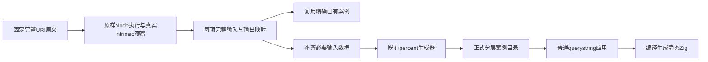
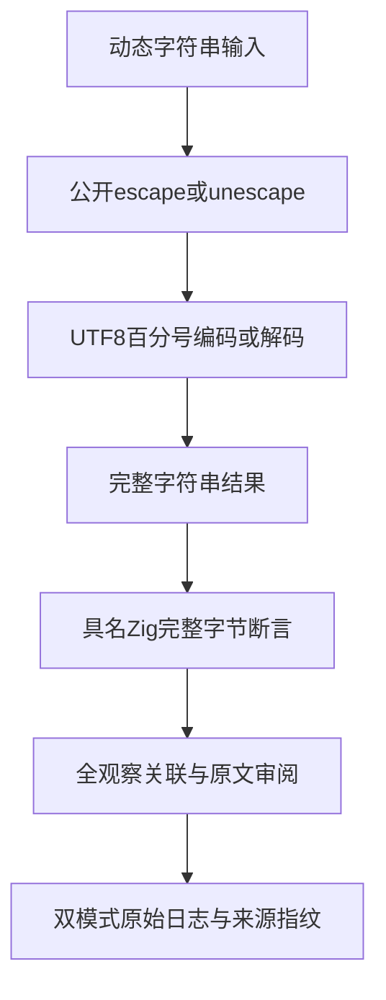

# URI编解码完整原文适配计划

## IDEA

Intent：完整适配固定 Test262 中现有公开 querystring 编解码接口可以表达的 16 份成功原文，保留每一项输入与完整输出。

Data：encodeURIComponent 九份原文共 96 项观察，decodeURIComponent 七份原文共 38 项观察；源码与索引 SHA 已由只读审阅核对。现有 escape/unescape 普通应用接收 string 并返回 string，99 项原文观察有精确现有案例；预计需要 35 个新增输入。

Edges：适配明确的 std:querystring.escape/unescape 接口，不声称 JS 全局函数、隐式对象转换、孤立 UTF-16 surrogate 或 URIError 兼容。保留原文俄文案例的短路分支，不修正看似异常的备选字面输入。完整成功原文通过与整个 URI 家族兼容是不同结论。

Answer：保存 16 份全文与 SHA、32 次普通/严格原样参考执行、134 项逐份观察映射；仅补齐缺少的独立输入，复用正式应用、生成器与 querystring 门禁，在 Debug/Safe 实际执行后登记完整 adapted 审阅并单独提交 push。

## 执行步骤

1. 保存全文与 metadata，主代理逐段阅读；原样 Node 普通/严格运行，观察器只记录实际 intrinsic 的调用结果，不替换输出。
2. 按 operation、精确输入和预期输出复用已有目录记录；缺失输入写入草稿数据文件。扩展现有 percent_cases 消费该数据，增加生成检查所需的文件依赖，保持已有记录顺序与字节。
3. 草稿同步到固定隔离检出，执行正式 querystring 门禁的 Debug/Safe，检查生成产物、每个新增 ID 及所有关联原文观察，不把重复目标或缓存算为独立用例。
4. 核验草稿与正式文件一致、生成检查、目录审计、类型与本次 diff 格式；保存执行结论并自我批判，再提交 push。

## 自我批判要求

不能因 querystring 解码对合法字符串成功，就忽略其对损坏编码采用保留或替换的不同契约。原文的 ASCII 循环、大小写百分号与控制字符都必须保留，不能仅选几个示例。新增数据属于测试输入和参考结果，不在生产逻辑中按用例返回答案。

根目录 ebe3d605 ReleaseSafe 完整回归继续使用另一隔离检出，本部分独立绑定生产基线，不覆盖其报告。
