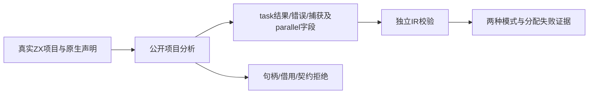
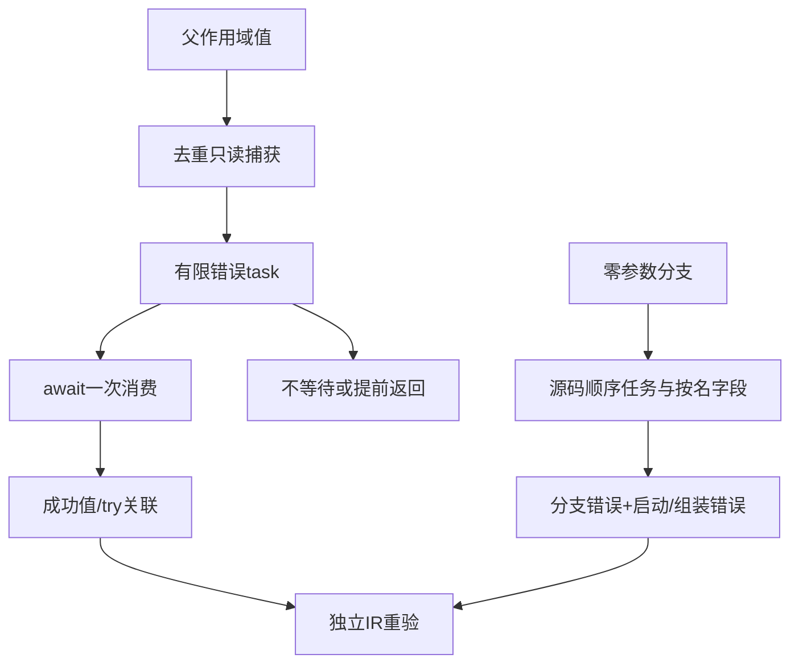

# ZX 任务分析测试计划

## Intent：最终目标

为已提交的async/await/parallel建立正式项目分析和独立IR校验门禁，验证一次消费句柄、只读捕获、有限错误集合与并行结果形状。

## Data：可用证据

最初沿用release-safe-regression工作树0f371fe5，包含039a7ce0的ZX异步实现；最终固定同步至ae31a16cac36f32f0f2e053c17869e5479bb216d，包含独立void await语句修复。已阅读ZX异步参考、analysis/tasks、ir/tasks、ownership/check、类型及错误效果实现。成熟测试布局参考typed_try/analysis；公开project.analyze返回真实IR，随后validateIr独立重验。

## Edges：边界与限制

只修改packages/test和执行文档，不修改实现会话的生产源码。显式cancel已随ae31a16c实现，另立取消分析与运行部分，不扩大当前任务分析范围。任务只允许本地创建绑定或直接await，句柄不复制、不装入容器、不由任务返回；引用捕获和await结果保守保持borrowed。并行字段按名称形成对象但分支仍按源码顺序，void分支无结果字段；有限错误需要显式原生concurrent契约。分析门禁不代替实际IO并发、退出等待与取消运行证据，后续单独执行。

## Answer：交付格式与成功标准

代码草稿先写同名资源目录，再同步已授权正式测试。按shape、acceptance、rejection、allocation划分职责，注册test-zx-tasks-analysis。成功用例必须经独立IR校验，形状以语义成员和实际表达式定位；拒绝检查明确诊断，不把解析夹具错误冒充所有权拒绝。类型构造器中已有不定位诊断边界单独记录，不虚称全部错误都具有非空span。Debug/ReleaseSafe完成后记录指纹并提交push。

## 执行记录

正式修改7个文件（6个新增文件及构建总入口），初轮52个独立Zig声明：shape12、acceptance14、rejection23、allocation3。第一轮因shape中的独立void await被语句前端拒绝，以及两个测试误判推断诊断，整体失败。最初错误地把含14个测试的acceptance模块导入作helper，额外重复运行14个声明；helper已移入fixture，不将重复执行计为独立声明。

两个夹具预期已修正：[work,in]在没有tuple上下文时走同质列表推断，实际type_mismatch；task与null的条件表达式不能建立optional上下文，实际type_mismatch。这些是类型检查的更早拒绝，不能声称已抵达tuple/optional task容器创建检查。

独立await缺口已用固定检出公开project.analyze复现，并于本阶段向实现会话反馈：两套语句前端都只接受.call，await关键字也未进入evaluate分支。对应void task接受测试保留，并在生产修复后验证；没有通过try await捕获或return await提前返回替代原语义。

最终增加直接await async void正例及禁止静默丢弃nonvoid await结果的拒绝用例，合计54个独立声明：shape12、acceptance15、rejection24、allocation3。Debug最终19/19构建步骤成功，54/54测试实际执行通过，运行缓存步为0。ReleaseSafe最终同样19/19构建步骤成功，54/54实际执行通过，运行缓存步为0。

[代码草稿与完整日志](ZX任务分析测试/)保存每个正式文件的同路径副本、三份失败定位日志、最终两种模式日志和指纹结果。失败日志保留以区分夹具修正与生产缺陷修复。

## 自我批判

不能仅检查前端接受源码，必须对句柄、捕获列表、payload和finite errors做实际IR断言。并行类型的规范化字段顺序与启动顺序不同，测试从真实字段名定位ID，不按偶然位置猜测。分配失败用既有枚举工具，不预设次数；运行时生命周期另行验证。
