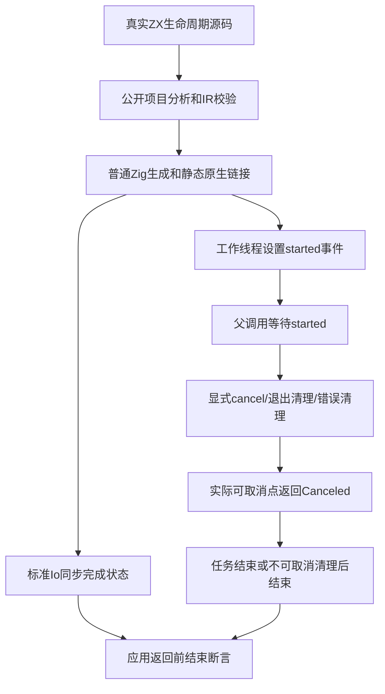
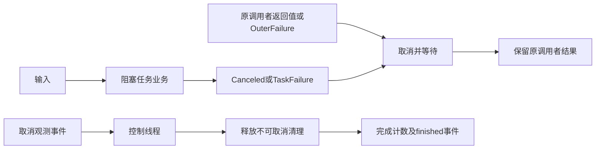

# ZX 任务生命周期测试计划

## Intent：最终目标

用真实Zig标准Io验证显式取消、未等待作用域退出、提前返回、调用者错误及取消后清理，确认应用返回前任务已结束且不会用任务业务错误覆盖调用者结果。

## Data：可用证据

固定生产检出2617ae6e，生产取消功能为ae31a16c。任务分析、等待运行及取消分析各部分已提交。已读std.Io.Event、Future.cancel及Threaded.cancel：标准取消请求会在下一个可取消点返回Canceled，并等待任务返回。Threaded.async允许内联回退，所以阻塞原生探针先设置started事件并检测父线程ID；若内联则返回有限InlineExecution错误，测试明确失败且不会阻塞父线程。

## Edges：边界与限制

仅修改正式测试和构建入口，草稿先写同名目录。8组源程序、13个独立声明；completed两项各验证内联与线程，合计每种编译模式15次应用执行。其他用例必须观测到真实工作线程。事件同步建立先后关系，不用耗时推测取消或等待；5秒绝对截止仅为阻塞夹具挂起保护，处理spurious timeout后重试。收到取消后的清理使用不可取消事件等待，由控制线程在观测到Canceled后释放；完成断言必须在测试宿主释放事件、Threaded.deinit和arena.deinit之前进行。

本部分证明实际观测的取消与结束路径，不是所有调度的形式证明；不覆盖parallel分支汇合与启动中途失败。测试使用实际编译器与Threaded/Event/Future；completed两项仅通过标准Io.VTable覆盖async，保留原Threaded userdata，委派真实async及await填充结果并返回null，建立标准接口规定的同步完成状态。工作线程仍执行真实生成worker，计数检查覆盖函数确实调用一次；不可取消清理场景不是强制终止工作线程。

## Answer：交付格式与成功标准

正式tasks/runtime/lifecycle按cancel、scope_exit、early_return、caller_error、block_exit、completed、direct、cleanup八组存放源程序与执行声明。原生host只描述业务行为，probe负责事件与原子观测，check执行实际生成应用并核对结果/准确错误、启动、工作线程、完成、取消、后续调用及清理释放次数。注册test-zx-task-lifecycle并纳入任务总入口。Debug/ReleaseSafe通过后保存真实日志、草稿和指纹，独立提交push。

## 自我批判

若仅在Threaded.deinit后检查完成，宿主收尾可能掩盖生成程序漏掉等待，因此所有语义断言必须先于宿主兜底释放与销毁。兜底释放只用于失败路径安全结束，不计入成功的语义证据。已完成任务的取消必须保留完成状态，不凭空报告Canceled。原生finished事件只证明业务结束，不能单独证明Future后台状态done；completed组使用标准Io同步完成契约，不能把它说成未修改的Threaded调度路径。cancel与cleanup使用同一ZX语句形状，cleanup增加收到取消后的不可取消清理事件协议；它们是不同生命周期断言，不计成不同语言语法特性。任务业务错误与原调用者错误分别记录。以最终两模式日志和指纹作为通过证据。

## 执行记录

Debug和ReleaseSafe首轮均36/36构建步骤成功、13/13实际运行；复核发现completed组只等原生finished事件，Future后台状态可能仍在收尾，不能声称已建立后台完成状态。收紧为标准Io async同步完成夹具，补充completed_starts=1断言，原两份通过日志保留为收紧前证据。Debug收紧后最终仍36/36步骤成功、13/13实际执行，15次应用执行及完成覆盖计数通过，运行缓存步为0。ReleaseSafe收紧后最终同样36/36步骤成功、13/13实际执行，15次应用执行及完成覆盖计数通过，运行缓存步为0。两种模式合计30次应用执行，仍只计13个独立声明。完整结果见[收录结果](ZX任务生命周期测试/结果.json)。

completed两项各调用线程与内联执行一次，其余11项各调用线程执行一次，共15次生成应用执行。事件及原子计数确认工作线程启动、取消回应和任务结束；显式/直接取消后的普通原生调用只在结束后发生。scope_exit、early_return、caller_error和block_exit分别保持当前调用者结果、提前返回值、OuterFailure及外层后续语句。

cleanup两项的控制线程必须先观察到实际Canceled事件，再释放不可取消清理；应用返回前断言released=1、finished=1，宿主销毁不参与通过证据。本轮收紧了一处完成状态证据边界，未发现生产缺陷。
