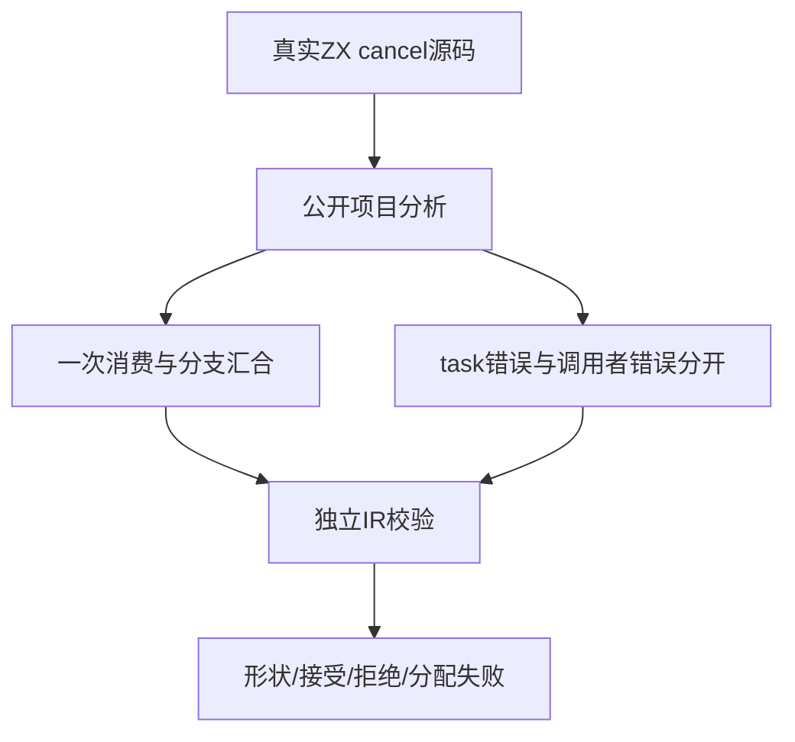
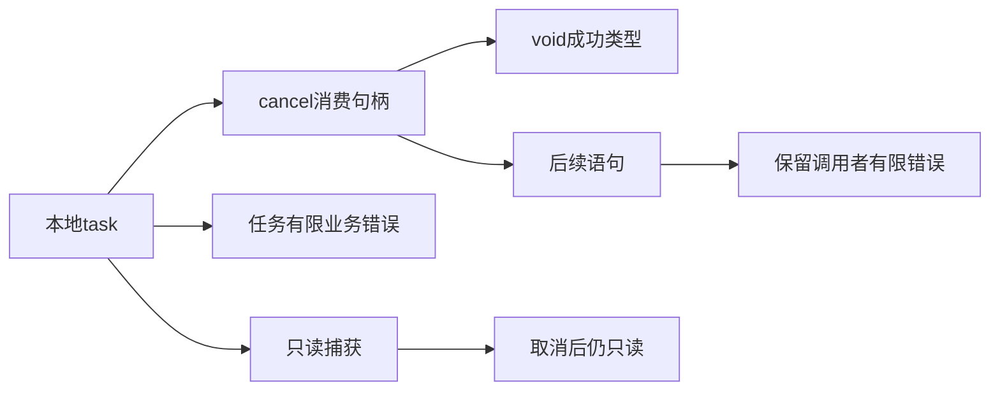

# ZX 取消分析测试计划

## Intent：最终目标

为正式cancel语义建立独立公开分析与IR校验门禁，核验void结果、一次句柄消费、控制流汇合、捕获只读和任务业务错误不向取消调用者传播。

## Data：可用证据

固定生产检出1fd80645，包含ae31a16c的显式取消与独立等待语句实现。已阅读任务分析、所有权消费、任务IR规则与core.error_effects：cancel先检查task操作数；消费路径与await共享所有权状态；cancel的结果为void，错误效果只访问操作数，不合并任务返回错误。复用tasks/analysis/fixture的真实project.analyze及validateIr，通过具名task_fixture模块连接，不导入含test的模块。错误效果检查从compiler既有zx模块引用core公开接口，采用仓库已有import_table连接方式。

## Edges：边界与限制

只修改正式测试及任务构建注册。4个形状测试、5个接受测试、9个拒绝测试及3个分配失败测试，共21个独立声明。合法分支和只读借用用真实分析验证；拒绝必须匹配诊断及源码范围，不能用更早的语法错误冒充所有权验证。分析与IR规则不能证明取消已等待真实线程退出，生命周期运行另立部分。

## Answer：交付格式与成功标准

草稿先写同名目录，正式tests/language/expressions/tasks/cancel_analysis按shape、acceptance、rejection、allocation划分职责，注册test-zx-cancel-analysis并纳入任务总入口。两种编译模式通过后记录实际执行与缓存、源与证据指纹，完成本部分提交push。每项形状断言检查实际cancel节点、操作数task、void类型、原task错误集合和整个程序错误效果。

## 自我批判

取消与等待共享句柄消费，但结果和错误效果不同，不能只复制await用例并换词。正常控制流接受、所有权拒绝及错误元数据分别断言。此计划不是运行通过证据，实际取消请求与等待清理仍需后续运行门禁。

## 执行记录

首轮把兄弟目录的fixture.zig直接相对导入，4组Zig编译均因import outside module path失败，未运行语言断言。已按Zig模块边界改为具名共享task_fixture模块，保持正式fixture源码不变；修正前日志原样保留。这是测试组织错误，不是生产缺陷。

Debug最终19/19构建步骤成功，21/21独立声明实际执行，运行缓存步为0。4个形状用例同时检查真实cancel节点、void类型、operand种类、原task的有限错误，以及整个程序错误效果。ReleaseSafe最终同样19/19步骤成功、21/21声明实际执行，运行缓存步为0。两种模式分别覆盖形状4、接受5、拒绝9及分配失败3。完整指纹见[收录结果](ZX取消分析测试/结果.json)。
