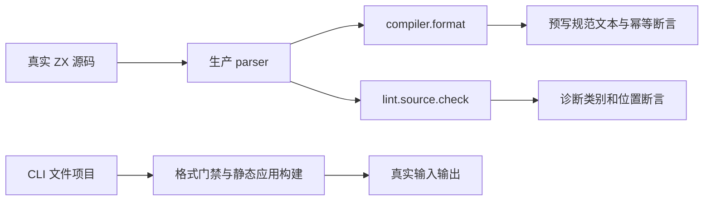
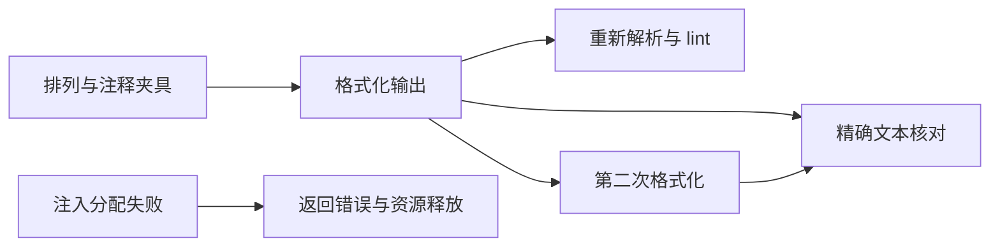

# ZX 导入排序正式回归

## Intent

验证 ZX 内置 import 顺序在格式化、lint 与编译门禁中一致；保持声明、注释、静态绑定与应用计算语义，格式化幂等且分配失败无泄漏。

## Data

实现基线为 `6b25ce82`，当前检出包含上一阶段测试提交 `52420c05`。契约依据 [导入排序规则设计](../2026-10-05/导入排序规则设计.md)：值导入按 std、zig、c、外部包、内置根 alias、相对路径排列，类型导入整体放在最后；同一子类按区分大小写的 UTF-8 字节序排列，同路径声明保持原序。大组之间只有一行空行。

生产 `lint/source.zig` 为检查与格式化生成同一编辑计划，编译器已接入门禁。实现会话的迁移文档验证了自举源码，但测试包缺少专门的组序、注释归属与幂等测试。成熟测试参考 `tests/formatting/rx` 的 CLI 只读、check/write 模式及 OOM 所有权覆盖。

## Edges

只修改测试包和本轮文档，不修改生产实现。自定义 alias 尚未接通，不伪造支持；`@scope/pkg` 是外部包，不能因以 @ 开头就归入根 alias。RX 调用顺序不在排序范围内。

声明内注释和同一行尾注释属于声明；文件头注释及独立注释形成保守边界。不得删除、合并、重命名声明或改写路径。比较预写的规范文本，不调用生产分类/比较器计算 expected。测试枚举数不冒充 Test262 审阅数或独立目录用例数。

## Answer

1. 新建 `tests/formatting/zx/imports`，按组序、注释与资源管理分根组织。
2. 比较所有已接通类别的规范输出；枚举七个代表声明的全部 5040 种排列、类别对和同路径稳定性；检查 UTF-8、LF/CRLF、空组、重复声明与具名绑定顺序。
3. 检查文件头、独立注释、同行与声明内注释的精确输出，输出再格式化保持不变；对有效和无效输入检查全部分配失败点及输入释放后的输出寿命。
4. CLI 覆盖 stdout/check/write、lint 位置与只读行为；真实项目排序前被编译门禁拒绝，排序后静态构建并运行，验证计算顺序不变。
5. Debug/ReleaseSafe 聚合入口与 TypeScript 类型检查通过后记录真实证据并提交推送；新生产缺陷才通知实现会话。

## 实施与验证结果

注册 `test-zx-import-order` 聚合入口，包含 `test-zx-import-order-library` 与 `test-zx-import-order-cli`，并接入测试包全量入口。三个 Zig 根分别负责组序、注释与资源；CLI 夹具、模式检查和应用执行各自独立。

Debug、ReleaseSafe 聚合入口均退出 0，完成 23/23 构建步骤。每种模式包含 10 个 Zig 测试声明、22 个 CLI 格式用例和 1 个真实应用用例。代表性七类别的 5040 种排列及十二类别的 132 个有序类别对全部符合预写顺序；同路径声明与具名绑定的原序、大小写/UTF-8 路径和 scoped 外部包分类保持正确。

七个库层注释样例分别执行 LF/CRLF，覆盖行尾、块尾、声明内、连续尾注释、文件头与独立边界。CLI 的十一类样例同样执行 LF/CRLF，并补充多行尾注释、空 import 区段、单声明与多余内部空行。普通 lint、fmt stdout、fmt --check 保持文件不变，fmt --write 生成预写结果；规范结果再次 lint/check 和格式化通过，即使项目 manifest 无法解析也不影响源码工具行为。

真实项目先被排序门禁拒绝且不产生应用文件，格式化后构建并执行输入 `0`、`7`、`123`，输出始终为 `2 * (input + 1)`。此例通过 `twice(increment(in))` 区分调用顺序，避免只验证可交换的加法。helper 文件在全过程中保持原文。类型检查与本轮格式、diff 检查通过。

- [Debug 聚合日志](ZX导入排序正式回归/Debug日志.txt)
- [ReleaseSafe 库层实际执行日志](ZX导入排序正式回归/ReleaseSafe库层日志.txt)
- [ReleaseSafe 聚合日志](ZX导入排序正式回归/ReleaseSafe日志.txt)
- [类型检查日志](ZX导入排序正式回归/类型检查日志.txt)
- [结果及源码、日志指纹](ZX导入排序正式回归/结果.json)

两个最终聚合日志中的 10 个库测试均复用成功缓存；Debug 的实际执行证据位于 [状态块集成前日志](ZX导入排序正式回归/状态块集成前阻断日志.txt)，ReleaseSafe 的实际执行证据位于独立库层日志。CLI 用例在最终聚合中全部实际执行。排列数、类别对、测试声明与 CLI 用例分别报告，不将嵌套断言或重复执行计为新增 Test262 用例。

## 偏差处理与自我复核

[库层首轮日志](ZX导入排序正式回归/库层首轮日志.txt)保留两处测试错误：我把导入区段末端写为 57，按源码字节核算应为 53；未闭合字符串应由 lexer 返回 lexical 诊断，原来误写为 syntax。两处均仅修正错误预期，没有放宽生产契约。

首轮聚合还发现并行新增 `state_block` 在 RX 表达式推导与 Store getter 检查中缺少 switch 分支，使 CLI 构建失败。已将两处位置、复现命令及日志发送给用户指定实现会话。该会话补齐后重新构建，Debug/ReleaseSafe CLI 均通过；本轮未修改生产源码。此问题来自新增 AST 集成，不能归因于 import 排序。

测试采用真实解析器与预写排序结果，不读取生产分类器或比较器计算 expected。有限排列和类别对不能证明任意源码规模；注释边界检查只覆盖当前明确的保守归属规则。未声明支持自定义 alias，未据此证明所有原生接口都可语义链接。验证基于活动共享检出，记录了执行时观察到的 ReleaseSafe CLI 产物指纹，并不替代固定版本的全仓库回归。

本轮专注新实现特性，Test262 审阅仍为 2248 份、待审阅 51349 份；下一阶段继续核对新加入的 forEach/iterate 与原始 Test262 用例。
