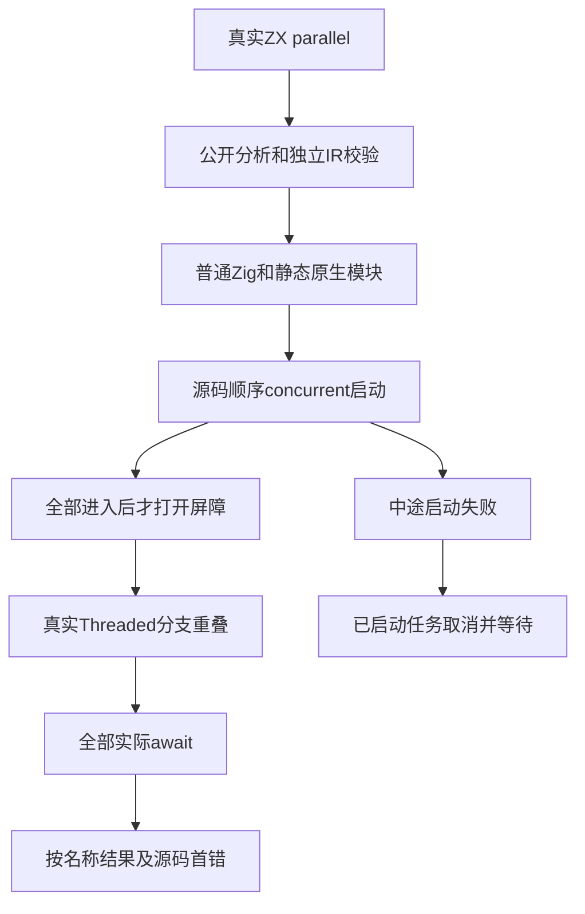
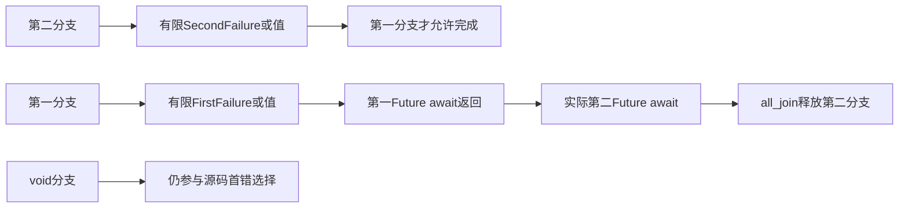

# ZX 并行运行测试计划

## Intent：最终目标

验证parallel的实际分支重叠、源码启动顺序、按名称映射结果、逆序业务完成时的首错选择、所有任务先正常等待，以及启动中途失败时已启动任务的取消与等待。

## Data：可用证据

固定生产检出db5e0040，原生产async/parallel为039a7ce0，取消为ae31a16c。已读genz/tasks.parallel：先按源码创建全部concurrent任务，再收集全部await错误联合，之后按源码传播错误及组装字段。复用await/lifecycle的真实公开分析、独立IR校验、普通Zig与静态原生链接入口。std.Io.concurrent无内联回退，concurrent_limit.nothing可提供真实标准能力不可用场景。

## Edges：边界与限制

8组ZX夹具、13个独立声明，每种编译模式14次应用执行；values的一项同时验证零与非零输入。所有启动成功的正常并发场景用事件屏障阻止任何分支在全部进入前完成，同时核验peak活动数与工作线程ID。5秒绝对截止只是夹具挂起保护，不用于判断重叠。

测试Io保留原Threaded userdata和除concurrent/await/cancel外的全部VTable成员；三项仅委派真实标准操作，并增加可观测的测试控制。concurrent等待每个worker的started事件后返回，使源码启动顺序能用真实原生标签观测；它没有串行完成分支，全部worker先在屏障重叠。all_join场景第二分支只在实际进入第二个Future的await时释放；若首错导致提前取消，将明确观测Canceled，而非错误地把取消清理计为正常汇合。mid_failure在第二次concurrent调用中注入标准ConcurrencyUnavailable，第一worker必须已启动；initial_failure使用真实Threaded并发限额为零，不注入该错误。

宿主控制是测试夹具，不是新增生产运行库；worker业务和Zig标准Threaded运行保持实际执行。本部分不覆盖结果组装分配失败、统一库重发布及目标宿主拒绝，后续另立门禁。启动失败清理断言必须在宿主释放事件、Threaded.deinit及arena.deinit之前。

## Answer：交付格式与成功标准

先写同名目录草稿，正式tasks/runtime/parallel按values、source_order、all_join、mixed、all_void、capture、initial_failure、mid_failure存放源程序与执行声明。native host处理有限业务错误及值，probe管理事件/原子计数，io_backend负责标准接口观测与单次故障，check执行普通生成程序并检查结果、准确错误、启动/完成标签、peak、await/cancel调用和取消响应。注册test-zx-parallel-runtime并纳入任务总入口；两模式成功后记录实际运行、缓存及源/证据指纹，独立提交push。

## 自我批判

分支原生调用的进入顺序本来由调度决定，因此必须说明started握手宿主的控制条件，不能把普通线程调度次序当语言保证。所有任务结束也可能来自错误后的取消清理，必须同时观察实际await次数与Canceled/cancel次数。业务完成标签不冒充标准Future后台状态，但Future.await回收及启动失败的Future.cancel由真实标准接口完成。await/cancel计数指VTable实际回调；已await的Future仍有生成的defer.cancel，但幂等读取缓存结果，不再触发VTable.cancel。最终两模式日志与指纹作为通过证据。

## 执行记录

前两轮生成步骤成功，但Zig测试夹具未能编译：第一轮数组重复写法不被当前0.17编译器接受，改为显式定长声明及@memset重置；第二轮errdefer错误捕获写法不被接受，改为普通catch内记录取消。这两轮均未执行语言语义断言，失败日志原样保留，不反馈为生产缺陷。8组实际生成程序与ABI原样保存为.zig.txt副本，避免提交格式化改写生成证据。最终两模式验证后补充结果。

Debug最终36/36步骤成功，13/13独立声明实际执行，运行缓存步为0；values的一项调用两次，共14次生成应用执行。其中12次完整并发运行观测到2或3个活动worker同时进入屏障；initial_failure实际标准限额为零，0个worker、1次启动尝试；mid_failure已进入的第一worker在第二次启动故障后收到Canceled并结束，实际await=0、cancel=1。all_join实际第二Future await在第一业务完成后才释放第二worker，await=2、cancel=0、Canceled=0，不能由宿主销毁冒充汇合。ReleaseSafe最终同样36/36步骤成功、13/13声明实际执行，运行缓存步为0；14次应用执行的重叠、首错、全部await及两种启动失败断言全部通过。两种模式合计28次应用执行，仍只计13个独立声明。完整指纹见[收录结果](ZX并行运行测试/结果.json)。
