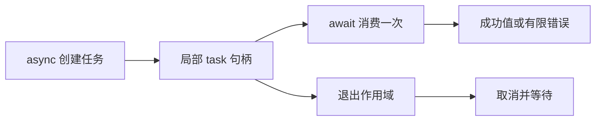

# ZX 异步与并发参考

## Intent：最终目标

在 ZX 中独立启动作用域内任务，等待结果，或并发执行一组分支。通过有限错误集合显式处理失败，不依赖 RX 编排。

## Data：语法与使用

### async 与 await

```zx
import fs from "std:fs"

export type Input = { path: string, max_bytes: u64 }

export type Output = string?

export default function (in: Input): Output {
  const task = async fs.readText(in)

  const [err, res] = try await task

  if (err != null) {
    return null
  }

  return res
}
```

`async expression` 创建任务，整个操作数在任务内求值。任务类型携带成功结果类型和有限错误集合；`await task` 消费句柄并取得结果，未捕获的错误向调用者传播。普通函数不需要 async 修饰符。

任务只能保存在创建它的局部 const 中，或直接写作 `await async expression`。每个句柄最多 await 一次；不能复制、作为参数传递、返回，或放进 object、tuple、list、optional。任务离开作用域时，编译器确保取消并等待未完成的执行；提前 return 和错误传播同样适用。

任务的错误只在 await 时传播。退出清理不会把未等待任务的错误替换成当前返回值或已经传播的错误。

async 沿用 std.Io 的语义，允许同步完成，不承诺每个任务都独占线程。取消是协作式的；不响应取消的计算仍会被等待，不会被强制终止。

### parallel

```zx
const result = parallel({
  first: () => fs.readText(in.first),
  second: () => fs.readText(in.second)
})
```

parallel 接受一个静态对象，每个字段是零参数回调。分支按源码顺序启动，结果按名称组成对象。void 分支仍然执行，但不产生结果字段；全部 void 时整体结果是 void。

所有启动成功的分支先全部等待，再按源码顺序传播第一个错误。若启动中途失败，已启动任务会取消并等待。parallel 要求实际并发能力，不支持时返回 ConcurrencyUnavailable，不默默改为串行执行。

捕获整个并发操作：

```zx
const [err, res] = try parallel({
  first: () => fs.readText(in.first),
  second: () => fs.readText(in.second)
})
```

err 包含各分支的有限错误集合、并发启动错误，以及结果组装可能产生的分配错误。err/res 的成功关联与 [类型化错误](类型化错误参考.md)一致。

### 原生并发契约

```zx
export declare function readText(allocator, io, in: ReadOptions): string throws { OutOfMemory, Canceled, ReadFailed } concurrent
```

这是声明形状示意；实际错误成员必须准确对应原生实现。`concurrent` 显式承诺函数可并发调用，不能仅凭带 io 参数或有限 throws 集合推断这一性质。标准模块已声明其并发契约；第三方函数缺省不能在任务中调用。

## Edges：边界与限制

- 捕获通过只读借用传递，不隐式深复制。当前捕获引用在 await 后仍保持只读；任务返回的引用结果也保守视为 borrowed。
- 任务不能持有 Store capability，也不能直接读写 Store 或调用带 Store 能力的函数。父作用域已经读取的普通值按只读快照借用；它不是任务对 Store 的实时访问，任务结束前不能回收其底层内存。
- 并发可安全调用不等于外部操作有确定顺序。多个分支操作相同文件、标准输入输出或外部服务时，应用应自行确定业务上的并发含义。
- 所有分支汇合不提供外部副作用回滚。
- task 不支持 requires/ensures 契约和 RX 属性表达式。RX 可通过普通 Call 调用包含这些逻辑的 ZX；既有 RX Parallel 的纯计算边界未因此扩大。
- 需要显式 std.Io 宿主。当前 Node addon 和 freestanding Wasm 不提供该能力，会拒绝任务程序；不能把系统进程宿主的支持范围自动推广到这些目标。
- 生成普通 Zig 并静态链接，没有额外 zxc 调度运行库。allocator 同步只在同次执行需要任务时生成。

## Answer：交付与成功标准

[async_read.zx](ZX异步并发与类型化错误/验证/async_read.zx)展示文件读取和 try await；[parallel_http.zx](ZX异步并发与类型化错误/验证/parallel_http.zx)展示真实 IO 并发及 try parallel。构建、服务端重叠观测、首错汇合、库消费和未运行边界见 [异步实施记录](ZX异步并发与类型化错误/异步实施记录.md)。


