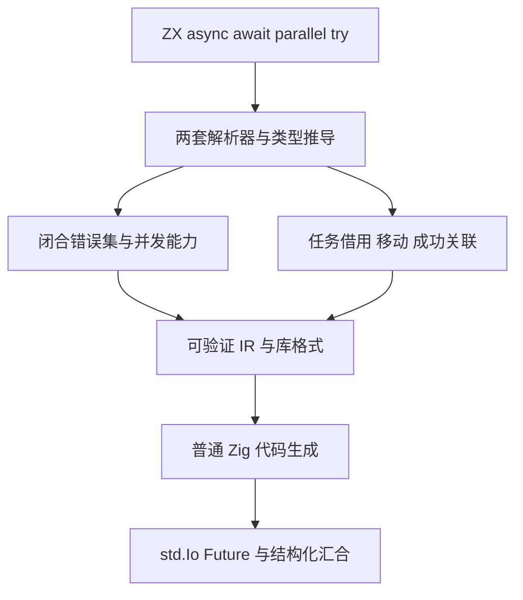
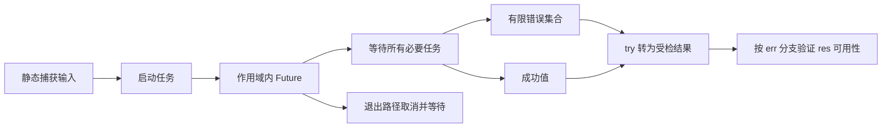

# ZX 异步、并发与类型化错误实施计划

## Intent：最终目标

按用户要求立即实现三项相互配合的语言能力，ZX 可以独立编写异步代码，不依赖 RX：

1. 基于 Zig std.Io 的高效、极简异步原语。
2. 名为 parallel 的并发表达式。
3. `const [err, res] = try ...` 捕获机制，错误具有静态类型，可预测、可检查。

这些能力仍遵守 zero runtime：生成普通 Zig、静态链接，不增加 zxc 调度运行库、解释器或动态加载层。数据借用和移动不能退化为隐式深复制。

## Data：可用证据

- 当前本机 Zig 为 0.17.0，std.Io 提供 async、concurrent、Future.await、Future.cancel。
- async 允许同步完成；concurrent 保证并发执行能力，不支持时返回 ConcurrencyUnavailable。
- cancel 同时取消并等待；取消是协作式，不能把它描述为强制停止 CPU 计算。
- 现有 ZX 尚无 task 类型、async/await IR 或捕获错误的表达式。
- 现有 RX Parallel 使用 Thread.spawn，且只接受纯计算；这不能代替本次 std.Io 异步能力。
- 当前原生接口只有裸 throws/fallible 布尔值，genz 将错误联合打印为 anyerror。该信息不足以支持可预测的 typed try。
- 当前 ZX 没有 optional 控制流窄化；普通 tuple 不包含 err/res 的成功关联。
- 自举表达式与状态块已共用驱动，但生产 Program 入口尚未切换。新增语法须同时覆盖旧解析器与 RX+ZX 解析器。

## Edges：边界与限制

### 异步任务

- `async expression` 创建作用域内任务，`await task` 等待并取得成功值；未捕获错误继续向调用者传播。
- 任务不是可随意复制的普通值。编译器跟踪任务及其捕获借用，禁止重复消费和并发使用冲突。
- 退出作用域前，已启动的任务必须完成，或取消并等待；提前 return 和错误路径同样适用。
- 不允许任务借用逃出被借用数据的生命周期，不通过全局任务池或隐式后台线程逃避这一限制。
- async 保留 Zig 的可同步完成语义；parallel 使用保证并发的 concurrent，不静默串行降级。

### 并发汇合

目标语法：

```zx
const result = parallel({
  first: () => readFirst(in.first),
  second: () => readSecond(in.second)
})
```

- 任务数量、名称和结果结构在编译期确定；分支主体在任务内求值。
- 分支可只读捕获作用域值，捕获通过编译期转换成为普通 Zig 参数，不产生运行时闭包对象。
- 所有分支启动后汇合；正常启动的分支全部等待，再按源码分支顺序传播首个错误。
- 启动失败时，已成功启动的任务必须取消并等待。
- void 分支仍执行，不产生结果字段；全部 void 时整体为 void。
- 并发不承诺跨分支副作用顺序，不提供文件操作回滚。
- 不全局放开 map/loop 的捕获规则，不允许任务持有 Store capability 或实时读写 Store。父作用域已读取的普通值遵守只读快照借用，底层区域必须活到任务汇合之后。
- 标准库 IO 需真实可用；未知原生全局状态必须有明确的并发契约，不能仅因签名带 Io 就断言安全。
- 调用者 arena 不是天然线程安全；只串行化必要的 allocator 操作，捕获与返回 slice 底层数据不复制。

### 类型化错误

目标语法：

```zx
const task = async readText(in.path)
const [err, res] = try await task

if (err != null) {
  return in.fallback
}

return res
```

- 示例中的成功关联是待实现的编译器规则，当前版本尚不支持，不能以现有 optional 行为冒充已经可用。
- 错误集合来自原生接口及调用链，并包含生成代码可返回的分配、边界检查、契约、并发启动等错误。
- 原生接口需要声明有限集合，并由生成的 Zig 适配器校验真实错误集，漏报不能转成 Unknown 掩盖。
- try 捕获子表达式的错误；错误效果分析必须沿可达表达式图并在捕获边界停止，不能扫描平铺节点后直接求并集。
- 非 void 捕获结果先具备安全的 `[E?, T?]` 表示，失败时 res 为 null，禁止 undefined 或伪造默认 T。
- 对受检解构保留 err/res 来源关联；只有已证明成功的路径，res 才可作为 T 使用。普通 tuple 不自动获得这一规则。
- void 返回使用 `[E?, void]`，结果槽用 `_` 丢弃，沿用现有 tuple void 规则。
- 成功返回 null 与执行失败必须可区分，不能压平嵌套 optional。
- Zig panic、进程退出和外部终止不等同于可捕获错误。

## Answer：交付与成功标准

实施顺序：

1. genz 精确错误集合及错误联合表示，原生接口错误契约和 IR 错误效果。
2. async/await 的 AST、任务类型、IR、作用域和所有权规则，std.Io 生成。
3. parallel 的静态分支、只读捕获、汇合与错误清理，复用上述任务能力。
4. typed try 与受检解构的成功路径窄化，串起 try await 与 try parallel。
5. 同步自举词法/解析、库格式、IR 验证、优化遍历、公开用法与 reference。

成功不能只凭语法通过：必须构建真实生成产物，核对任务确实重叠执行、错误集合确切、所有退出路径完成清理、捕获生命周期有效，并确认库消费和宿主能力边界。用户要求不新增测试用例、不执行全量测试；优先重放已有材料，记录覆盖不足，不把代码审阅当作已运行证据。

Node 与 freestanding Wasm 当前没有 Io 注入，不得偷偷创建全局 backend；相关宿主应给出准确能力诊断，后续显式宿主实现仍属于整体能力审计。





## 自我复核要求

不能把 fork/join 的 parallel 当作独立 async/await 已完成；不能把字符串错误或 anyerror 当作类型化错误；不能只限制成纯计算来绕过 IO 并发；不能省略 arena 线程安全或失败启动清理。三个要求均以真实实现和证据交付，完整自举工作继续保留在总体目标中。

## 任务实现决策

类型化 try 已完成，剩余工作优先异步和并发。以下结构是待实现方案，不代表功能已经完成。

- IR 的 task 类型保存成功类型和有限错误集类型。创建任务不传播主体错误，await 才传播；错误集不从句柄引用反查语法树。
- task 表达式保存延后执行的主体与静态捕获符号。parallel 保存源码顺序的任务与结果字段映射，沿用普通 object 的字段排序，但不改变启动和首错顺序。
- task 仅可绑定到局部 const 或直接 await；禁止复制、容器封装、跨函数传递和返回。沿控制流检查一次消费，退出路径生成取消并等待。
- 捕获数据只读借用，任务不取得输入所有权。Store 与没有明确并发契约的原生调用不能进入任务。
- worker 生成普通 Zig 函数，捕获是普通参数，表达式在 worker 内执行。所有分支启动并注册清理后，先等待全部结果，再按源码顺序传播错误。
- allocator 的同步覆盖同次执行的父任务和所有子任务，且作用域先完成任务清理再销毁 allocator。使用 std.Io 的同步接口，避免硬绑某一种 backend。
- IR、序列化、链接、验证、所有权分析和自举解析共同升级；不能通过仅在代码生成阶段识别源语法来绕过静态规则。

## 紧接本任务执行的完善

用户于 2026-10-06 明确要求：完成 async/await、parallel、类型化 try 三项后，立即执行 [Zig代码生成全面原语化实施计划](../Zig代码生成全面原语化实施计划.md)。这是已授权的后续实施，不是仅供建议的清单。当前异步实现新增的 worker、Future 操作与 allocator 同步适配也必须使用 genz 结构化节点，不增加新的源码模板债务。
