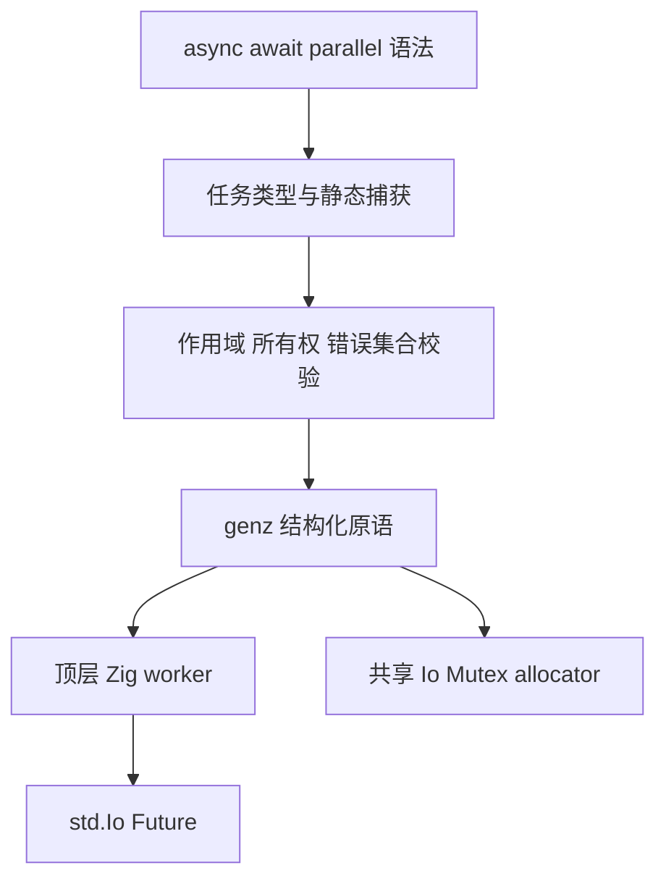
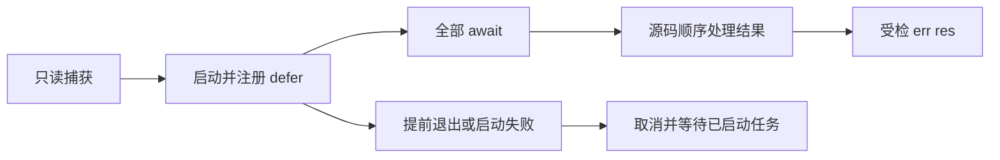

# ZX 异步与并发实施记录

## Intent：最终目标

完成作用域内 async/await、ZX 独立 parallel，并与已实现的有限错误集 try 联通。三项结束后，立即执行 [Zig 代码生成全面原语化](../Zig代码生成全面原语化实施计划.md)。

## Data：实现与运行证据

### 已实现结构

- IR 版本升级为 20。task 类型保存成功类型与有限错误集；task 节点保存延后执行的主体和静态捕获。
- async 生成 `std.Io.async`，parallel 生成 `std.Io.concurrent`。worker 为普通顶层 Zig 声明，捕获经参数传入；不生成运行时闭包。
- 创建成功后立即注册取消并等待的 defer。parallel 按源码顺序启动，先保存全部 await 结果，再按源码顺序传播第一个错误。
- execute 在需要任务能力时，为同次执行的 arena 创建一个使用 Io.Mutex 的 allocator 适配。父调用、普通内部调用和所有 worker 共用同一适配。
- worker、Future 操作、allocator vtable 均由 genz 原语构造。未新增源码模板或整段运行库嵌入。
- `concurrent` 是原生声明的显式并发契约，可写在有限 throws 集合之后。标准库 124 个函数已补充声明；第三方缺省禁止在任务中调用。
- 所有权检查将句柄作为一次消费的局部值。捕获在 worker 分析前冻结为只读，库 IR 重验类型、捕获作用域、错误集合及合法使用位置。

### 实际执行

| 操作                                                      | 结果                                                                           |
| --------------------------------------------------------- | ------------------------------------------------------------------------------ |
| async_value：`async (in + 1)` 后 await，输入 41           | 构建成功，返回 42                                                              |
| async_value：输入 0，创建任务后提前 return                | 构建成功，返回 0；生成作用域 defer 覆盖此路径                                  |
| async_read：`try await` 读取真实文件                      | 返回文件内容                                                                   |
| async_read：不存在的路径                                  | 返回 null，进程成功退出                                                        |
| parallel_http：本地 HTTP 服务收到两个请求后才允许任何响应 | 两个请求均在响应前到达，均返回 200；运行约 0.008 秒                            |
| parallel_http：首分支非法 URL，第二分支延迟 0.4 秒响应    | 第二响应发送完成后进程才返回 null；运行约 0.413 秒，证明首错不提前取消正常分支 |
| async_read 发布 library.zxcir，独立目录仅消费发布产物     | 构建成功；文件读取和缺失路径结果与源码入口一致                                 |
| async_value 构建 freestanding Wasm                        | 明确拒绝缺少 IO/process 宿主能力                                               |
| async_value 构建 Node addon                               | 明确拒绝缺少显式 IO/process 宿主实现；当前 Zig 还会附带 execute 参数数目诊断   |

本地 HTTP 观测使用临时服务和现有应用示例，不访问外部服务，不使用浏览器。没有新增 packages 测试用例或执行全量测试。

### 已发现并修正的问题

1. 最初将 worker 类型声明放在 execute 内部，Zig 拒绝 worker 参数遮蔽外层 allocator。改为共享声明收集器，生成顶层 worker，嵌套任务共享同一收集器。
2. 初版 `knownType` 未认识 await，导致 `1 + await task` 无法从右侧任务推断 i32/f64。已补充从任务类型及直接 async 主体取得结果类型。
3. 任务可能进入既有纯值与缓冲区优化。已将任务及含任务的调用链排除出这些优化，并补齐必要遍历。
4. 入口的 allocator 生成取决于被调用函数的任务能力。生成指纹已加入入口的传递任务能力，防止仅修改被调函数后错误复用旧入口。

## Edges：边界与限制

- task 只能由 async 创建后绑定到局部 const，或直接 await/cancel；禁止别名复制、容器封装、函数输入输出和导出。每个句柄最多消费一次（await 或 cancel）。
- 捕获引用当前永久保持只读；await 后也不会恢复可消费所有权。await/parallel 的引用结果保守视为 borrowed。此限制避免不准确的别名证明，不能把它描述为完整的借用区间推导。
- Store capability 不允许进入任务；父作用域已读取的普通值可作为只读快照借用。当前 Store commit 替换根引用，旧 region 的 releaseRetired 在请求 handle 返回后执行，此时作用域任务已汇合。没有把该语义误写成禁止一切 Store 来源值。
- 未知原生调用不因签名带 Io 或有限错误集而自动安全。
- concurrent 表示可并发调用，不保证共享文件、标准输入输出等外部副作用的顺序。
- async 允许同步完成；parallel 不静默串行降级。取消是协作式，退出仍等待任务完成。
- 对启动失败的清理已经过生成代码审查，但尚未通过故障注入实际触发 ConcurrencyUnavailable；不把源码推导写成运行证据。
- 普通生成模块的 `pub call` 用于内部静态链接，allocator 由 execute 传入。直接手写 Zig 绕过 execute 不在应用宿主入口验证范围。

## Answer：交付与剩余检查

正式源码、可运行 ZX 示例和本记录共同交付。两套表达式解析器已沿用既有差分工具，对 4 份示例的全部 281 个 token 起点进行核对，差异为 0，覆盖 Async、Await、Capture 和 parallel 的回调对象。最终 `zig build dist -j2`、本次差异格式检查通过；退出清理由生成结构审查和提前返回示例核对。

本阶段三项特性完成，仍保留上文明确的所有权与宿主边界。后续立即进入全面 genz 原语化；本阶段完成不代表整个编译器自举已经完成。

## 自我批判

成功输出一个异步算术结果不足以证明 IO 并发；本次用服务端双请求屏障观测真实重叠。成功路径也不足以证明首错汇合，因此另行观测错误分支与延迟成功分支的完成顺序。仍未实际覆盖的取消时序与启动资源耗尽需明确保留边界，不夸大验证范围。

## 显式取消补充

按用户提出的 Zig 取消能力补齐 `cancel task`：语法、AST、IR、类型检查、所有权、错误传播、产物重验和 genz 均已连通。cancel 返回 void，发出取消请求并等待，丢弃任务的成功值与业务错误；退出清理继续保留。IR 版本为 20。

独立 await/cancel 也允许作为 void 执行语句，两套语法实现同步。局部 Scope 的任务绑定使用相同的 var 与 defer 生成，原先拒绝 Scope 中任务绑定的 IR 限制已移除，仍禁止句柄逃出作用域。

验证证据：CLI 构建成功；async_value 与 cancel_http 均生成并构建成功；输入 0 返回 0，输入 41 返回 42；本机监听但不提供响应的 HTTP 地址，立即取消在约 0.006 秒内返回 null，退出码 0。此观测没有确认请求已进入阻塞读取，不把它写成阻塞 IO 时序证明。自举表达式重新生成并编译后，两个示例 93 个解析起点无差异，覆盖 Cancel。

自我批判：取消仍由 std.Io 协作完成，不承诺强制打断 CPU 计算。重复消费依赖既有所有权 move 检查，本次未新增测试用例；Scope 清理由结构审查及编译确认，尚未单独运行循环中的任务示例。

### 提交前复核与反馈门禁

原语化完成后，使用最新 CLI 重建上述两个既有示例：async_value 输入 0 输出 0，输入 41 输出 42；cancel_http 对本机监听地址立即取消，退出码 0、输出 null，耗时约 0.0058 秒。仍未据此宣称请求已进入阻塞读取。

另一测试会话在旧提交上报告 void 原生任务的独立 await 语句无法解析。本次已包含该修复：Zig parser 与 ZX body grammar 均允许 await/cancel 进入既有 evaluate 分支；分析阶段继续要求 void，不放宽任意值表达式。已运行该会话新增的现有专项 `zig build test-zx-tasks-analysis -Doptimize=Debug`（packages/test），退出码 0，包含 `void native task keeps void payload and its finite error`。本会话没有新增测试或修改其测试文件，没有运行全量测试。
