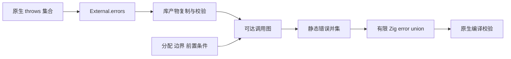
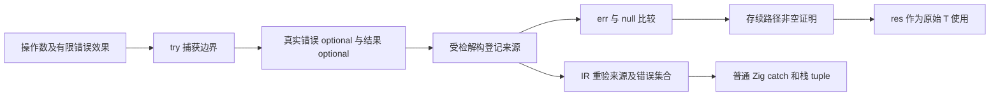

# 错误契约与效果分析实施记录

## Intent：最终目标

为 ZX typed try、异步任务和 parallel 提供能沿调用链传播的静态错误集合。此记录覆盖错误基础设施与 typed try。async/await 和 parallel 尚未交付，不能以本阶段代替完整需求。

## Data：可用证据

原生声明新增可选有限集合：

```zx
export declare function encodeUtf8(in: string): u8[] throws { InvalidUtf8 }
```

- 裸 `throws` 暂时保留为未知集合；无 `throws` 为不会返回错误。
- 声明拒绝重复成员及不符合 PascalCase 的错误名称。
- reviewed external 的 `implementation.errors` 可以从 pkg.yaml 读取，并保留到 IR。
- IR 原生接口保留集合；模块产物复制集合及成员字符串，校验相同导出名的错误契约一致。
- IR 版本从 16 升至 18，避免旧缓存直接复用新语义。
- genz 支持有限 error set 和 error union，原生包装函数的返回类型由 Zig 编译器校验。
- `core/error_effects` 从执行语句、前置条件及可达子表达式遍历调用图，去重、排序错误名称，不扫描未被引用的表达式。
- 生成普通 ZX 函数时使用推导集合；未迁移的原生错误契约、Store 外部上下文及旧 Thread 并行暂时保留未知集合。
- 编码模块六个函数与 SHA-256/SHA-512 已按本机 Zig 0.17 的实际签名补齐错误集合。

现有纯加法示例生成：

```zig
pub fn execute(arena: *std.heap.ArenaAllocator, in: *const Input) error{}!f32
```

现有编码示例的入口生成八个错误成员：InvalidCharacter、InvalidHex、InvalidLength、InvalidPadding、InvalidUtf8、NoSpaceLeft、OutOfMemory、Overflow。UTF-8 包装函数仅含 InvalidUtf8。

### 验证过程

- 原生契约阶段 `zig build dist -j2` 成功。
- 接入错误效果分析后 `zig build dist -j2` 成功。
- 补齐编码与两个摘要函数声明后 `zig build dist -j2` 成功。
- 既有编码示例需先按当前导入顺序格式化；只在本目录复制和格式化，不改测试源文件。
- UTF-8 有限错误集合版本已构建出真实原生程序。
- 既有编码数据中空 bytes 的六项结果经 process JSON 字节字符串归一化后与预期一致。
- 最初直接向 stdin 传入 jsonl 不符合该程序的 argv 协议，返回 ExpectedJsonInput；随后直接比较 jsonl 的字节数组与 process JSON 字符串也不适用。以上两次不计入功能通过记录。
- 八成员入口版本的生成源码已核对，最终原生构建成功。
- 未新增测试用例，未执行全量测试。

## Edges：边界与限制

错误集合是静态保守集合。分支和循环中可能执行的错误都会合并，后端消除分配后不会反向缩小语言契约。不能把集合中的每个成员解释为每次执行都可发生。

`error_effects.expression` 为 try 分析提供子表达式入口；捕获节点阻断子表达式错误向外传播。直接解构按值降低，不额外分配；作为普通聚合值保存时沿用现有 tuple 表示，包装分配错误在捕获操作数外传播。错误字符串引用依赖调用者持有 IR 生命周期，返回的切片由调用者分配器持有。

标准模块全部可失败函数已补齐有限接口；第三方原生接口的 unknown 不能被 typed try 默认为有限集合。已增加 error-set 类型、捕获节点与受检解构窄化；task 类型和 std.Io 并发生成仍未实现。

## Answer：交付格式与成功标准

正式实现分布在 core（错误语义和 IR）、compiler（原生声明及产物边界）、genz（Zig 类型生成）、cli（manifest 读取）。执行资料和复用示例存放于本功能目录。

本阶段成功标准是有限集合不在模块和生成边界丢失，并由 Zig 接受真实实现。整体成功仍按实施计划，包括 async/await、parallel、typed try、任务生命周期与两套解析器一致性。



## 自我复核

没有将错误转为字符串或以 Unknown 成员掩盖漏报；unknown 仍是分析边界，不是可捕获的错误值。当前为迁移基础，anyerror 尚未完全移除。没有新增专用运行库或动态层；全部错误分析发生在编译期。后续仍须验证失败路径与任务退出，当前构建证据不覆盖它们。

## 类型化捕获接入

`try` 是前缀表达式，与其他前缀表达式采用相同优先级；要捕获复合表达式，使用 `try (表达式)`。普通函数调用仍隐式传播错误。

```zx
const [err, res] = try encoding.decodeUtf8(in)

if (err != null) {
  return err == error.InvalidUtf8 ? "invalid" : "unexpected"
}

return res
```

- IR 中使用真正的 `error_set`，成员规范排序、深复制并参与结构相等及 ABI 摘要；不借用 nominal enum 身份。
- `capture` 保留原始操作数；`optional_value` 仅在已证明非 null 的 reference 上允许。
- 原生错误以及生成代码的边界检查、分配失败统一进入捕获边界。嵌套捕获各自保存和恢复边界。
- 直接 capture 解构登记 err/res 关联；普通 tuple 没有该关联。成功后仅去掉 res 外层 optional，原始 T 为 optional 时仍保留 T。
- `error.Member` 只能使用当前有限集合中存在的成员，未知成员给出编译诊断。错误集合支持相等与分支匹配，不使用错误数字作为公开 ABI。
- 核心非空证明由分析器与 IR 作用域校验器共用，涵盖取反、确定的短路分支，以及返回后的存续路径。
- IR 另行重新计算每个捕获的真实错误集合，拒绝库产物伪造错误类型。
- loop 状态块从真实捕获临时值及两个 tuple 投影恢复关联，不赋予普通 tuple 成功语义。
- RX 属性继续限制为数据组装；新增 try 计算通过 ZX 调用完成。
- NAPI 的错误值边界按成员名称映射；Wasm scalar ABI、硬件和证明后端不把错误码伪装成整数。

### 已完成的实际验证

- `utf8_capture.zx` 来源于既有编码示例的 UTF-8 操作；未向 tests 添加文件。
- 最初以 `res ?? ""` 验证捕获本身，原生应用对合法 UTF-8 返回 `"hello"`，对非法字节返回 `"invalid"`。
- 随后移除 `??`，加入 `error.InvalidUtf8` 判断；原生构建成功，同样两条路径返回上述结果。
- 核对生成代码：直接解构使用栈 tuple；入口为 `error{}![]const u8`；错误成员保留为 `error.InvalidUtf8`；成功路径只生成经过证明的 `res.?`。
- switch、loop 与 IR 边界补丁的 compiler 构建已经通过；自举表达式 parse.zx 也成功生成 Zig，但尚未据此声称它已成为正式 Program 入口。

### 本轮自我批判与修正

关键字生成脚本与派生文件已不一致：源表缺少 do/loop/next，脚本仍写入禁止的 `.zx` 导入后缀。首次重生成暴露了该问题，已补齐源表并修正脚本，不采用保留手改派生文件的方式掩盖。

只读审查发现 contracts 的 IR 校验只检查类型，没有经过新非空证明与捕获集合核验。分析和 IR 两端现已明确拒绝契约中的 capture/optional_value，保持原有契约能力边界；不能把普通函数的验证保证错误套用到契约。



## 标准模块契约提取

利用真实生成的 ABI，按 std 模块目录中的函数声明，对 Zig 函数返回类型执行编译期反射；没有调用文件、网络、进程等原生操作。提取脚本的 `@compileLog` 有意令命令以日志诊断结束，这不是普通构建成功。仅当没有其他编译错误、106 个结果都为有限集合时才接受结果。

已对 x86_64/aarch64 的 macOS、Linux musl、Windows GNU 六个发布目标提取，106 个可失败函数的成员集合完全一致。完整结果位于 `错误契约提取/错误集合.json`，规范集合位于 `统一错误集合.json`。接口含 std:fs、std:http、std:process 等真实 I/O；不是只迁移编码示例。

子进程完成队列原先把两个实际有限返回值扩大成 anyerror；现按各工作函数的返回类型定义 Completion，并让工作函数推导有限错误。六个目标均无未知集合。所有标准 .d.zx 的 throws 已写入提取后的成员，不猜测平台错误成员。

标准库有限契约版本的 `zig build dist -j2` 已通过。补充沿用现有进程上下文操作的 environment_capture 示例：明确设置的非敏感变量返回 `"hello"`，不存在的变量返回 null，表明成功 null 未被错误压平为调用失败。不以编译期反射替代运行验证。

附加别名复核发现，新 optional 解包及捕获包装还必须参与调用间缓冲区的借用追踪。已让追踪穿透 optional_value，并将 capture 的结果槽映射回操作数；捕获的错误槽不作为数据别名。迭代值布局也直接处理解包后的现有布局，避免把已展开的值再次当作指针解引用。最终构建包含这些修正。

## 阶段最终核验

- 最终 `zig build dist -j2` 成功，含缓冲区别名、迭代布局及全部标准错误契约修正。
- safe_index 示例将既有列表索引操作放入 try：合法索引返回 9；越界经 `error.IndexOutOfBounds` 的穷尽 switch 返回 null。它验证了编译器自身产生的错误，不只验证原生调用返回错误。
- UTF-8 捕获示例发布为编译库，消费方仅导入发布产物后构建原生程序，合法与非法输入分别返回 `"hello"`、`"invalid"`。覆盖有限错误类型、capture/optional_value 序列化、重新联结、IR 再校验与生成。
- 消费配置初稿误将 `pkgs/*` 写为无引号的配置值，随后误把 app 构建入口写成 pkg.yaml；均已改为带引号的路径与 `zxc build main.zx`，这两次使用错误不计入通过证据。
- 不新增 tests 用例，不执行全量测试。自举表达式模块仅验证生成，不把它等同于完整自举或新语法差分覆盖。

### 提取命令

从仓库根目录先生成所有原生接口的 ABI，再按目标执行报告器。下列目标可以替换为前述六个 triple；报告器只用于编译期审阅，`found compile log statement` 是预期结束方式，任何其他 error 都必须先处理。

```sh
zxc docs/2026-10-06/ZX异步并发与类型化错误/错误契约提取/native_interfaces.zx --no-cache --out docs/2026-10-06/ZX异步并发与类型化错误/错误契约提取/native_interfaces.zig

zig build-exe -target x86_64-linux-musl -fno-emit-bin \
  --dep zxc_standard \
  -Mroot=docs/2026-10-06/ZX异步并发与类型化错误/错误契约提取/native_errors.zig \
  --dep zxc_abi \
  -Mzxc_standard=packages/compiler/standard/src/root.zig \
  -Mzxc_abi=docs/2026-10-06/ZX异步并发与类型化错误/错误契约提取/native_interfaces.zig.abi.zig \
  -lc
```

版本控制保留报告器、接口汇总源码、规范错误集合和应用示例；派生 Zig、ABI、各目标原始编译日志与临时可执行产物可由上述命令重建。
