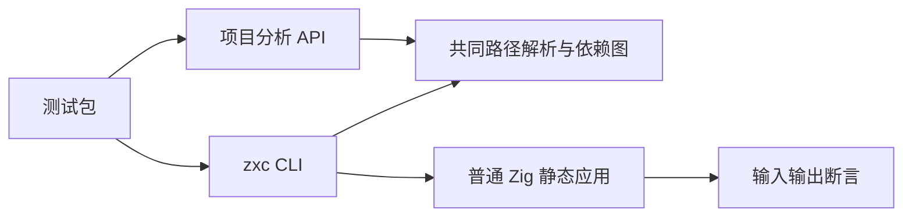
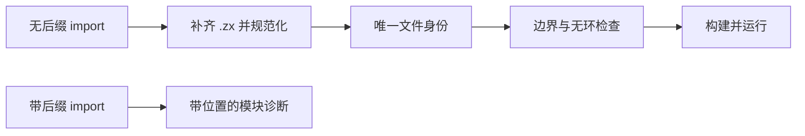

# ZX 强制无后缀导入回归

## Intent

验证最新导入契约：ZX 文件仍以 `.zx` 命名，源码 import 必须省略后缀。覆盖项目分析、解析缓存与 CLI 实际文件构建执行，保持静态模块身份、包边界与无环约束。

## Data

`dd1cfb53` 根据用户最新要求拒绝所有显式扩展名，撤回 `8894ded2` 的显式 `.zx` 兼容。上一份《ZX省略后缀导入回归计划》的通过结果属于旧契约，不能用于证明新规则。当前 HEAD 为 `e7aa69f8`，生产实现由另一个会话维护，验证期间需记录源码状态。

成熟测试参考 `tests/package_manifest/import_test.ts` 的真实临时项目构建与运行，以及 `tests/rx/cli/store_paths_test.ts` 的源文件完整性断言。库层使用既有 import_paths 测试入口。

执行期间，实现会话接入固定 import 排序并迁移自举源码。多导入夹具遵守相同语言格式契约：值导入按根路径、相对路径分组，类型导入放在最后，每组之间留空行。夹具只按显式给定顺序输出源码，不复制生产排序算法作为判断依据。

## Edges

只修改测试包和本轮文档。入口路径、Source.path 和真实文件名继续包含 `.zx`；只拒绝 import 中的后缀。不得将此有意契约改变当作生产缺陷，不改写历史验证结果。CLI 负例必须存在对应目标，避免因缺失文件偶然通过；循环负例包括未使用导入。

保持 zero runtime：测试调用既有编译器，应用由普通 Zig 静态构建。临时资源独立创建并在 finally 清理，不调用浏览器。已有包根与分配失败覆盖继续执行，不以本轮局部通过代替全部特性回归或 Test262 对齐完成。

## Answer

1. 直接解析测试将显式 `.zx` 移入拒绝集合，保持错误类别、位置和分配失败检查。
2. 项目测试使用相对、规范化和 `@/` 无后缀引用验证唯一身份、类型与枚举；新增函数、类型、枚举的显式后缀拒绝。
3. CLI 使用真实 `.zx` 文件构建应用并运行多个输入；验证相对、父目录、根引用、含点目录、重复依赖、类型与枚举。验证显式后缀、目录 index 回退及未使用依赖环拒绝，检查源文件不被修改。
4. 在 Debug 与 ReleaseSafe 执行聚合入口及 TypeScript 类型检查，保存真实日志和自我复核，完成后提交并推送本部分。

## 结果与自我复核

Debug 与 ReleaseSafe 的聚合入口均退出 0，分别完成 19/19 构建步骤。库层有 11 个测试声明，CLI 有 14 个真实文件项目用例：7 个成功项目、7 个拒绝项目。每个成功项目运行输入 `0`、`7`、`123`，每种模式共验证 21 次应用执行；所有源码在调用后逐字保持不变。TypeScript 类型检查退出 0，格式检查与本轮 diff 检查通过。

Debug 的库层 11 个测试在第二次执行时实际通过；最终重跑只修改 CLI 夹具与诊断预期，库测试复用成功缓存。ReleaseSafe 的 11 个库测试全部实际执行通过。日志区分 Zig 测试声明和 Node CLI 用例，不把应用输入次数冒充新的 Test262 用例。

- [Debug 最终日志](ZX强制无后缀导入回归/Debug日志.txt)
- [ReleaseSafe 最终日志](ZX强制无后缀导入回归/ReleaseSafe日志.txt)
- [类型检查日志](ZX强制无后缀导入回归/类型检查日志.txt)
- [结果与源码、CLI、日志指纹](ZX强制无后缀导入回归/结果.json)

本轮保留两次首轮失败证据：[自举迁移前阻断](ZX强制无后缀导入回归/自举迁移前阻断日志.txt)与[诊断预期修正前记录](ZX强制无后缀导入回归/诊断预期修正前日志.txt)。前者来自实现会话新接入排序门禁时的自举迁移中间态，该会话已在处理；后者来自我把目录目标缺失误预期为底层 `FileNotFound`。实际公开契约是模块诊断 `import target is missing from the source set`，与已有库层测试一致。修正的是测试误判，没有修改生产实现或放宽断言。

唯一模块身份由库层模块数量、单 helper 函数与 ParseCache 条目检查；CLI 执行补足真实文件收集和构建行为。类型与枚举用例通过两种路径共享定义，并把枚举实际传入函数执行分支。包根隔离、跨包拒绝和 OOM 仍由库 API 测试验证，本轮未将它们误称为 CLI 物理文件边界的完整证明。

本轮在活动共享检出上执行，生产源码同时由实现会话推进；结果文件记录检出基线和实际 CLI 构建产物指纹。此结果不是全仓库最新版本的完整回归，也不覆盖符号链接、未来自定义 alias 或所有导入排序行为。未发现新的生产缺陷，未发送实现会话消息。Test262 审阅仍为 2248 份，51349 份待审阅。
