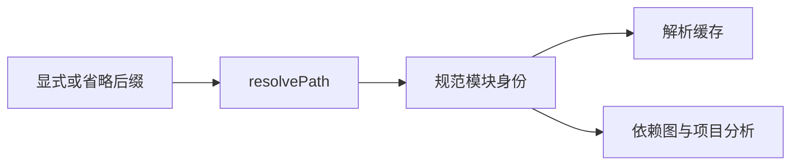

# ZX 省略后缀导入回归

## Intent

验证省略 .zx 与显式 .zx 在共同项目解析层具有相同模块身份，支持函数、类型与枚举引用，同时保持包边界和无环限制。

## Data

8894ded2 修改 resolvePath：无扩展名时补 .zx；拒绝目录形式和显式非 .zx 后缀。resolveTarget 继续根据导入方包归属选择 @/ 根，并检查跨包引用。CLI 与项目语义分析调用共用路径解析链。

已有 module_records 与 parse_cache 测试提供成熟的真实 Source 集合分析和记录校验方式。本轮新增独立 modules/import_paths 目录及测试目标。

## Edges

本轮验证库 API 与项目语义装载，不据此宣称 CLI 实际文件收集、物理符号链接身份或尚未实现的自定义 alias 已验证。导入路径是静态数据，不新增运行时解析或动态加载层。

保留显式后缀兼容，路径归一化必须在补齐后得到唯一目标。循环检查包含未使用导入。省略后缀不能触发目录 index.zx 回退，也不能允许跨包 ../ 越界。

## Answer

注册 test-zx-import-paths 并接入全量回归。直接路径测试覆盖 ./、../、@/、目录中含点、非法后缀/目录和新增分配路径；项目测试覆盖重复身份、类型/枚举共享、包根隔离、跨包拒绝、目录入口拒绝及显式/省略引用形成的环。Debug/ReleaseSafe 运行并记录结果，发现真实实现问题发送到实现会话。

## 结果与自我复核

Debug 命令 `zig build test-zx-import-paths -j2 --summary all`，ReleaseSafe 增加 `-Doptimize=ReleaseSafe`，两者均退出 0：9/9 构建步骤、10/10 测试全部实际执行通过。

直接路径测试比较八种显式/省略/规范化写法、三个含点目录路径、九种非法目录/后缀及三种省略引用的全部分配失败点。项目测试验证三个函数导入只产生两个模块、一个 helper 函数及两个解析缓存条目；混合类型/枚举导入只产生一个 nominal enum；两个声明包各自使用本包 @/；跨包、目录 index 回退和未使用导入的混合写法环均按契约拒绝。

未修改生产实现，未发现生产缺陷，未发送实现会话消息。正式目标已接入完整测试包，但本轮成功属于库 API 与项目语义装载，CLI 文件收集及物理文件身份仍需要独立验证。Test262 审阅计数不变。

## 后续契约变更

`dd1cfb53` 根据用户最新要求强制源码 import 省略 `.zx`，显式后缀兼容已撤回。以上执行结果只描述 `3986ed1c` 时的旧规则；新规则见 [ZX强制无后缀导入回归计划](ZX强制无后缀导入回归计划.md)。
