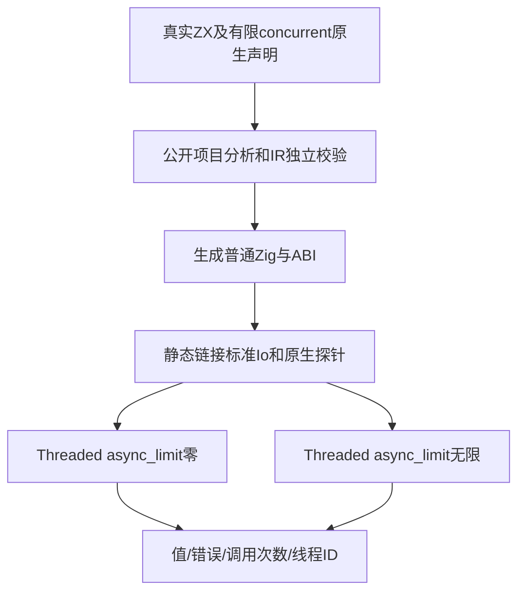
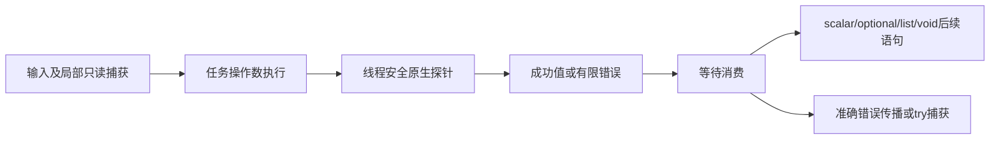

# ZX 等待运行测试计划

## Intent：最终目标

验证已实现的async/await在普通生成Zig中的值、错误、捕获、optional、void继续执行与列表结果。不把分析接受代替执行，也不把async语法代替线程观测。

## Data：可用证据

固定release-safe-regression检出24a12de4，生产功能为039a7ce0及ae31a16c；ZX任务分析54项已完成。复用typed_try/runtime的公开project.analyze、validateIr、emitBundle与静态原生模块链接。已读std.Io.Threaded.InitOptions及async实现：async_limit为0强制内联；unlimited允许线程执行，但内存或线程资源不足仍可回退。原生探针记录父线程ID、总调用数及不同线程调用数，threaded路径必须观测到不同线程才通过。

## Edges：边界与限制

仅增加正式测试及构建注册，草稿先写本目录。18个独立声明各执行内联与线程两条路径；两种编译模式分别验证。线程探针使用原子计数，父线程ID在启动前固定、全部等待后读取；不按时间推测调度。Threaded清理先于结果arena释放。本部分不覆盖parallel实际重叠、启动失败清理、未等待退出及显式cancel，后续分别建立门禁。不会新增zxc专用运行库，普通生成模块只链接Zig标准库和显式测试原生模块。

## Answer：交付格式与成功标准

按scalar、capture、direct、nested、optional、void、capture_error、list八个目录划分源程序与执行断言，共18个独立源码测试声明。每个声明内联和线程路径均断言结果或准确错误、总调用与线程观测。Debug/ReleaseSafe运行后保存日志、源草稿、指纹及失败定位记录，独立提交push。正式入口test-zx-await-runtime纳入test总入口。

## 自我批判

测试原生行为由输入驱动且只充当可观测业务接口，不替换生产分析、生成或调度机制。两种执行路径不是新增两份独立语义声明；线程资源不足引发内联回退时线程路径应失败，不能把该执行报告为真实线程通过。只有最终日志和指纹确认后才收录为通过证据。

## 执行记录

首轮生成已成功，测试宿主把execute参数错误地写作(arena, io, input)，8组执行测试均编译失败，尚未运行。读取实际生成函数确认签名为execute(arena, input, io)，只修正测试宿主两处调用；失败日志原样保留，没有将夹具错误反馈为生产缺陷。

Debug最终36/36构建步骤成功，18/18独立声明实际执行，8个测试运行步缓存命中为0。每个声明实际执行内联与线程两条路径，共36次生成应用执行；线程路径均满足原生探针异于父线程ID的计数断言，void继续语句中的普通调用仍在父线程。生成程序与ABI按8组原样保存为.zig.txt副本，避免提交格式化重写原始生成证据；编译器生成步骤在Debug最终运行中使用首轮成功产物缓存，不能称全部生成步骤重新执行。ReleaseSafe最终同样36/36步骤成功，18/18声明实际运行，36次生成应用执行通过，测试运行缓存步为0。两种模式合计72次应用执行，仍只计18个独立语义声明。完整结果见[收录结果](ZX等待运行测试/结果.json)。
