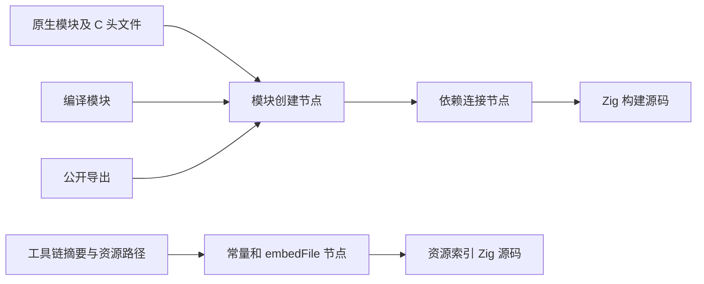
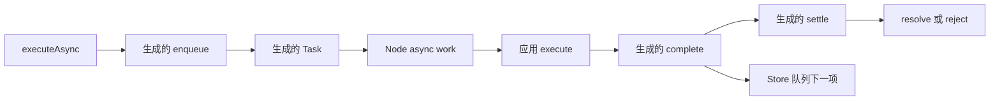
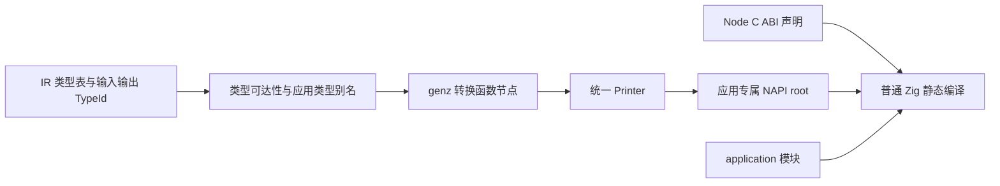

# Zig 代码生成全面原语化实施记录

## Intent：最终目标

执行 [全面原语化计划](../Zig代码生成全面原语化实施计划.md)，将全部生产 Zig 生成路径收口到 genz 的结构化节点及 Printer，消除模板、源码透传与专用实现原样嵌入。

前置三项特性已在提交 `039a7ce0` 完成，本完善立即开始。

## Data：首轮生产调用链盘点

### genz 内部

| 路径                                          | 生产职责                                       | 迁移方式与状态                                                               |
| --------------------------------------------- | ---------------------------------------------- | ---------------------------------------------------------------------------- |
| `zx/abi_view.zig`                             | canonical 类型别名与 native/layouts 命名空间   | 已改为声明与表达式节点，CLI 和应用构建通过                                   |
| `zx/parallel/allocator.zig`                   | 旧 RX Parallel 的 allocator 模板               | 已复用结构化 allocator，CLI 构建通过                                         |
| `gateway/storage.zig`                         | initializers 与 zx_pending 字段                | 已改为结构体字段与默认值节点，CLI 构建通过                                   |
| `gateway/adapter.zig`                         | Context 槽位映射和 commit 转发                 | 已用 FieldType、字段和函数节点构造，CLI 构建通过                             |
| `zx/state.zig`                                | State 初始化、校验、apply                      | 已分为 storage/lifecycle 节点构造，CLI 与既有 Store 应用构建通过             |
| `zx/state/request.zig`                        | Request 与 Region 生命周期                     | 已分为 request/request_commit/region 节点构造，CLI 与既有 Store 应用构建通过 |
| `zx/state/reclaim.zig`                        | retired region 回收                            | 已使用 optional while 与 continue 节点，CLI 与既有 Store 应用构建通过        |
| `gateway/invoke.zig`                          | JSON 输入、execute、错误响应                   | 已使用 catch 与 return 表达式节点，Gateway 应用构建和请求重放通过            |
| `gateway/entry.zig`                           | 路由、方法选择、配置和 handler                 | 已构造声明与路由节点，Gateway 应用构建和请求重放通过                         |
| `gateway/http.zig`                            | 被 entry 原样嵌入的 readBody/respond/validHead | 已转为 http/head 节点模块，Gateway 应用构建和请求重放通过                    |
| `node.Declaration.source` 与 Printer 对应分支 | 源码透传出口                                   | 已删除源码透传节点与 Printer 分支                                            |

### genz 外部

已确认必须继续盘点 CLI 的 process/state/gateway runner、Wasm runner/scalar、Node runner/context/task/enqueue、NAPI 的 value/read/write 适配和 library build/config。compiler Zig backend 的主要路径已委托 genz；文件写入动作本身不等于源码生成。

NAPI C ABI 声明、显式原生模块及其依赖属于真实静态源码边界，需按角色核实。zxc 专用的读取、写入、队列和入口适配必须迁移，不能通过改名为 native 规避要求。

## Edges：边界与限制

- 动态标识符、路径与应用字符串可使用普通字符串处理，再交给对应节点；禁止字符串里藏完整 Zig 语句。
- 最终产物结构中的 `source` 字段只是字节输出，不等于 `Declaration.source` 透传节点，不作机械删除。
- 补充通用语法原语，不创建带业务源码的 Store/Gateway 特制节点。
- 保持现有公开签名、错误、内存回收顺序和宿主行为；不把结构迁移变成业务重写。
- 对专用适配优先按实际类型、路由或宿主需求静态生成，不制造一个运行时通用解释层。
- 不新增测试用例或执行全量测试；重放既有构建和运行材料，记录实际范围。

## Answer：执行顺序与验收

1. ABI view 与旧 Parallel allocator，先封闭 `Declaration.source` 出口。
2. 字段默认值等必要原语，以及 Gateway storage/adapter。
3. Store state/request/reclaim。
4. Gateway entry/invoke/http。
5. CLI、Wasm、Node/NAPI 及库构建入口。
6. 完整调用链复查、针对性构建和既有材料重放，确认没有遗留生产模板。

每项的修改和验证证据在执行后追加。超过 1000 行时按 Store、Gateway、宿主拆分记录。

## 自我批判

文本搜索命中不能直接等同于模板，空结果也不能证明全路径完成。每项必须同时核实生产入口与最终节点构造；尤其不能仅把旧模板包装为 node 或改成静态导入。

### 结构原语补充

字段默认值、根模块字段声明、optional if/while 捕获、continue、FieldType 与推导错误联合已加入节点和 Printer。Builder 增加 field/call/builtin/path 工厂，只组合结构节点；路径列表的每一段均作为独立标识符处理，不接收语句或表达式源码。

Store 原有单个模板拆为存储声明、生命周期操作、Region 释放、Request 构造、Request commit 与退休回收。拆分服务于原有职责，保持 initialize/commit/validate/apply/request/deinit/releaseRetired 的公开行为和释放顺序。

### Store 首轮重放

Store 节点迁移后 `zig build dist -j2` 成功。复用旧 Store 请求归属示例，复制到 `既有Store示例/`，入口只移除旧 Call.out 并将结果引用改为当前 `$ctx.advance`；未改变 ZX 业务和 Store 定义。构建原生应用成功，独立启动输入 3 返回 6，输入 0 返回 3，与初始值 3 相符。未据此宣称已验证同一进程多请求或长期回收。

Gateway adapter 与 storage 已通过包含其生产调用点的 CLI 构建；真实 Gateway 生成与运行仍待后续 entry/invoke/http 整体迁移后重放。

### Gateway 与 CLI 入口迁移

Gateway entry/invoke/http 已全部使用节点，HTTP 请求头校验按职责放在 head.zig。新增通用 catch 块、return 表达式、定长数组类型、饱和加法、errorName 及 Builder 组合工厂，未添加源码解析或透传入口。

复制既有 Gateway 应用到 `既有Gateway示例/`，仅适配旧 Call 结果语法和本地监听端口。构建成功，实际请求 POST /api/v1/echo 输入 42 返回 200/42，非法 JSON 返回 400，错误方法返回 405/Allow: POST，未知路径返回 404。该轮使用迁移后的 Gateway 服务生成和原有连接入口；不能代表新连接入口已经运行。

普通 CLI 与 Store CLI 的 runner 已迁移到 genz/host/cli，result 配置由布尔常量节点生成。Gateway 连接入口已迁移到 genz/host/gateway。最新 `zig build dist -j2` 通过；使用新连接入口重建 Gateway 应用后，200、400、405 与 404 四类请求重放通过，stderr 为空。确认无生产引用后，已删除三个旧 CLI runner 模板。

用户追加 README 语法同步，已完成根 README 和首页链接示例更新；证据见 [README 执行记录](../README语法同步/执行记录.md)。两入口三组输入全部保持原结果。

### 库发布与工具链资源

库发布不再嵌入 library_build.zig 或拼接 Config 源码；genz/host/library 按发布时已知的 native/generated/public 模块及依赖直接生成 build 函数。生成文件仍通过 standardTargetOptions 与 standardOptimizeOption 接收 Zig 消费者的构建配置。C translate、include 路径、ABI view、公共别名和链接设置保留；删除已无引用的旧 library_build 模板。依赖缺失在生成阶段报告 UnknownModuleDependency，而不是留到消费者构建时 panic。

两处 C adapter 均由 import 与公开常量节点生成。工具链 pack 的 resources.zig 也改为 genz 节点；embedFile 在这里仅引用二进制压缩资源及 JSON 索引，不嵌入 Zig 实现。打包工具以 host 目标依赖 genz，目标平台选择仍由原 manifest 决定。

最新 CLI dist 构建通过，包含更新后的工具链打包器。既有 shipping ZX 与 C 原生 bridge 示例均成功发布库；C 库 build.zig 可执行构建配置，C 原生应用构建成功且输入 2 返回 4。此项没有证明 C 库已被独立 Zig 应用执行消费。

独立 Zig 消费核对通过：`既有库消费示例/` 复用既有 invert.zx 与 bool_test.zig，并使用既有 entry/zig/build.zig，配置公开名 library。发布库后 zig build 执行原有断言，false→true、true→false 均通过。未新增测试逻辑。首次准备误复制了依赖 bundle 的消费者 bool.zx，随后根据源码改为真正的 invert.zx；早期失败属于验证材料依赖缺失，没有修改编译器来绕过。

### Wasm 宿主节点迁移

freestanding Wasm 入口已改由 genz/host/wasm 生成，按存储声明、请求生命周期、输入内存、JSON 执行与标量接口分文件组织。生成时选择有无 Store，保留 zxc_alloc、zxc_execute、结果指针/长度、reset/deinit，以及适用类型的 zxc_call/zxc_scalar_result。

新增通用原语为模块变量、ABI 导出函数、调用约定、comptime 声明块、switch 捕获与默认分支、optional 指针捕获、unreachable 表达式、左移及所需标准 builtin。没有将业务专属 Wasm 逻辑塞进 node 或 Printer。

CLI 已接入新生成路径。`zig build dist -j2` 通过；复用仓库既有 Wasm 专项脚本，在 safe 优化等级下完成 489 项标量、JSON、生命周期、Store 与 WASI 检查。副本 `既有Wasm示例/` 只调整旧 RX Call 结果语法，没有新增测试逻辑；这是 Wasm 专项重放，不是仓库全量测试。确认无生产引用后删除旧 runner.zig 与 scalar.zig。其他优化等级本轮未重跑。

### Node Context 与入口

Context 的引用计数、关闭、清理钩子与 Store 释放已改为节点生成。CLI 将生成后的宿主文件纳入构建配置指纹，并以独立 arena 管理这些文本的生命周期。Node runner 的 API 版本导出、注册、finalizer 与同步 execute 也已迁移；两个固定导出属性在生成阶段展开为独立语句块，不再依赖 inline 源码模板。

本阶段任务队列与 NAPI read/write 尚未迁移，不能宣称 Node 原语化完成。编译产物的 Signature 已保留完整 IR 类型表及输入输出 TypeId，后续按实际类型生成转换函数，避免把通用读取/写入源码作为专用运行库复制。

Node Context 与入口的 CLI 构建通过。首轮专项脚本已通过十一种标量类型并运行到 Store 清理检查，因命令未带 --expose-gc 而停止在 globalThis.gc；已使用正确参数重新运行。此失败未触发编译器或断言修改。旧 context.zig、runner.zig 已确认无生产嵌入引用并删除；task/enqueue 仍待迁移。

使用 --expose-gc 重跑 Node 专项完成，safe 模式共 561 项通过，包含 45 项字节、31 项 record、20 项 collection 和 18 项 State 检查，以及标量和属性检查。验证覆盖当前 Context 与同步入口；异步队列节点化仍待完成，不能将本轮结果当作该部分的验收。

## Node 异步队列与任务原语化

- Intent：保留 Promise 结算、异步工作引用计数和 Store 串行队列语义，将最后两个 CLI Node 模板迁入 genz。
- Data：以原 `cli/node/task.zig` 和 `enqueue.zig` 的完整调用链为依据；Context 和同步入口既有专项已通过 561 项。
- Edges：本次仅替换代码表达方式。有无 Store 在生成时选择；NAPI 类型读取和写入仍待后续迁移，不据此宣称全部原语化完成。
- Answer：`host/node/enqueue.zig` 生成入队与参数捕获；`host/node/task/root.zig` 生成任务存储、执行和销毁；`complete.zig` 生成回调及队列推进；`settle.zig` 生成结果与异常结算。待构建与既有异步专项完成后记录结果。

通用节点补充错误联合条件表达式捕获、分支错误捕获和 `errdefer` 表达式，没有加入 Node 专用语法节点。CLI 统一在 arena 内生成三份宿主源文件，配置指纹与写盘使用同一批字节。

自我复核重点：输入 arena 在 Store 请求创建时转移；complete 保留 Context 到函数退出；settle 失败关闭队列；任务销毁同时释放 work、回调引用和 Context 引用。迁移不改变这些顺序。

实际验收：`zig build dist -j2` 成功。重放现有 `napi_bindings/run_test.ts`，使用此前迁移语法的 Node 示例目录，通过 33 项 TypeScript 声明检查；异步专项通过 18 项协议、42 项所有权、11 项 Store、12 项 Worker 生命周期、8 项执行失败检查；完整脚本报告 64 项模块绑定检查通过（safe）。未添加测试或执行全量测试。删除已无生产引用的 CLI `task.zig` 和 `enqueue.zig` 模板。

## NAPI 按应用类型生成转换函数

- Intent：自动 addon 构建仅携带实际输入、输出所需的转换函数，撤除泛型 NAPI 适配源码的原样嵌入。
- Data：compiler Bundle 已保留完整 IR 类型表及输入输出 TypeId；旧适配器规定了标量、错误成员、可选值、数组、字节和对象的 Node ABI。
- Edges：`packages/napi` 的显式 Zig 原生库公开接口保留。自动构建仅复制稳定的 Node C ABI 声明 `api.zig`；专用适配全部由 genz 构造。应用 Task 类型不属于 Node 值 ABI，生成时返回 `UnsupportedNodeType`。
- Answer：新增 `host/node/napi`，按职责分为类型可达性及别名、基础值操作、数字检查、读取、写入、列表和记录转换。CLI 生成 NAPI root 并将其纳入配置指纹；NAPI 模块静态依赖 application，宿主调用固定的 `read(allocator, env, value)` 和 `write(env, value)`。构建与既有专项验收尚在进行。

复核：对象写入仍使用 define_properties，避免原型属性触发 setter；字节输入仍复制到请求 arena，输出仍创建 Buffer 副本，保持已有所有权契约，不能因“zero copy”口号跨异步生命周期借用 JS 可变内存。对象读取直接填充 arena 中的布局。标量保留有限数、整数范围、截断检查与 BigInt 无损检查。

NAPI 实际验收：`zig build dist -j2` 成功。专用转换器通过现有 561 项 NAPI 协议检查（全部标量，以及 45 项字节、31 项记录、20 项集合、18 项状态检查）；现有异步专项再次通过 18 项协议、42 项所有权、11 项 Store、12 项 Worker 和 8 项执行失败检查；33 项 TypeScript 声明及脚本报告的 64 项模块绑定检查通过。均为 safe 构建，无新增测试、无全量测试。错误集合类型虽已按 IR 成员静态生成，本轮 NAPI 既有 fixture 不包含该类型，不扩张上述验收结论。

## 标准库目录生成补漏

生产路径复查发现 `compiler/build/standard.zig` 还在拼接 Zig 的 Source 与 modules 声明，已新增 `genz/host/catalog.zig` 负责节点生成。构建脚本只收集接口路径和元数据，由独立宿主工具 `build/generate_catalog.zig` 读取 JSON 并调用 genz。元数据输入与最终 catalog 使用不同 WriteFiles 步骤，避免输出反向依赖其自身输入形成构建环；`.d.zx` 接口仍作为数据资源随 catalog 放置。该补漏已通过 `zig build dist -j2`，包含标准接口目录消费及完整 CLI 构建。

再次检索生产 Zig 的声明拼接、完整模板及 `.zig` 嵌入：剩余 `.zig` 嵌入仅为 NAPI C ABI 声明；JS wrapper 和 ZX 标准接口构造属于各自语言，不冒充 Zig 原语化结果。构建脚本自身的 Zig Build 配置保持普通源码。
